# GIT Version Control Basics

## Scenerio
If a member "Tom" makes changes to the home page file "index.html" to updatethe navigattionand at the same time, another team member "Jerry" makes changes to add contact information to the footer of the same homepage thereby editing the same index.html flie. Without VCS, the last person to upload their verion of the file to the shared folder or server would ovewrite the other person,s changes, resulting in lost work.

Git is a tool that helps people work together on computer projects. It keeps track of all the changes everyone makes, so if something goes wrong, you can always go back to a version that worked. It also lets everyone works on their part at the same time without getting in each other's way.

## Prerequisites
### Initial Set-up:
* Both Tom and Jerry have Git installed on their computers

* They clone the project repository from a central repository to their local machines. This gives them each a complete copy if the project, including all its files and Version history
### Tom and Jerry Start Working:
* Tom and Jerry pull the latest changes from the central repository to ensure they start with the most current version of the index.hdml file.

* They both create a new branch from the main project. Tom names his branch `update-navigation`, and Jerry names his `add-contact-info`
### Making Changes
* Tom updates the navigation bar in `index.html`

* Jerry works on his branch to add contact information to the footer of the same file.

* They commit their changes to their respective branches.
### Merging Changes
* Once they're done, Tom and Jerry push their branch to the central repository.

* Tom decides to merge his changes first. He creates a `pull request (PR)`for his branch `update-navigation`

* After reviewing Tom's changes the team merges his PR into the main branch, updating the `index.html` file to the main project line

* Jerry then updates his branch with the latest changes from the main project to include Tom's updates.

* Jerry resolves any conflicts that arises from Tom's changes and his own.

* Jerry then Puches his updated branch and creates a PR for his changes. The team reviews Jerry's additions, and once they're approved, his changes are merged into the main project.
## Intial Set-Up
To start the initial project I first created the project repository with the information I recieved

I have create the Root Github Repository using the terminal. This is what it looks like on the dashboard
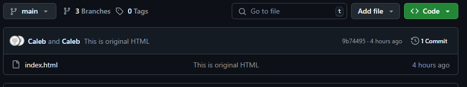

In the image you can see that an index.html has been created.

This showcases that Tom has logged into his own terminal
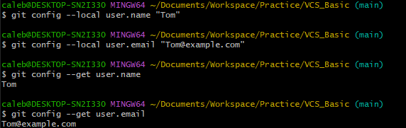

This showcases that Jerry has logged into his own terminal
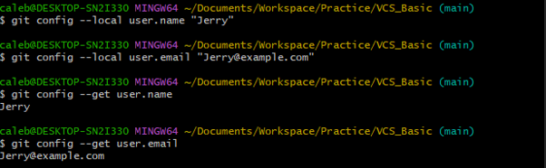
## Tom and Jerry Start Working:
 Tom and Jerry both pull latest changes from the central repository
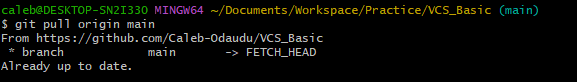
 
Tom creates his `update-navigation` branch

Jerry creates his `add-contact-info` branch
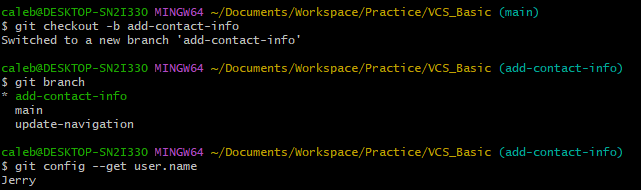
## Making Changes
This part will show the changes jerry made aswell as the changes Tom made

### Tom's Changes
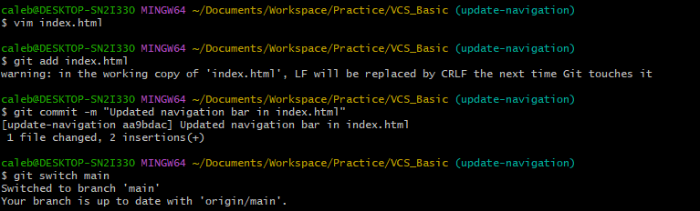
### Jerry's Changes
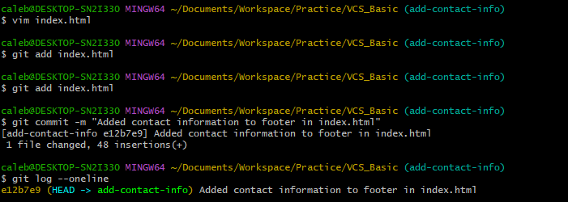
## Merging Changes
Before merging each developer needs to push their branch to the remote repository:

### Tom pushing his branch
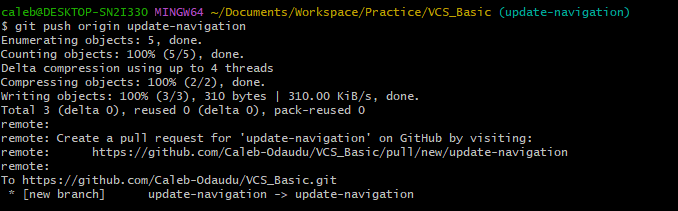
### Jerry pushing his branch
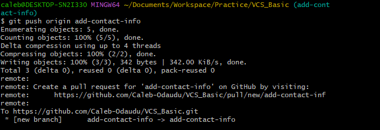

Tom wants to merge his changes first, so he creates a pull request (PR) from his branch `update-navigation` into the main using the command line:

The team reviews his changes and merges them into the main.

Since Tom’s changes are now in , Jerry needs to update his branch before merging:
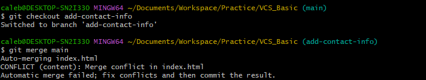

If there are conflicts as showcased in the image above, Git will highlight them, and Jerry must resolve them manually in . Once fixed, he stages and commits the resolved file:
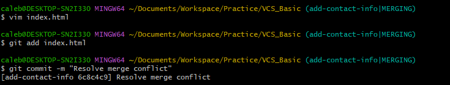

Once everything is clean, Jerry pushes his branch and creates a PR:
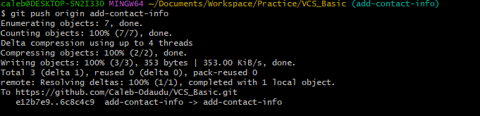

After review, his changes are merged into :

## Conclusion
Through this process, Tom and Jerry were able to work on the same file simultaneously, without overwriting each other's work Git tracked their changes, allowing them to merge their updates seamlessly into the main project. This illustrates the power of using VCS like Git for collaborative development, enshuring that all contributions are preserved and integrated efficiently and effectively.