# Basic Git Commands
## Scenerio
In this project, we will create a step-by-step project to simulate the workflow of Tom and Jerry using Git and GitHub. This hands-on project will include installation of Git, settingup a Github reposirory, cloning repository, creating branches, making changes, and merging those changed back into the main branch.
## Prerequisites
* Part 1: Setup and Initial configuration
* Part 2: Simultating Tom and Jerry's Work
## Part 1: Setup and Initial configuration
### Install Git
For the first part of the set-up we need to install Git. From the image below you click on your operating system and follow the installation instructions.
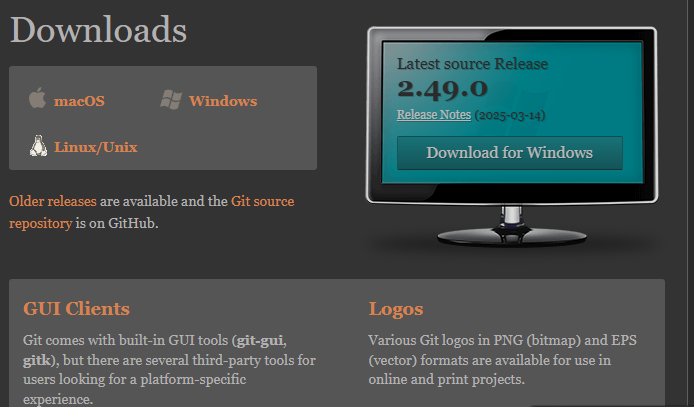 
### Create a Github repository
It is essential for this project to sign up or log in to GitHub

After Signing in click the + icon in the top-right corner and select 'New Repository' 
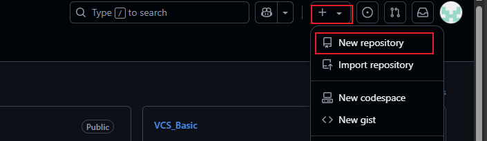
 
After clicking on new repository, it is important to ame the repository and initialise it with a README file. Then create repository
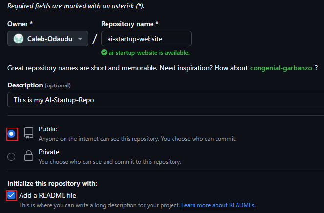
### Clone the repository
On the repository page on GitHub, click the "code" button and copy the HTTPS URL
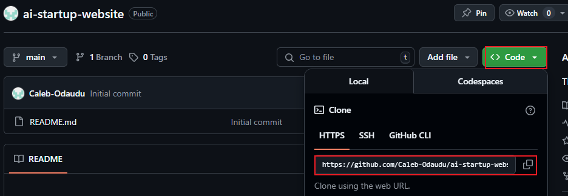

Open your terminal or command prompt. Create a folder named "git-project" in a folder in which you will remember. Change directory into the "Git-Project"
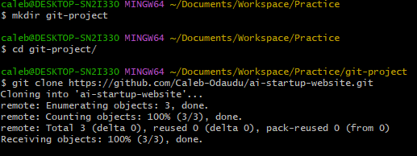

As the cloning has been successful, you should be in the `main` branch. We can now navigate into the repository that was cloned.

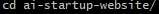

We will now create an empty index file, After we will add a text in the html file

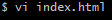
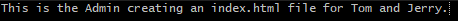

Checking the status to see if we need to add any files,then we commit with a message and push main branch to GitHub
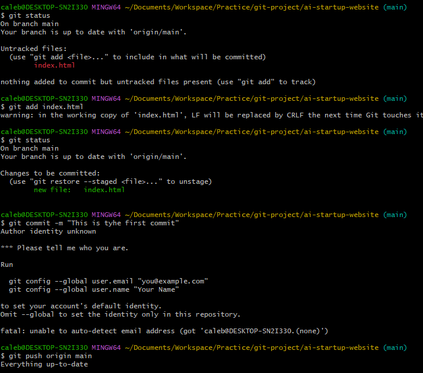 

## Part 2: Simultating Tom and Jerry's Work
To simulate both Tom and Jerry's work on the same laptop, you'll switch between two branches, making changes as each character
 
### Set-Up
Before moving into the work it is important to configure the user names and email this allows us to showcase that Tom or Jerry did the following work.

Tom's Set-Up

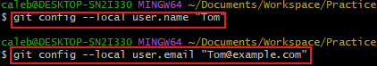

Jerry's Set-UP

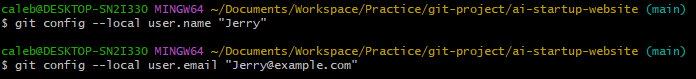

### Tom's Work
First thing to do is to navigate to the project directory you just cloned

This moves Tom into the folder containing the cloned Github repository on his loval machine. It's like stepping into the project workspace.

Check the current branch: Initially, you'll see only the main branch because that's the default starting point and no other branches has been created yet. Tom will then create a new branch `update-navigation`

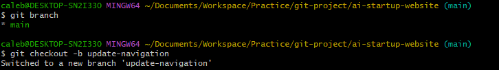

This creates a new branch named `update-navigation`. The command also automatically swiches to the newly created branch from the `main` branch. This branch `update-navigation` is where you'll simulate Tom's updates to the website without affecting whatever is in the main branch. This is shown when we use `git branch`
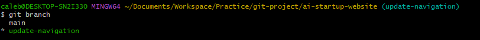

Running `git branch` again now shows your newly created branch, indicating yoyu are now working in this new 'workspace' dedicated to Tom's navigation updates.

Recalling the created empty file 'index.html' in the main. The file will also exist in the `update-navigation-branch`

Tom will now open the `index.html` and add his content

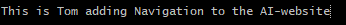

This simulates Toms contribution to the project. This text represents the work he's doing in thr navigationbar. In the real world, this will be an actual software code.

Tom will now check the status to see if we need to add any files,then we commit with a message and push main branch to GitHub

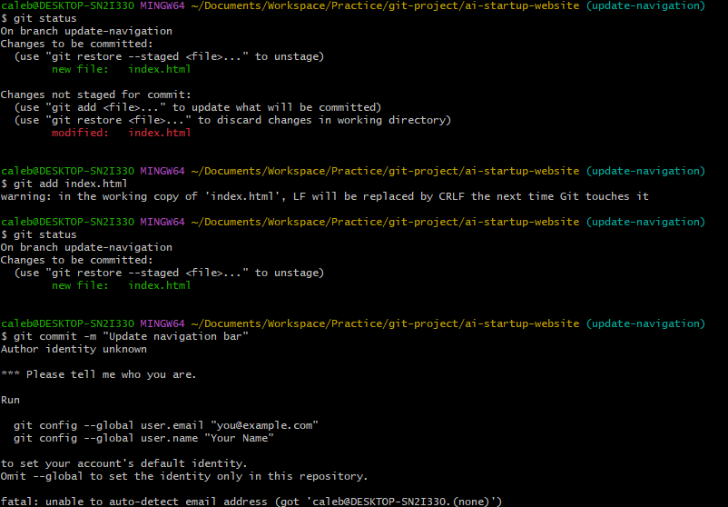
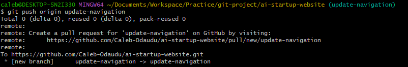

After completing Tom's workflow, you will now simulate Jerry's contribution to the project. To do this you'll

* Switchback to the main branch,

* Create a new branch for Jerry,

* Make changes, and then,

* Stage, commit, and push these changes to GitHub

### Jerry's work

#### Switchback to the main branch
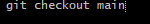

This command switches your current working directory back to the main branch, ensuring that Jerry's changes start from the latest version of the project.

#### Pull the Latest Changes:

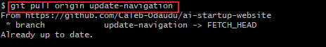

This ensures that you have the latest updates from the repository, including Tom's merged changes, if any.

#### Create a New Branch for Jerry's Work

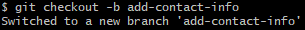

This creates a new branch where Jerry will make his changes, keeping them seperate from the main project until they're ready to be merged.

After we will need to make Jerry's changes to the index.html file by adding contact information.

#### Stage, commit, and push these changes to GitHub

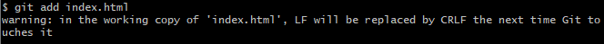

This command stages the changes Jerry made to the index.html file, preparing them for commit.

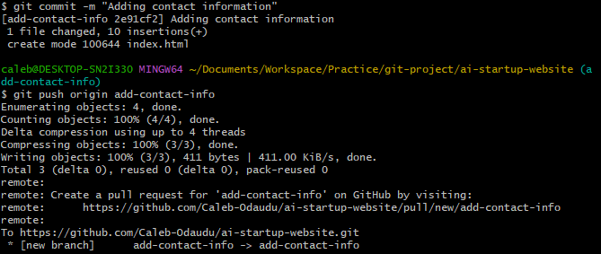
  
In this image I have commit Jerry's changes in the branch history, with a message describing what was done. After we Push the branch to GitHub. This command uploads Jerry's branch to the GitHub repository, making it available for review and merging into the main project.

After review, his changes are merged into :
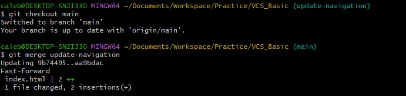
## Conclusion

So far you have experienced collaboration between Tom and Jerry. But thats not all. Someone needs to review their work merge the changes to the main project, and resolve conflict if any. In the next project, we will see how that works.