# Terraform EC2 Instance and AMI

In this mini project, we will use Terraform to automate the creation of an EC2 instance on AWS and then create an Amazon Machine Image (AMI) from that instance.

## Objectives

- Learn how to write basic Terraform configuration files.
- Learn how to write Terraform scripts to automate the creation of an EC2 instance on AWS.
- Learn how to use Terraform scripts to automate the creation of an AMI from an already created EC2 instance on AWS.

## Prerequisites

This project requires you to have an AWS account and the AWS CLI configured locally. This setup will be used by the Terraform script we are going to write. From our local command line interface, Terraform will use the configured AWS CLI credentials to communicate with our AWS account when executing the script.

- Ensure you have an AWS account created and functional. Here is a [guide]() to create a new AWS account.
- Ensure you have the AWS CLI installed and configured with the credentials of your AWS account. Here is a [guide]().
- Ensure you have Terraform installed on your computer. Here is a [guide]().

## Task Outline

1. Confirm prerequisites
2. Write the script
3. Execute the script
    1. Initialize (`init`)
    2. Validate (`validate`)
    3. Plan (`plan`)
    4. Apply (`apply`)
4. Confirm resources
5. Clean up
    1. Destroy (`destroy`)

## Project Tasks

### Task 1: Confirm the Prerequisites

1. Log in to your AWS account to confirm it is functional.

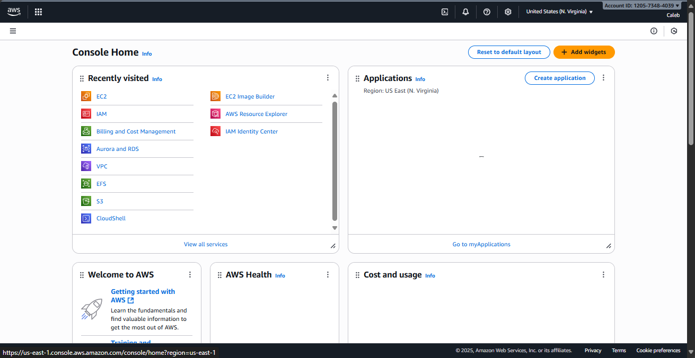

2. Run `aws --version` in the terminal to confirm the AWS CLI is installed.

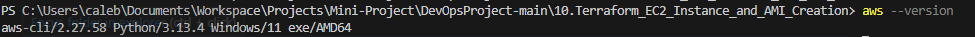

3. Run `aws configure list` to confirm the AWS CLI is configured.

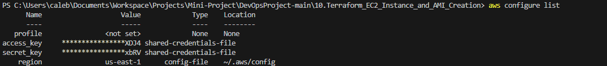

4. Run `aws sts get-caller-identity` to verify that the AWS CLI can successfully authenticate to your AWS account.

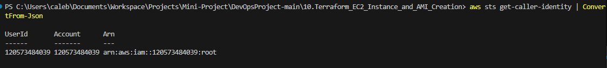

5. Run `terraform --version` to confirm Terraform is installed.

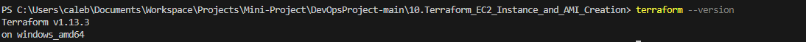

### Task 2: Developing the Terraform Script to Create an EC2 Instance and AMI

1. Create a new directory for this project:

```bash
mkdir terraform-ec2-ami
cd terraform-ec2-ami
```

2. Inside this directory, create a Terraform file:

```bash
nano main.tf
```

3. Inside this file, write the script to create an EC2 instance specifying the instance type, AMI, and tags. Extend this script to include the creation of an AMI from the created EC2 instance.

```hcl
provider "aws" {
  region = "us-east-1"
}

resource "aws_instance" "my_ec2_spec" {
  ami           = "ami-08982f1c5bf93d976"
  instance_type = "t2.micro"
  tags = {
    Name = "Terraform-created-EC2-Instance"
  }
}

resource "aws_ami" "my_ec2_spec_ami" {
  name               = "my-ec2-ami"
  description        = "My AMI created from my EC2 instance with Terraform script"
  source_instance_id = aws_instance.my_ec2_spec.id
}
```

#### Script Explanation

1. **Provider Block**
    - `provider "aws"` tells Terraform that we are using AWS as our cloud provider.
    - `region = "us-east-1"` specifies the AWS region where the resources will be created.

2. **EC2 Instance Creation**
    - `resource "aws_instance" "my_ec2_spec"` defines a resource of type `aws_instance` with the name `my_ec2_spec`.
    - `ami = "ami-08982f1c5bf93d976"` specifies the Amazon Machine Image (AMI) ID to use for the instance. This AMI ID corresponds to a specific operating system and configuration.
    - `instance_type = "t2.micro"` specifies the type of instance to create, in this case, a t2.micro instance which is eligible for the AWS free tier.
    - The `tags` block allows us to assign metadata to the instance; here, we are giving it a name tag with the value "Terraform-created-EC2-Instance".

3. **AMI Creation from EC2 Instance**
    - `resource "aws_ami" "my_ec2_spec_ami"` defines a resource of type `aws_ami` with the name `my_ec2_spec_ami`.
    - `name = "my-ec2-ami"` specifies the name of the AMI that will be created.
    - `description = "My AMI created from my EC2 instance with Terraform script"` provides a description for the AMI.
    - `source_instance_id = aws_instance.my_ec2_spec.id` specifies that the AMI should be created from the EC2 instance we defined earlier in the script. The `aws_instance.my_ec2_spec.id` references the ID of that instance.

### Task 3: Executing the Terraform Script

1. Initialize the Terraform project.

```bash
terraform init
```

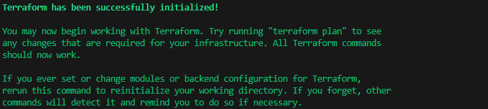

2. Validate the correctness of this script.

```bash
terraform validate
```

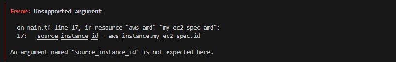

In the image above, it shows there is an error: an unsupported argument. What it is basically saying is that Terraform doesn’t have a native `aws_ami` resource that lets you create an AMI directly from an instance using `source_instance_id`. That’s actually a feature of the AWS API, but in Terraform, you need to use the `aws_ami_from_instance` resource instead.

```hcl
provider "aws" {
  region = "us-east-1"
}

resource "aws_instance" "my_ec2_spec" {
  ami           = "ami-08982f1c5bf93d976"
  instance_type = "t2.micro"
  tags = {
    Name = "Terraform-created-EC2-Instance"
  }
}

resource "aws_ami_from_instance" "my_ec2_spec_ami" {
  name               = "my-ec2-ami"
  description        = "My AMI created from my EC2 instance with Terraform script"
  source_instance_id = aws_instance.my_ec2_spec.id
}
```

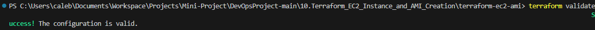

3. Confirm the resources that will be created by the execution of this script.

```bash
terraform plan
```

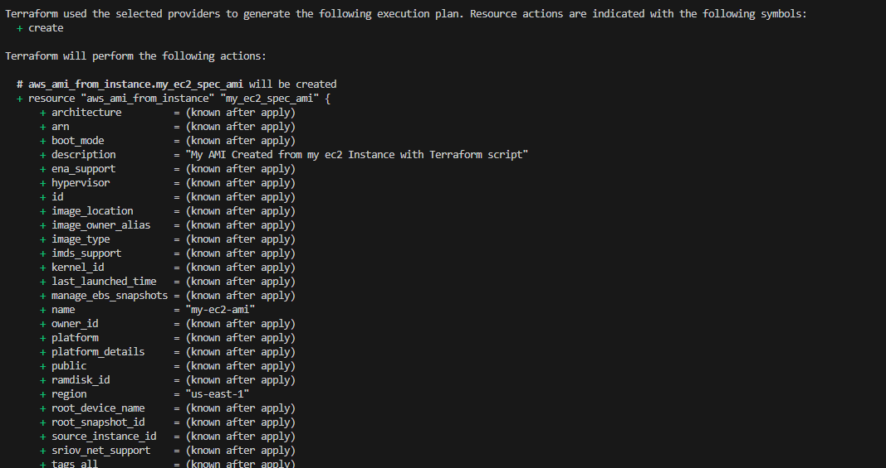

4. Apply the Terraform configuration.

```bash
terraform apply
```

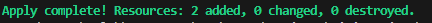

### Task 4: Confirm Resources

Confirm the creation of the EC2 instance and its AMI in the AWS Console according to the specific details.

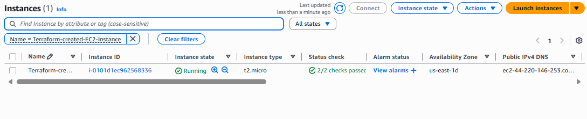

The image above confirms that the instance has been created.

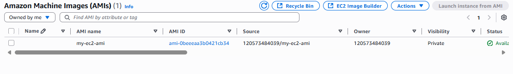

The image above confirms the creation of the AMI.

### Task 5: Clean Up

Clean up the resources created by the script.

```bash
terraform destroy
```


## Conclusion

In this mini project, you learned how to write a basic Terraform script to automate the creation of an EC2 instance on AWS and then create an AMI from that instance. You also learned how to execute the script using various Terraform commands such as `init`, `validate`, `plan`, `apply`, and `destroy`.

