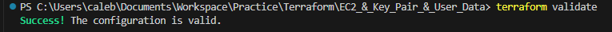
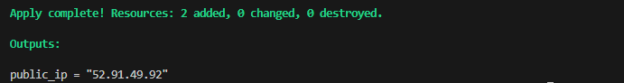

# Terraform EC2 Instance with Key Pairs and User Data

In this mini project, we will use Terraform to automate the creation of an EC2 instance on AWS. The project includes the generation of a downloadable key pair for the instance and the execution of a user data script to install and configure the Apache HTTP server.

## Objectives

1. **Terraform Configuration:**
    - Learn how to write Terraform code to launch an EC2 instance with specified configurations.

2. **Key Pair Generation:**
    - Generate a key pair and make it downloadable after EC2 instance creation.

3. **User Data Execution:**
    - Use Terraform to execute a user data script on the EC2 instance during launch.

## Project Tasks

### Task 1: Terraform Configuration

1. Create a new directory for the Terraform project.

2. Inside the project directory, create a Terraform configuration file.

3. Write Terraform code to create an EC2 instance with the following specifications:
    - Instance Type: `t2.micro`
    - Key Pair: Generate a new key pair and make it downloadable.
    - Security Group: Allow incoming traffic on port 80.

4. Initialize the Terraform project using the command `terraform init`.

5. Apply the Terraform configuration to create the EC2 instance using the command: `terraform apply`.

### Task 2: User Data Script Execution

1. Extend the Terraform configuration to include the execution of the provided user data script.

2. Modify the user data script to install and configure the Apache HTTP server.

3. Apply the updated Terraform configuration to launch the EC2 instance with the user data script using the command: `terraform apply`.

### Task 3: Accessing the Web Server

1. After the EC2 instance is created and running, access the Apache web server by using its public IP address.

2. Verify that the web server displays the "Hello World" message generated by the user data script.

## Instructions
0. Before starting, ensure you have the following prerequisites:
    - An AWS account with appropriate permissions to create EC2 instances and key pairs.
    - AWS CLI installed and configured on your local machine.
    - Terraform installed on your local machine.
     
``` bash
aws sts get-caller-identity | more
terraform --version
```

1. Create a new directory for the Terraform project using the terminal.

    ```bash
    mkdir terraform-ec2-keypair
    ```

2. Change into the project directory.

    ```bash
    cd terraform-ec2-keypair
    ```

3. Create a Terraform configuration file.

    ```bash
    nano main.tf
    ```

4. Input this configuration into the file:

    ```hcl
    provider "aws" {
    region = "us-east-1"
}
data "aws_vpc" "default" {
  default = true
}


resource "aws_key_pair" "example_keypair"{
    key_name = "example-keypair"
    public_key = file("C:/Users/caleb/.ssh/id_rsa.pub")
}

resource "aws_instance" "example_instance" {
    ami = "ami-08982f1c5bf93d976"
    instance_type = "t2.micro"
    key_name = aws_key_pair.example_keypair.key_name
    vpc_security_group_ids = [aws_security_group.example_sg.id]
    user_data = <<-EOF
        #!/bin/bash
        yum install -y httpd
        systemctl start httpd
        systemctl enable httpd
        echo "<h1> Hello World from $(hostname -f)</h1>" > /var/www/html/index.html
        EOF
}

resource "aws_security_group" "example_sg" {
  name        = "example-sg"
  description = "Allow HTTP traffic"
  vpc_id      = data.aws_vpc.default.id

  ingress {
    description      = "Allow HTTP from anywhere"
    from_port        = 80
    to_port          = 80
    protocol         = "tcp"
    cidr_blocks      = ["0.0.0.0/0"]
    ipv6_cidr_blocks = []
  }

  egress {
    description      = "Allow all outbound traffic"
    from_port        = 0
    to_port          = 0
    protocol         = "-1"
    cidr_blocks      = ["0.0.0.0/0"]
    ipv6_cidr_blocks = []
  }

  tags = {
    Name = "example-sg"
  }
}

output "public_ip" {
  value = aws_instance.example_instance.public_ip
}
    ```

5. Save the file and initialize the Terraform project.

    ```bash
    terraform init
    ```

6. Apply the Terraform configuration using `terraform apply` and confirm the creation of the EC2 instance.

    

    

7. Access the Apache web server on the created EC2 instance using its public IP address.

    

8. To clean up the resources created, run:

    ```bash
    terraform destroy
    ```
## Conclusion

With the completion of this mini project, you have successfully automated the creation of an EC2 instance on AWS using Terraform. You have also generated a key pair for secure access and executed a user data script to install and configure an Apache HTTP server. This project demonstrates the power of Infrastructure as Code (IaC) and how it can streamline the deployment and management of cloud resources.executed a user data script to install and configure an Apache HTTP server. This project demonstrates the power of Infrastructure as Code (IaC) and how it can streamline the deployment and management of cloud resources.
