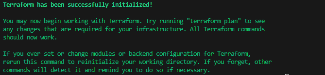
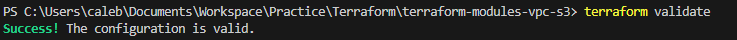
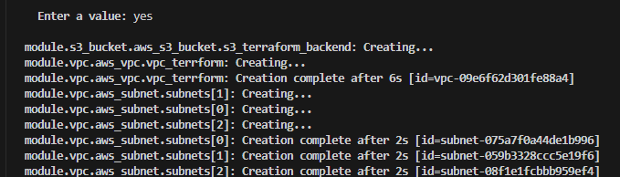
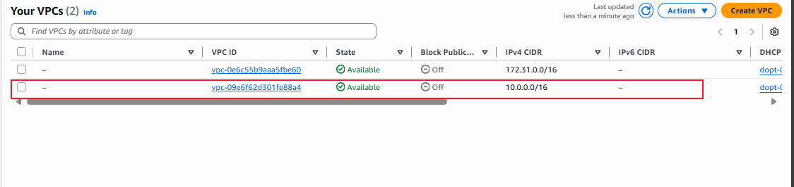

# VPC and S3 Bucket with Backend Storage

This project demonstrates how to create a Virtual Private Cloud (VPC) and an S3 bucket using Terraform, with backend storage configured for state management.

## Objectives

1. **Terraform Modules:**

    - Learn how to create and use Terraform modules for modular infrastructure

2. **VPC Creation**

    - Build a reuseable Terraform module for creating a VPC with specified configurations

3. **S3 Bucket Creation**

    - Develop a Terraform module to use Amazon S3 as the backend storage for storing the Terraform state file.

4. **Backend Storage Configurations:**

    - Configure Terraform to Use Amazon S3 as the backend storage for storing the Terraform state file

## Project Task

### Task 1: VPC Module

1. Create a new directory for the Terraform project

2. Inside the project directory, create a directory for the VPC module.

3. Write a Terraform module for creating a VPC with customisable configurations such as CICDR block, subnets, etc

4. Create a main Terraform configuration file in the project directory and use the vpc module to create a VPC

### Task 2: S3 Bucket Module

1. Inside the Project directory create a directory for the S3 bucket module

2. Write a Terraform module for creating an S3 with customisable configurations such as bicket name, ACL, etc

3. Modify the main configuration file to use the S3 module and create an S3 Bucket

### Task 3: Backend Storage Configuration

1. Configure Terraform to use Amazon S3 as the backend storage the Terraform state file.

2. Create a backend configuration file specifying the S3 bucket and key for storing the state.

3. Initialise the Terraform project 

4. Apply the Terraform configuration to create the VPC and S3 Bucket.

## Instructions

0. Before starting, ensure you have the following prerequisites:
    - An AWS account with appropriate permissions to create EC2 instances and key pairs.
    - AWS CLI installed and configured on your local machine.
    - Terraform installed on your local machine.
     
``` bash
aws sts get-caller-identity | more
terraform --version
```

1. Create a new directory for the Terraform project using a terminal

```bash 
mkdir terraform-modules-vpc-s3
```

2. Change into the project directory.

```bash
cd terraform-modules-vpc-s3
```

3. Create the directories for the VPC and S3 modules.

```bash
mkdir -p modules/vpc
mkdir -p modules/s3
```

4. Write the VPC module configurations and the S3 module configuration.

```bash
touch modules/vpc/main.tf
```

```module/vpc/main.tf

data "aws_availability_zones" "available" {}

resource "aws_vpc" "vpc_terrform" {
  cidr_block = var.cidr_block
  tags = var.tags
}

resource "aws_subnet" "subnets" {
  count             = length(var.subnet_cidrs)
  vpc_id            = aws_vpc.vpc_terrform.id
  cidr_block        = var.subnet_cidrs[count.index]
  availability_zone = data.aws_availability_zones.available.names[count.index]
  tags              = var.tags
}

```
create the variables file for the VPC module.

```bash
touch modules/vpc/variables.tf
```
```module/vpc/variables.tf

variable "cidr_block" {
  description = "The CIDR block for the VPC"
  type        = string
    default     = "10.0.0.0/16"
}

variable "subnet_cidrs" {
  description = "List of CIDR blocks for the subnets"
  type        = list(string)
  default     = [
    "10.0.1.0/24",
    "10.0.2.0/24",
    "10.0.3.0/24"
  ]
  validation {
    condition     = length(var.subnet_cidrs) == 3
    error_message = "You must provide exactly 3 subnet CIDR blocks."
  }
}


variable "tags" {
  description = "A map of tags to assign to the VPC"
  type        = map(string)
  default     = {
    Environment = "Dev"
    Project     = "Terraform-VPC-S3"
  }
}

```
```module/vpc/variables.tf

```bash
touch module/s3/main.tf
```

```module/s3/main.tf
resource "aws_s3_bucket" "s3_terraform_backend" {
  bucket = var.bucket_name
  acl    = var.acl
  tags   = var.tags
}
```

create the variables file for the S3 module.

```bash
touch modules/s3/variables.tf
```
```module/s3/variables.tf
variable "bucket_name" {
  description = "The name of the S3 bucket"
  type        = string
  default = "my-terraform-backend-bucket-us-east-1"
}

variable "acl" {
  description = "The ACL for the S3 bucket"
  type        = string
  default     = "private"
}

variable "tags" {
  description = "A map of tags to assign to the bucket"
  type        = map(string)
  default     = {
    Environment = "Dev"
    Project     = "Terraform-VPC-S3"
  }
}
```

5. Create the main Terraform file and use the VPC and S3 modules.

```bash
touch main.tf
```
```hcl
module "vpc" {
  source       = "./modules/vpc"
  subnet_cidrs = [
    "10.0.1.0/24",
    "10.0.2.0/24",
    "10.0.3.0/24"
  ]
}


module "s3_bucket" {
  source = "./modules/s3"
}

provider "aws" {
  region = "us-east-1"
}

```

6. Create the backend configuration file to specify the backend storage

```bash
touch backend.tf
```
```hcl
terraform {
  backend "s3" {
    bucket         = "my-terraform-backend-bucket-us-east-1"
    key            = "env:/terraform.tfstate"
    region         = "us-east-1" # ← match actual bucket region
    use_lockfile   = true        # ← replaces dynamodb_table
  }
}
```

7. Initilaise the Terraform project

```bash
terraform init
```


8. Apply the Terraform Configuration and confirm the creation of the VPC and S3 Bucket

```bash
terraform validate
```



```bash
terraform apply
```




9. Destroy the created resources after verification

```bash
terraform destroy
```

### Side Notes for Configurations

- Ensure that the S3 bucket name is globally unique.

- Adjust the CIDR blocks and subnet configurations as per your requirements.
- Make sure only one backend configuration is present in the project.
- Make sure the S3 bucket region in the backend configuration matches the actual region of the created S3 bucket.
- If the S3 bucket already exists, ensure that it is empty before using it as a backend.