# Linux Fundamentals

## Introduction to Linux

In the dynamic landscape of technology, mastering the fundamentals is essential for anyone aspiring to excel in fields such as DevOps, Cloud Computing, Software Development, Cybersecurity, Data Analysis/Science, AI, and QA Testing. This project is designed to equip you with a solid foundation in Linux. Understanding the basics lays the groundwork for success in various tech-centric careers.

### What is Linux

Linux is a free, open-source operating system similar to Windows or macOS, but it's more widely used for servers and supercomputers. It's known for its stability, security, and flexibility, allowing users to modify and distribute their own versions. Linux runs on a wide range of devices, from desktops to smartphones, and powers much of the internet's infrastructure. It's supported by a global community of developers who contribute to its many distributions, each tailored for specific needs or preferences.

### Linux Distributions

Linux distributions, often referred to as "distros," are different flavors of the Linux operating system built using the Linux kernel. These distros package the Linux kernel with a range of software, libraries, and tools to provide a functional computing environment. They offer different configurations, desktop environments, package managers, and software repositories, and are branded accordingly. Some popular Linux distributions are:

* **Ubuntu:**  
  Known for its user-friendliness and ease of installation. It is an excellent choice for those new to Linux as well as for everyday computing. Ubuntu also has server editions for web hosting and cloud deployments.

* **CentOS:**  
  Favored in enterprise and server environments due to its stability and long-term support. It is essentially a free and open-source version of Red Hat Enterprise Linux (RHEL), which is another distro itself but requires a paid license. System administrators often choose CentOS because it's free, reliable, and robust.

* **Debian:**  
  Known for its commitment to free and open-source software principles. Debian is available for free, provides a wide range of software packages, and supports multiple hardware architectures.

* **Fedora:**  
  A cutting-edge distribution that focuses on integrating the latest software and technologies. It is suited for those who want to experiment with new features and applications. Fedora is also the testing ground for Red Hat Enterprise Linux products.

## Installation and Initial Setup

In this section, we will create a server in the cloud and gain access to it from our local environment. Then, we will connect to that server remotely from your laptop.

We will use AWS, a public cloud provider, to create the server. First, we will provision an EC2 instance running Ubuntu Server.
 
### Setting Up the Instance

Before starting the project, we need to set up an EC2 instance. First, log in to the AWS console to access the dashboard.

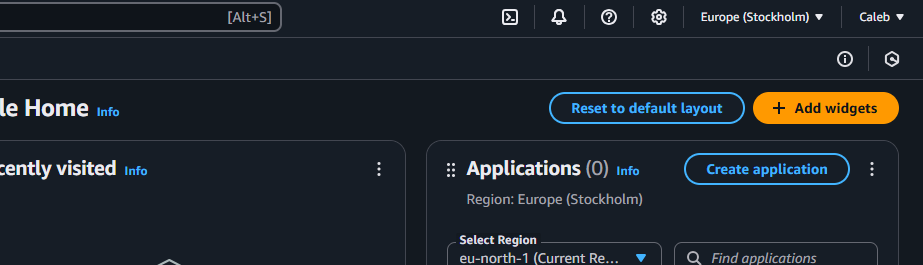

In the search bar, type "EC2," which stands for Elastic Compute Cloud.

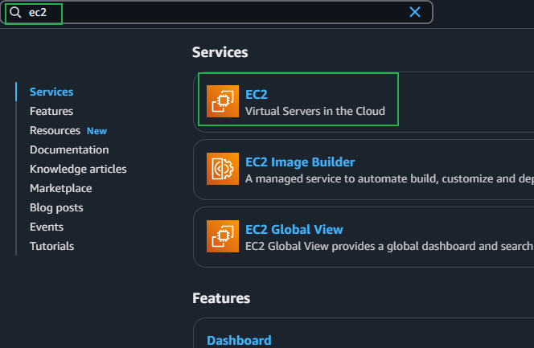

To create an EC2 instance, navigate to the left-hand side and select the "Instances" tab. Then, click "Launch Instance." Here, you can specify the instance type and settings for the project.

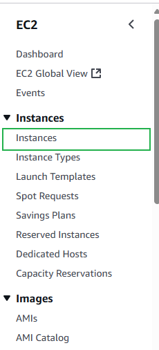

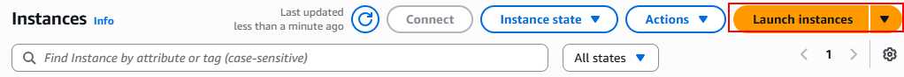

After launching the instance, the first step is to select the name of the instance and the instance type. For this project, I named the instance `Linux_Server` and selected `Ubuntu`.

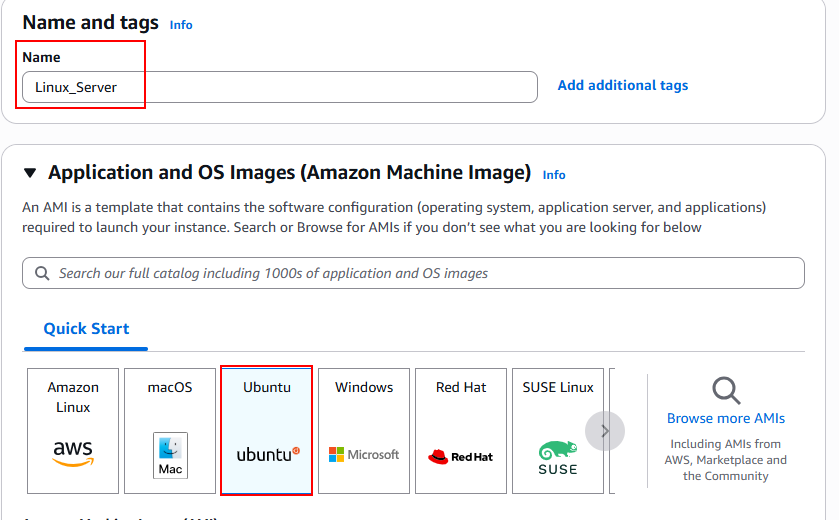

Next, create a key pair. This is an essential step in creating an EC2 instance, as it acts as a secure gateway to access the instance.

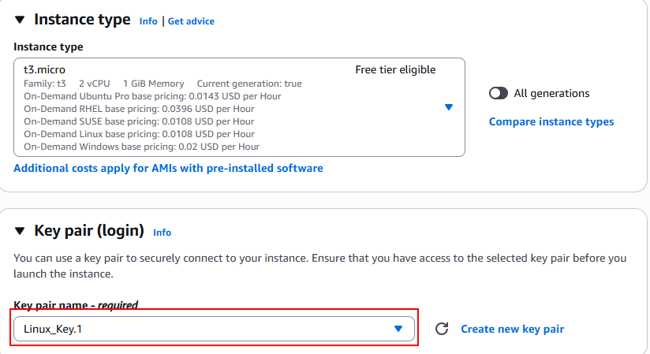

As shown in the image above, I already created a key pair called `Linux_Key.1`. During setup, I made sure to enable a PEM file, which was downloaded to a secure device.

We also created a security group. A security group is like a virtual bouncer for your cloud resources—it decides who gets in and who’s kept out. As shown in the image below, I allowed SSH traffic from anywhere. SSH is a protocol that lets you securely connect to another computer over an unsecured network—like logging into a remote server from your laptop.

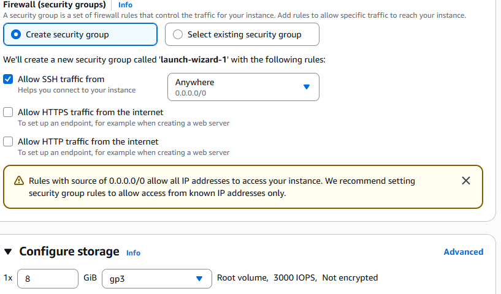

We are now able to launch the instance. Once created, it will look like this:

### Connecting to the Server

Now it's time to access the server we just created in the cloud. You will need a few things set up, depending on your operating system:

1. **A client tool:** A program on your computer that lets you communicate with and send commands to a remote server.

2. **A secure protocol:** A protected path over the internet that ensures the information you send from your computer to a remote server is safe from prying eyes. A popular protocol for this purpose is SSH.

#### Client Tool

For this project, we will use Git Bash as the client tool due to personal preference, although there are many other options such as:

* PuTTY
* MobaXterm
* PowerShell

## Connecting Using SSH

With the terminal open, it's time to connect to the remote server created on AWS. Most client tools already have SSH installed, so you only need to type the `ssh` command in the terminal.

1. Open the terminal.

2. Locate the PEM key that was downloaded when provisioning the cloud server:

    * As mentioned before, I saved the PEM file as `Linux_key.1`, so the key should be `Linux_key.1.pem`. You can verify this by typing the `ls -l` command in Git Bash in the Downloads directory.

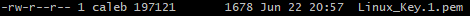

3. Extract the public IP address of the server created on AWS.

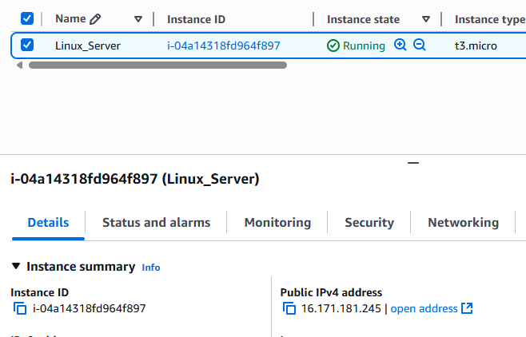

4. Connect to the server using SSH:

~~~
ssh -i "Linux_key.1.pem" ubuntu@public_ip_address
~~~

Once you establish a successful connection, you will see an output like the one below, which proves you have successfully connected to the remote server.

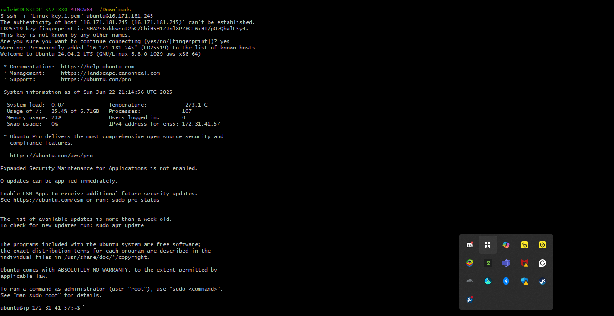
 

## Package Managers

Most of the time, when working on Linux, you will need to install tools. For example, servers are used to host websites, and there must be a tool to help render the web pages. A commonly used tool is called "Nginx."

Since servers are not like regular computers where you can use a browser to click and download, you need package managers to help achieve this.

Package managers in Linux are tools that automate the process of installing, updating, configuring, and removing software packages on a Linux server. They simplify software management by handling dependencies, versioning, and installation procedures. There are several package managers used in various Linux distributions.

#### Commonly Used Package Managers

**APT (Advanced Package Tool):**  
Used by Debian-based distributions such as Debian, Ubuntu, and derivatives. Commands include `apt-get` and `apt`.

**YUM (Yellowdog Updater Modified):**  
Originally used by Red Hat and CentOS, '`YUM`' is now largely replaced by '`dnf`' in mordern Red Hat-based distributions. It simplifies package management by resolving dependencies just like '`apt`'

**DNF (Dandified YUM):**  
Used in modern versions of Red Hat-based distributions as a replacement for YUM. It provides improved performance and resolves some of the limitations of the older YUM tool.

## Installing, Updating and Removing Software

Since we are already on an Ubuntu based server, lets explore how to install tools on a lim=nux server.

1. **Updating Package Lists:** Before installing new software or updating existing packages, it's important to refresh the package lists.

~~~ 
sudo apt update     # For Debian/Ubuntu-based systems
~~~
~~~
sudo yum update     # For Red Hat/Fedora-based systems
~~~
Note: `sudo` provides administration access.

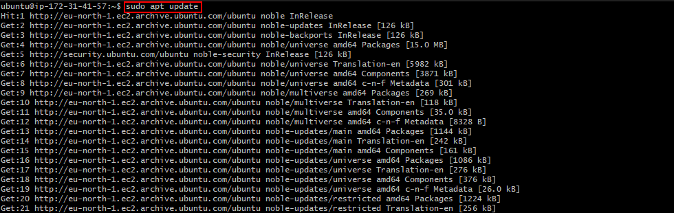

2. **Installing Software Packages:**  
For this  direction we will install a command called `tree`. The `tree` commands is commonly used to visuallly see the file system structure on a linux server. Since this is a ubuntu server we will use the `apt` command

~~~ 
sudo apt install tree
~~~

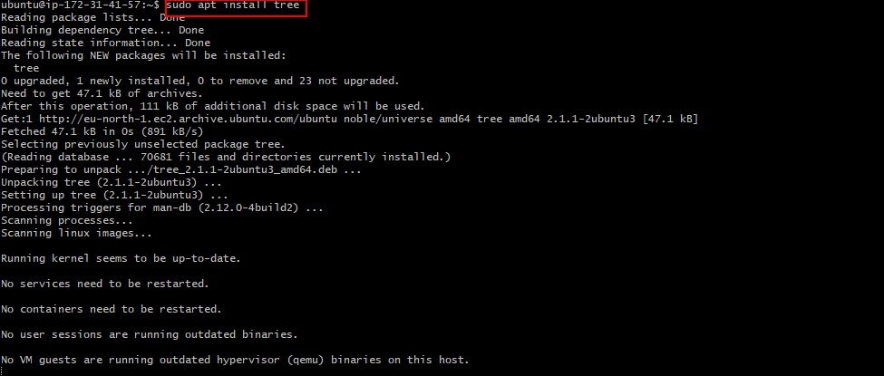

3. **Verifying Installed Packages:** To confirm that the desired package or software has been successfully installed, simply run the `tree` command and specify the path we wanr to see the tree structure

For Example:

~~~
tree ~/Downloads
~~~

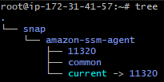

4. **Removing Software Package:** To remove the `tree` package we installed earlier , run the command below

~~~
sudo apt remove tree
~~~

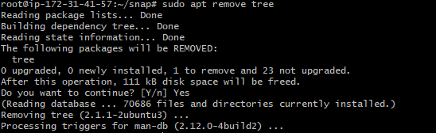

## Additional work

Now we will practice everything again using other tools
 
1. **Install nginx** 
~~~
sudo apt install nginx
~~~

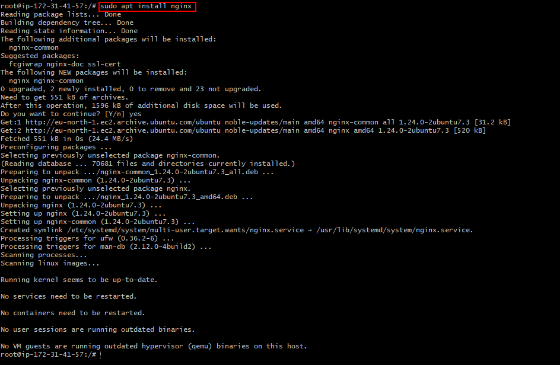

2. **Install htop:** 
`Htop` is an interactive process viewer for Linux—think of it as a more colorful, user-friendly version of the top command. It lets you monitor system resources like CPU, memory, and running processes in real time, and you can even kill processes directly from the interface.

~~~ 
sudo apt install htop
~~~

3. **Verifying Installed Packages:**
~~~ 
htop
~~~

When typing this command it will showcase this interface:

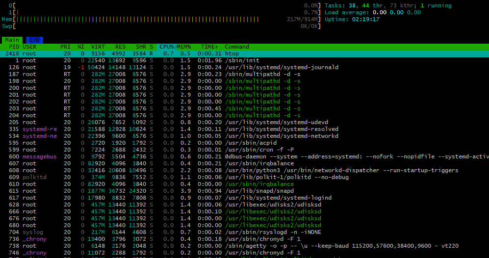

4. **Removing htop package**

~~~
sudo apt remove htop
~~~

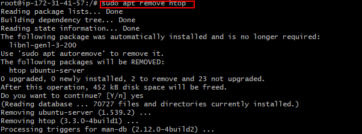

## Conclusion
This concludes the project. You have set up a solid foundation for working with Linux, including installing and managing software, connecting to remote servers, and understanding key Linux concepts. With these fundamentals, you are well-prepared for future projects. As a next step, consider exploring topics such as shell scripting, file permissions, or basic networking commands to deepen your Linux skills.