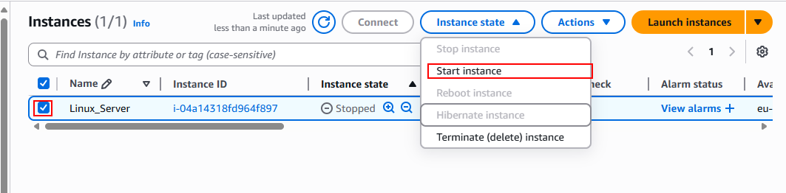

# Basic Linux Commands

## What is a Linux Command

A Linux command refers to a program or utility that runs in the Command-Line Interface (CLI). The CLI is a text-based environment where you interact with the system by typing commands.

Linux commands are executed by entering text in the terminal and pressing `enter`. These commands enable you to perform a wide range of tasks, including installing packages, managing users, manipulating files and directories, configuring system settings, and more.

The general syntax of a command is as follows:

~~~
CommandName [option(s)] [parameter(s)]
~~~

* **CommandName:**  
  This represents the action or task you want to perform using the command.

* **Option or flag:**  
  An option modifies the behavior of a command. It is typically preceded by a hyphen (-) or double hyphen (--) and can be used to customize the command's functionality.

* **Parameter or Argument:**  
  A parameter provides specific information or data required by the command to execute the desired action.

Note: Linux commands are case-sensitive, so enter them exactly as they are spelled and formatted.

## Manipulating files and directories on Linux

Most of the time on Linux, you will be working with files and directories. Hence, it is important to know how to work with them. In this section, we will focus on different commands that cover various use cases for manipulating files and directories on Linux.

### The `sudo` command

In Linux, some actions need special permission to be carried out, like creating files in certain areas or changing important system settings. This is where the `sudo` command comes into play. "sudo" stands for "superuser do", and allows you to run commands with the security privileges of another user, typically the superuser or "root".

#### Why Use sudo?

**Security:** It helps in keeping the system secure by limiting access to powerful commands.

**Tracking:** It logs who executed which command, adding a layer of accountability.

#### How Sudo Works:

When you precede a command with sudo, Linux asks for your password. Once you enter it correctly, you can run commands as if you were the system's superuser for a short period (usually 15 minutes). This means you won't need to enter your password for each sudo command within this timeframe.

#### Creating a Folder with sudo:

Sometimes, you need superuser privileges to create a folder in certain locations on your system. This is how you do it:

1. Open your terminal and connect to your Linux server using SSH.

First, log in to the AWS console and type EC2 in the search bar. On the left-hand side, click 'instance' and you will see the already created instance from the last project.

Using the already created instance, start the instance.

Once the instance is running, use your preferred client tool and connect to the server using SSH.

This is done by using the SSH PEM key and the IP address given by AWS to connect to the server.

2. Try creating a folder in a restricted location. For this project, let's create a folder named 'example' in the '/root' directory, which is reserved for the root user.

~~~
mkdir /root/example
~~~

As seen in the image above, the command was denied with the message:

~~~
mkdir: cannot create directory ‘/root/example’: Permission denied
~~~

This error is due to the regular user not having the necessary permission to create directories in `/root`.

3. Use sudo to successfully create the folder.

~~~
sudo mkdir /root/example
~~~

To verify the folder's creation, use the command:

~~~
sudo ls /root
~~~

Using this command, you should be able to see the 'example' folder in the root directory.

#### pwd command

In this step, we will use the `pwd` command to find the path of your current working directory. Simply entering `pwd` will return the full current path (a path of all the directories that starts with a forward slash).

### The Linux directory structure

After learning about the use of sudo, it is crucial to understand how the Linux filesystem is organized. This knowledge is fundamental when navigating through the system, managing files, and understanding where different types of files and directories reside.

#### The Root Directory ("/")

At the top of the Linux file system hierarchy is the root directory, denoted by a single slash ('/'). Unlike Windows, which uses different drives ('C', 'D', etc.), Linux organizes everything starting from the root directory. Under '/', you'll find various directories with specific purposes:

* **/bin:** Essential user command binaries (programs) that need to be available to all users are stored here.
* **/home:** Personal directories for users.
* **/etc:** Configuration files for the system can be found here.
* **/root:** The home directory for the root user.
* **/var:** Variable data like logs.
* **/usr:** Secondary hierarchy for user data; contains the majority of user utilities and applications.

To navigate through the Linux files and directories, use the `cd` command.

~~~
cd /
~~~

To confirm that you are there, use the `pwd` command to check your location. To list the files and directories in the root filesystem, simply type `ls -l`.

Below is the output:

If you want to navigate to any of the directories in the output, let's say `usr`, then you can use the `cd` command to enter that directory:

~~~
cd /usr
~~~

Notice that `usr` has a `/` prefix. On Linux, navigation starts from the root.

## Side Hustle Task 1

To expand your knowledge of the basic commands, we will complete multiple tasks.

* Create a directory called photos inside the `/usr` directory
* Navigate into the `photos` directory
* Create 3 random directories inside the `photos` directory
* Show the newly created directories on the terminal
* Navigate into one of them
* Show the full path where you currently are on the screen

### Create a directory called photos inside the `/usr` directory

The first thing to do is to make sure you are in the `usr` directory using the `pwd` command

The image above shows that we are in the `/usr ` directory however if not in the usr file make sure you are in the root directory and input 'cd /usr'

To make the directory we will need to input 
~~~
sudo mkdir photos
~~~
To check if the directry has been created use 'ls' to list the directories, there you will see a file named `photos`

### Navigate into the `photos` directory

To enter the directory enter 
~~~
cd photos
~~~
### Create 3 random directories inside the photos directory

There are 2 different ways to make the 3 directories, the first is to make the directories individually. Another way- which is easier- is to make all directories at once. This is how it is done:
~~~ 
sudo mkdir car houses pets
~~~
Using `ls`, we can see that the directories have been created

### Navigate into one of them and show full path 
I will navigate into the pets directory and show the path

To navigate use the `cd` command followed by your chosen directory
after to show the full path use `pwd`

The image below shows the path the pets directory is in:

## Key commands

### ls command

The `ls` command lists files and directories. Running it without a flag or parameter will show the current working directory's content.

To see other directories' content, type `ls` followed by the desired path. For example, to view the contents of the Documents folder, enter:

~~~
ls /home/ubuntu/Documents
~~~

Here are some options you can use with the ls command:
~~~
ls -R  # Lists all the files in the subdirectories
ls -a  # Shows hidden files in addition to the visible ones.
ls -lh # Shows the file sizes in easily readable formats, such as MB, GB, and TB.
~~~

### cat command

`Concatenate`, or `cat`, is one of the most frequently used Linux commands. It lists, combines, and writes file content to the standard output. To run the `cat` command, type `cat` followed by the file name and its extension. For example:

~~~
sudo cat /etc/os-release
~~~

Displays the content of the `os-release` file in the `/etc/` directory.

### cp command

The `cp` command copies files or directories and their content. Take a look at the following use cases.

To copy one file from the current directory to another, enter `cp` followed by the file name and the destination directory. For example:

~~~
cp filename.txt /home/ubuntu/Documents
~~~

This will copy `filename.txt` into the `/home/ubuntu/Documents` directory. If you list the directory, you will find the file copied there.

To copy multiple files to a directory, enter the file names followed by the destination directory:
~~~
cp filename1.txt filename2.txt filename3.txt /home/username/Documents
~~~

To copy the content of a file to a new file in the same directory, enter `cp` followed by the source file and the destination file:
~~~
cp filename1.txt filename2.txt
~~~

To copy an entire directory, pass the -R flag before typing the source directory, followed by the destination directory:
~~~
cp -R /home/username/Documents /home/username/Documents_backup
~~~

### mv command

The primary use of the `mv` command is to move and rename files and directories. Additionally, it doesn't produce an output upon execution.

Simply type `mv` followed by the filename and the destination directory. For example, if you want to move `filename.txt` to the `/home/ubuntu/Documents` directory:
~~~
mv filename.txt /home/ubuntu/Documents
~~~

You can also use the `mv` command to rename a file:
~~~
mv old_filename.txt new_filename.txt
~~~

### rm command

The `rm` command is used to delete files within a directory.

**Caution:** This is a very dangerous command as it deletes the files completely, so it must be used with care.

To remove a single file:
~~~
rm filename
~~~

To remove multiple files, enter the following command:
~~~
rm filename1 filename2 filename3
~~~

Here are some acceptable options you can add:
~~~
-i prompts system confirmation before deleting the file. (Denotes "interactive")
-f allows the system to remove without a confirmation. (Denotes "force")
-r deletes files and directories recursively.
~~~

### touch command

The `touch` command allows you to create an empty file.

For example, enter the following command to create an HTML file named Web in the Documents directory:
~~~
touch /home/ubuntu/Documents/Web.html
~~~

### find command

Use the `find` command to search for files within a specific directory and perform subsequent operations. Here's the general syntax:
~~~
find [option] [path] [expression]
~~~

For example, if you want to look for a file called `notes.txt` within the home directory and its subfolders:
~~~
find /home -name notes.txt
~~~

## Conclusion

By working through these basic Linux commands, you have gained practical experience with essential tools for navigating, managing, and manipulating files and directories in a Linux environment. You now understand how to use commands like `sudo`, `pwd`, `ls`, `cat`, `cp`, `mv`, `rm`, `touch`, and `find` to perform everyday tasks on the command line. Mastering these fundamentals is a crucial step for anyone pursuing a career in DevOps, system administration, or software development. As a next step, consider exploring more advanced topics such as shell scripting, file permissions, process management, and networking commands to further enhance your Linux skills.