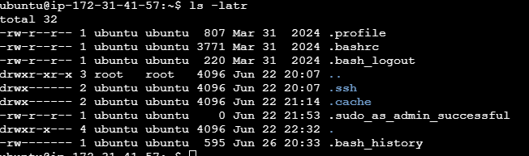
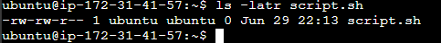
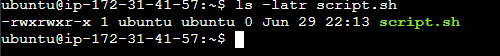
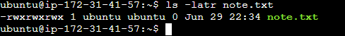
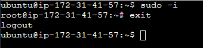

# Advanced Linux Commands

## Introduction

This guide covers advanced Linux commands and concepts, focusing on file permissions, ownership, and other essential administrative tasks. Mastering these topics is crucial for anyone aiming to manage Linux systems securely and efficiently.

---

## File Permissions and Access Rights

In Linux, managing file permissions and ownership is vital for controlling who can access, modify, or execute files and directories. Understanding these concepts allows you to maintain the security and integrity of your system.

### Numeric Representation and Permissions

In Linux, permissions are represented using numeric values. Each permission (**no permission, read, write, and execute**) is assigned a numeric value:

- **r** (read): Permission to view the contents. The numeric value is **4**
- **w** (write): Permission to modify the contents. The numeric value is **2**
- **x** (execute): Permission to run the file as a program or script. The numeric value is **1**
- **-** (no permission): Permission is not given. The numeric value is **0**

These values are combined to represent the permissions for each user class. Let's consider a few examples:

- **Permissions Represented by 7**
    - 4 (read) + 2 (write) + 1 (execute) = 7
    - Symbolic: rwx
    - Meaning: Read, write, and execute permissions are all granted.
    - Example Context: A script file that the owner needs to read, modify, and execute.
    - Note: It is not recommended to give 'rwx' permissions to group or others on Linux files or directories. This can lead to security risks, such as unauthorized changes or execution of files.

- **Permission Represented by 5**
    - 4 (read) + 1 (execute) = 5
    - Symbolic: r-x
    - Meaning: Read and execute permissions are granted, but write permission is not.
    - Example Context: A shared library or command tool that users can execute and read but not modify.

- **Permissions Represented by 6**
    - 4 (read) + 2 (write) = 6
    - Symbolic: rw-
    - Meaning: Read and write permissions are granted, but execute permission is not.
    - Example Context: A document or a configuration file that the owner needs to read and modify but not execute.

### Understanding User Classes from a Permission Perspective

It is important to understand the concept of 'user classes' in the context of Linux permissions. Think of user classes as categories of users that Linux recognizes when deciding who can do what with a file. There are three main classes:

- **Owner**: The user who owns the file. Often referred to as 'user'.
- **Group**: Users who are part of the file's group. They share certain permissions for the file.
- **Others**: All other users.

#### The Role of Hyphen (-) in Permission Representation

When discussing permissions, you might notice hyphens (-) being mentioned. In the context of Linux file permissions, a hyphen doesn't actually represent a user class. Instead, it's used in the symbolic representation of permissions to show the absence of permissions.

Run `ls -latr`

The order the user class is represented is as follows:
- The first set (after the file type) is the **user**.
- The second set is the **group**.
- The third set is **others**.

---

## File Permission Commands

To manage file permissions and ownership, Linux provides several commands:

### chmod command

The `chmod` command allows you to modify file permissions. You can use both symbolic and numeric representations to assign permissions to the user, group, and others.

Let's see an example.

Create an empty file using the `touch` command:
~~~
touch script.sh
~~~

Check the permission of the file:

This means the owner has the read and write permissions, the group has the read and write permissions, and others have only the read permissions.

Now let's update the permission so that all the user classes will have execute permissions:

~~~
chmod +x script.sh
~~~

The above command uses the chmod command with the `+x` option to grant execute permissions to the file `script.sh`. The `+x` option adds the execute permission to the existing permissions for all the user classes.

Now let's check what the file permissions look like:

This gives the execute permission to all roles.

The same can be achieved using the numeric approach:

~~~ 
chmod 755 script.sh
~~~

To add execute to all (user, group, others) you would add 1 to each of the three categories, resulting in 755:

- (4+2+1) = 7 for the user (read, write, and execute)
- (4+1) = 5 for the group (read and execute)
- (4+1) = 5 for others (read and execute)

Another example: Imagine the owner of a file is currently the only one with full permissions to `note.txt`:

~~~
touch note.txt
~~~

To allow group members and others to read, write, and execute the file, change it to the -rwxrwxrwx permission type, whose numeric value is 777:

~~~
chmod 777 note.txt
~~~

Check the output:

**Note**: The first dash (-) represents the file type and not a user class. It indicates that the entry is a regular file.

### chown command

The `chown` command allows you to change the ownership of files, directories, or symbolic links to a specified username or group.

Here's the basic format:

~~~
chown [option] owner[:group] file(s)
~~~

For example, let's assume there is a user on the server called **john**, a group on the server called **developers**, and you want the owner of **filename.txt** changed from **ubuntu** to **john**, and to also ensure that any user in the developer group has ownership of the file as well:

The command would look like this:
~~~
chown john:developers filename.txt
~~~

If either john isn't a valid user or developers isn't a valid group, you'll get an "invalid user" error.

## Superuser Privileges

It is often necessary to become the superuser to perform important tasks in Linux, but as we know, we should not stay logged in as the superuser. In most Linux distributions, there is a command that can give you temporary access to superuser privileges. This program is called sudo (short for superuser do) and can be used in those cases when you need to be the superuser for a small number of tasks. To use superuser privileges, simply type `sudo` before the command you will be invoking.

To switch to the root user, simply run:
~~~
sudo -i
~~~

You can type `exit` to leave the shell.

## User Management on Linux

As a DevOps engineer, you are also going to be doing systems administration, which involves managing different users on the servers. You should know how to create a new user or group, modify their permissions, update passwords, and perform similar tasks.

### Create a User

In Linux, you can create a new user account using the `useradd` or `adduser` command. The `useradd` command is a low-level utility that allows you to specify various options such as the user's home directory, shell, and group memberships. For example, running `sudo useradd username` will create a new user named "username." The `adduser` command is a more user-friendly, interactive script that prompts you for additional information like password and user details. Creating users is essential for managing access and ensuring each person has their own environment and permissions on the system.

### Granting Administrative Privileges

To grant a user administrative privileges, you typically add them to the `sudo` group. Members of this group can execute commands with superuser (root) privileges by prefixing commands with `sudo`. For example, `sudo usermod -aG sudo username` adds the user "username" to the sudo group, allowing them to perform administrative tasks securely without logging in as the root user.

### Switching User Accounts

The `su` (substitute user) command allows you to switch from your current user account to another user account within the terminal session. For example, `su username` will prompt you for the target user's password and then switch to that account. Alternatively, you can use `sudo su - username` to switch users with elevated privileges, or simply `sudo -i` to become the root user.

### Changing User Password

To change a user's password in Linux, use the `passwd` command. For your own account, simply type `passwd` and follow the prompts. To change another user's password, a superuser can run `sudo passwd username`, then enter and confirm the new password. This command is essential for maintaining account security and updating credentials as needed.

### Creating a Group

Groups in Linux are used to manage permissions for multiple users collectively. You can create a new group using the `groupadd` command. For example, `sudo groupadd groupname` creates a group called "groupname." Organizing users into groups simplifies permission management for shared resources and collaborative tasks.

### Adding Users to the Group

To add a user to a group, use the `usermod` command with the `-aG` option. For example, `sudo usermod -aG groupname username` adds the user "username" to the group "groupname." This allows the user to inherit the permissions associated with that group, enabling access to shared files or directories.

### Verifying Group Memberships

You can verify a user's group memberships using the `groups` command. Typing `groups username` will list all the groups that the specified user belongs to. This is useful for confirming that users have the correct permissions and access rights within the system.

### Deleting a User

To remove a user account from the system, use the `userdel` command. For example, `sudo userdel username` deletes the user "username." To also remove the user's home directory and files, use `sudo userdel -r username`. Deleting unused or unauthorized accounts is important for maintaining system security.

### Ensuring Proper Group Permissions

Proper group permissions are managed using the `chgrp` and `chmod` commands. The `chgrp` command changes the group ownership of a file or directory, while `chmod` sets the access permissions. For example, `sudo chgrp groupname filename` assigns group ownership, and `chmod 770 filename` ensures that only the owner and group members have full access. Regularly reviewing and updating group permissions helps maintain a secure and organized system.
