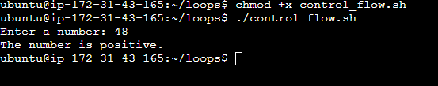
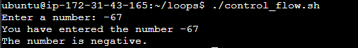

# Linux Shell Scripting (Control Flow)

## Introduction
Control flow statements are the backbone of making decisions in programming. In scripting, these statements let your scripts decide what to do or how to proceed based on conditions, loops, or user inputs.

Bash and other shell interpreters provide control flow statements like
- **if-else**
- **for** loops
- **while** loops and
- **case** statements to control the flow of execution in your scripts.

This project will focus on the **if-else** and **for** loops.

## What is Control Flow?
In simple terms, control flow directs the order in which commands or instructions are executed in the script. It's like a roadmap that decides which path to take based on certain conditions or how many times to visit a place.

Let's examine an **if-else** statement in Bash to understand how it makes decisions based on user input.

### The Task

The main script this project will cover asks for a number and then tells us if that number is positive, negative, or zero.

1. Create a file and name it **control_flow.sh**
~~~
vim control_flow.sh
~~~
2. Input this script.
~~~
#!/bin/bash

read -p "Enter a number: " num

if [ $num -gt 0 ]; then
    echo "The number is positive."
elif [ $num -lt 0 ]; then
    echo "The number is negative."
else
    echo "The number is zero"
fi
~~~
#### The Script Breakdown
- **#!/bin/bash**: This line is the shebang; it tells the system this script should be run with the **Bash** interpreter.
- **read -p "Enter a number:"**: This command asks you, the user, to enter a number. The **-p** option allows us to display a prompt message on the screen when you execute the script.

3. Execute the script  
It is important to allow the user the ability to execute the file:
~~~
chmod u+x control_flow.sh
~~~
This allows the user to input this command:
~~~
./control_flow.sh
~~~

Allowing the ability to execute the file  

Notice that when you execute the script, it just asks you to **Enter a number:**. Even when you type a number and hit enter, it takes the number, but you cannot visibly see what it does with the number. That is because the **read** command in the script has its own way of taking inputs from the user and storing the value into a variable passed to the **read** command.

The **read** command is used to capture input and store it in a variable. When you use **read** followed by a variable name (in the case of our script, num), Bash waits for the user to enter something into the command line (stdin). Once the user presses enter, **read** assigns the input to the variable.

Now let's make the script make more sense by updating the code below and executing it:
~~~
#!/bin/bash
read -p "Enter a number: " num
echo "You have entered the number $num"
~~~

This is the new execution

Notice how we have now used **echo** to return back to the screen (**stdout**) the value stored in the `$num` variable.

Since we now have something stored in the `$num` variable, we can use control flow to determine what the script executes next.

## if statement
The if statement in Bash scripts allows you to execute commands based on conditions. The basic syntax is:
~~~
if [ condition ]; then
    commands
fi
~~~
    
- **if**: This keyword starts the conditional statement.
- **[ condition ]**: The condition to evaluate. Brackets [] are used to enclose the condition being tested.
- **then**: If the condition is true, execute the commands that follow this keyword.
- **fi**: Ends the if statement. It's basically **if** spelled backward, indicating the conclusion of the conditional block.

Now let's bring it into our code.
~~~
if [ $num -gt 0 ]; then
  echo "The number is positive."
fi
~~~

The part above tests if the value in $num is greater than 0, then most likely you have entered a positive number. Now update your code to the below.

~~~
#!/bin/bash
read -p "Enter a number: " num
echo "You have entered the number $num"
if [ $num -gt 0 ]; then
  echo "The number is positive."
fi
~~~

Notice the keyword -gt in the condition. These are called operators that are used within the condition block to perform numeric comparisons between values. Run the code and experience the output. Tip: Always read your shell script line by line to get a sense of what it is doing.

### elif statement
After understanding the if statement, we move on to the elif part of control flow in Bash scripts. elif stands for “else if,” allowing you to test additional conditions if the previous if conditions were not met. It helps you add more layers of decision-making to your script.
The basic syntax for using elif is as follows:

~~~
if [ condition1 ]; then
  commands1
elif [ condition2 ]; then
  commands2
fi
~~~

- **elif**: This keyword is used right after an if or another elif block.

- **[ condition2 ]**: The new condition you want to evaluate.

- **then**: If the elif condition is true, execute the commands that follow this keyword.

Now, let's apply elif to our script to handle a scenario where the entered number might be negative:

~~~
#!/bin/bash
read -p "Enter a number: " num
echo "You have entered the number $num"
if [ $num -gt 0 ]; then
  echo "The number is positive."
elif [ $num -lt 0 ]; then
  echo "The number is negative."
fi
~~~

**In this updated version:**

* The if [ $num -gt 0 ]; then part checks if num is greater than 0 and prints "The number is positive." if true.

* If the first condition isn't met (i.e., the number is not greater than 0), the elif [ $num -lt 0 ]; then checks if num is less than 0. If this condition is true, it prints "The number is negative."

*This way, the script can differentiate between positive and negative numbers, providing specific feedback based on the value of num.

### Loops

Moving forward in our journey through Bash scripting, we encounter loops. Loops are fundamental constructs that allow us to repeat a set of commands multiple times. 

Loops empower us to automate and repeat tasks without writing the same code over and over again. Loops streamline this process by allowing you to write a single set of instructions that can be executed as many times as needed, making your script both cleaner and more powerful.

Some real-world scenarios where loops are inevitable are:

**Batch Processing:** Suppose you have a folder full of photos you want to resize or edit in some way. Instead of editing each photo individually, a loop can automate this task, applying the same code to each photo in the folder.

**Data Analysis:** If you're analyzing data, you might need to perform the same calculations on numerous data sets. A loop can iterate through each data set, apply the same code to do calculations, and collect the results.

**Automated Testing:** In software development, loops are invaluable for running through numerous test cases. You can use a loop to automatically test different inputs for your program and verify that it behaves as expected using the same code.

In Bash scripting, there are three primary types of loops that are commonly used to repeat a set of commands multiple times based on certain conditions: 
1. For,
2. While, 
3. Until.

The next stage will go through some examples.

### For Loop
The for loop is used to iterate over a list of values or a range of numbers. It is particularly useful when you know in advance how many times you need to execute the loop body. The for loop has two main forms:

1. List Form: Iterates over a list of items:

~~~
for item in item1 item2 item3; do
  echo $item
done

~~~
-    **for**: This keyword initiates the loop, signaling the start of a block of code that will repeat.

-   **item**: This is a variable that temporarily holds the value of each item in the list as the loop iterates.

-   **in:** The in keyword is followed by a list of items that the loop will iterate over.

-  **;**: A semicolon is used here to separate the list from the do keyword that follows.

-   **do**: This keyword precedes the block of commands that will be executed for each item in the list.

-   **done**: This keyword marks the end of the loop. It signifies that all commands in the loop have been executed for each item in the list, and the loop is complete.

Example:

~~~
#!/bin/bash
for i in 1 2 3 4 5
do
  echo "Hello, World! This is message $i"
done
~~~

Or using brace expansions:
~~~
for i in {1..5}; do
  echo "Counting... $i"
done
~~~

C-style Form: This style allows you to specify an initializer, condition, and increment/decrement expression.

~~~
for (( i=0; i<5; i++ )); do
  echo "Number $i"
done
~~~

(( i=0; i<5; i++ )): Initialization, condition, and increment enclosed in double parentheses.

## Practical examples

### List Form: Archive Log File

Suppose you want to compress all .log files in /var/logs/app:
~~~
#!/bin/bash
# archive_logs.sh
# Compress all .log files in /var/logs/app

for logfile in /var/logs/app/*.log; do
  gzip "$logfile"
  echo "Archived $logfile"
done
~~~

To set the execute permission for the script:
~~~
chmod u+x archive_logs.sh
~~~

Now we can execute the script:
~~~
./archive_logs.sh
~~~

### Brace Expansion: Check Status of Multiple Services

Suppose you want to check the status of several services:

First, make a file called check_services.sh using:
~~~
vim check_services.sh
~~~

Input this code into the file:
~~~

#!/bin/bash
# check_services.sh
# Check the status of nginx, docker, and ssh services

for service in nginx docker ssh; do
  systemctl status $service --no-pager
  echo "Checked status for $service"
done
~~~

Allow execute permission:
~~~
chmod u+x check_services.sh
~~~

Then execute the script:
~~~
./check_services.sh
~~~

### C-Style: Create Multiple User Accounts

Suppose you want to create 5 users named devuser1 to devuser5:

First, create a shell file called create_users.sh:
~~~
vim create_users.sh
~~~

Input this script into the file:
~~~
#!/bin/bash
# create_users.sh
# Create 5 user accounts: devuser1 to devuser5

for (( i=1; i<=5; i++ )); do
  sudo useradd "devuser$i"
  echo "Created user devuser$i"
done
~~~

Allow execute permission:
~~~
chmod u+x create_users.sh
~~~

Then execute the script:
~~~
./create_users.sh
~~~

### How to evaluate the scripts

- Check that log files are compressed in /var/logs/app.
- Confirm service statuses are displayed.
- Verify new users exist with id devuser1, id devuser2, etc.

These examples show how for loops can automate repetitive DevOps tasks, saving time and reducing manual errors.