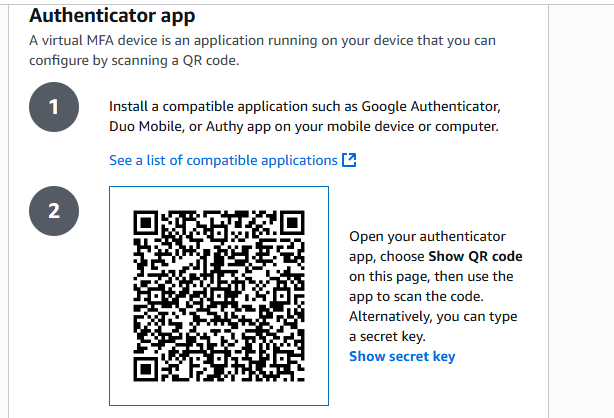

# Introduction to Cloud Computing - Security & Identity Management (IAM)

# AWS IAM Project: Zappy e-Bank

## Project Overview

This mini project explores the foundations of **Amazon Web Services (AWS) Identity and Access Management (IAM)** through the lens of a fintech startup—**Zappy e-Bank**. It simulates how real-world organizations establish secure, scalable, and role-specific access to cloud resources.

> Skill Focus: IAM fundamentals, roles, users, policies, and best practices

---

## Introduction to Cloud Computing

Before diving into IAM, it's essential to understand cloud computing at a high level:

- Cloud computing delivers services like **servers, storage, databases, and networking** over the internet.
- It powers innovation, scalability, and cost-efficiency for businesses across industries.

Zappy e-Bank aims to harness the cloud's potential to build a robust and secure financial platform.

---

## Importance of IAM for Zappy e-Bank

For a fintech startup, security and compliance are non-negotiable. The company must ensure that it's data, including sensitive customer informationm is securely managed and that access to resources is tightly controled. IAM enables:

- **Secure User Access:** Create and manage AWS users and groups
- **Granular Permissions:** Set fine-grained policies using roles
- **Enhanced Security:** Implement multi-factor authentication (MFA)

Through this project, you'll gain hands-on experience applying IAM concepts in a realistic cloud environment.

---

## Project Goals and Learning Outcomes

By completing this project, you will:

- Understand IAM components: users, groups, roles, and policies
- Learn how to manage access via the AWS Management Console
- Apply security best practices for cloud infrastructure
- Appreciate the impact of access control on compliance and data integrity

---

## Project Setup

1. **Log in to the AWS Management Console**
   - Use your administrator account.

2. **Navigate to the IAM Dashboard**
   - Manage users, groups, roles, and policies.

---
## Exercise
### Creating IAM Users
An IAM user is a unique identity within an AWS account that represents a person or service, granting specific permissions to access and interact with AWS resources under controlled and customisable security policies.

Imagine that you have a big secure building __(AWS account)__ that you own and control. When you first get the keys to this building, you're given a master key **(root user)** that can open every door, access every floor, and make changes to the building's structure itself.

This masterkey is powerful, allowing you to do anything from adding new rooms (services) to changing the locks (security settings). However, because this key can do so much, it's also very risky to use it for daily tasks- like if you lost it, someone could do anything they want with your building.

Now, imagine you have specific tasks that need to be done in the building, like cleaning, maintenance, or security checks. You would not give out the master key to every person who needs to do those jobs. Instead, you create specific keys (IAM users) that can only open certain doors to access certain floors. These keys are less powerfol but much safer to use for everyday tasks. They ensure that the people holding them can only access the parts of the building they need to do their jobs and nothing more.

Let's set up IAM users for a backend developer, **John** and a data analyst, **Mary**, by first determining their specific access needs.

As a backend developer, John requires access to servers **(EC2)** to run his code, necessitating an IAM user with policies granting EC2 access.

As a data analyst, Mary needs access to data storage **(AWS S3 service)**, so her IAM user should have policies enabling S3 access

Considering **Zappy e-Bank's** plan ot expand its team with 10 more developers and 5 additional data analyst in the coming months, it's inefficient to individually create similar policies for each new member. A more streamlined approach involves:

1. Crafting a single policy tailored to each role access requirements.

2. Associating this policy with a group specifically designed for that role.

3. Adding all engineers and analysts to their respective groups, simplifying the management of permissions and ensuring consistent access across the team.

### Creating policy for the Development team
1. In the IAM console, click on policies.

2. Click on create policy

3. In the select a service selection, search for ec2

4. For simplicity sake, select the **<u>All EC2 actions</u>** checkbox.

5. Also, make sure to select **"All"** in the resources section

6. Click Next

7. Provide the name **developers** and description for the policy.

8. Click on **Create Policy**

> Notice that after creating the policy, if you search for "developer" in the search box, you will notice that a number of policies are returned. This highlights the presence of both AWS managed and customer managed policies. AWS managed policies are predefined by AWS and provide permissions for many common use cases, allowing for quick and broad access management across AWS services without the need for custom policy creation like we just did. In contrast, customer managed policies are created and fully controlled by you, allowing for more tailored, specific access controls that can be finely tuned to your organization's requirements.

### Create policy for the Data Analyst team

Repeat the process above for the Data Analysts team, but instead of **EC2**, search for **S3**. Also name the policy **analyst**, instead of **developers**. You can give it any description of your choice.

### Create Group for the Development team

1. In the IAM console navigation, select **User group** and in the top right click **Create group**

2. Provide a name for the group.

3. Attach the developer policy we created earier to the group. This will allow any user in the **Development-Team** group to have access to EC2 instances alone.

4. You have successfully created a group and attached to a permission policy for any user added to the group to have access to the EC2 instance only. Recall that users in this group will be backend developers only

### Create Group for the Data Analyst team

Repeat the process above for the Data Analyst team.

1. The group name should be Analyst-Team

2. Instead of attaching developers policy, attach analyst policy.

> Recall that you only allowed S3 access for this policy. So any user in this group will have access to S3 access to S3 Services. In our case, our users will be the data analysts.

### Creating IAM User for John

Let's recall that John is a backend developer, therefore he needs to be added as a user to the **Developer-Team** group.

1. Navigation to the IAM dashboard, select 'Users' and then click 'Create User'

2. Provide a name of the User. and ensurethat the user can access the AWS Management Console

3. Add John to the development team group

4. Click on Create User

5. Download the login credentials for John

### IAM Configuration for Mary – Data Analyst

#### Task: Create IAM User

1. **Go to IAM Console**
   - Navigate: AWS Console → IAM → Users → Create User

   

2. **Create User: Mary**
   - Username: `Mary`
   - Console Access: Enabled

   

3. **Assign Group**
   - Add Mary to group: `Analyst-Team`
   - Permissions: Group should have `analyst` policy (S3 access only)

   

4. **Save Credentials**
   - Download or securely store login credentials for Mary
   
   
---

### Testing and Validation – IAM User Setup

#### Testing John's Access

- **Login as John**: Use the credentials provided to John to log into the AWS Management Console. This simulates John's user experience and ensures he has the correct access.

- **Access EC2 Dashboard**: Navigate to the EC2 dashboard within the AWS Management Console. John should be able to view, launch, and manage EC2 instances as his role requires access to servers for deploying and managing backend applications.

- **Perform EC2 Actions**: Attempt to create a new EC2 instance or modify an existing one to confirm that John has the necessary permissions. If John can successfully perform these actions, it indicates his IAM user has been correctly set up with the appropriate policies for a backend developer.

#### Testing Mary's Access

- **Login as Mary**: Use the credentials provided to Mary to log into the AWS Management Console. This ensures that Mary's user experience is as expected and that she has the correct access.

- **Access S3 Dashboard**: Navigate to the S3 dashboard within the AWS Management Console. Mary should be able to view, create, and manage S3 buckets as her role requires access to data storage for analyzing and managing data.

- **Perform S3 Actions**: Try to create a new S3 bucket or upload data to an existing bucket to verify that Mary has the necessary permissions. Successful execution of these tasks will confirm that Mary's IAM user has been properly set up with the appropriate policies for a data analyst.

### Validating Group Policies

For both users, ensure that their access is confined to their role-specific resources (EC2 for John and S3 for Mary) and that they cannot access other AWS services beyond what their group policies permit. This validation ensures adherence to the principle of least privilege, enhancing security by limiting access to only what is necessary for each user's role.

### Implement Multi-Factor Authentication (MFA)

Multi-Factor Authentication (MFA) is a security feature that adds an extra layer of protection to your AWS account and resources. With MFA enabled, users must provide two or more forms of authentication before accessing AWS services.

John, the backend developer, logs into the AWS Management Console to access EC2 instances for deploying and testing his code. To enhance security, Zappy e-Bank requires John to use MFA alongside his regular username and password.

When John attempts to log in, after entering his credentials, AWS prompts him for a one-time code generated by an MFA device.

---

#### Setting Up MFA for John

1. Navigate to **IAM Console → Users**, then click on **John** 

2. Click **Enable MFA**

3. Enter a device name (e.g., `John-MFA`) and select **Authenticator App**

4. Install an authenticator app like **Google Authenticator** or **Microsoft Authenticator** if it's not already on your device

5. Click **Next**

6. Open the authenticator app and **scan the QR Code**

7. Enter **two consecutive codes** shown in the app

8. Click **Assign MFA**

MFA is now enabled for John ✅

---

## 🛠️ Setting Up MFA for Mary

Repeat the exact steps listed for John, but this time for **Mary**, the data analyst.

---

## Summary: IAM & The Principle of Least Privilege

This project demonstrates how to securely manage user access in AWS using Identity and Access Management (IAM). By creating specific policies and user groups for backend developers and data analysts, each user receives only the permissions necessary for their role—developers can access EC2, analysts can access S3, and no one has unnecessary access to other services.

This approach follows the **principle of least privilege**, which means granting users the minimum level of access required to perform their tasks. Applying this principle reduces security risks, prevents accidental changes, and protects sensitive data by ensuring users cannot access resources beyond their responsibilities.

> **Tip:** Always review and update IAM policies regularly to maintain least privilege and adapt to changing team roles.

---

