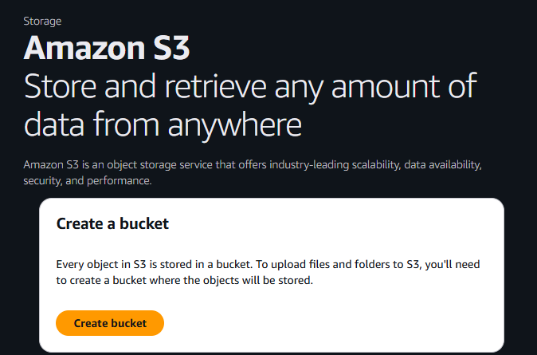
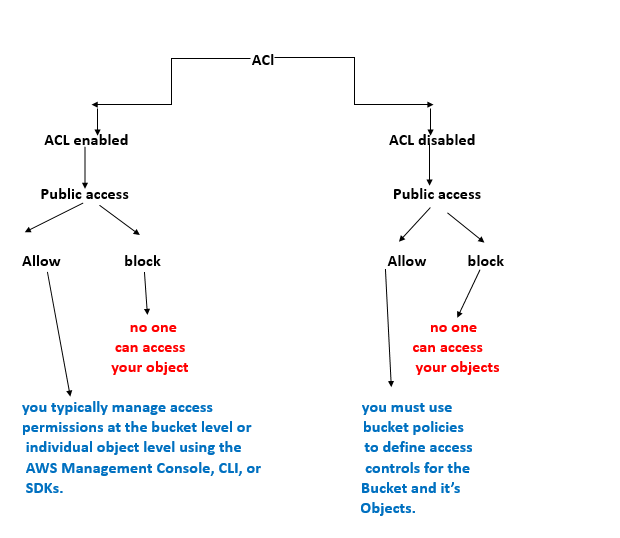

# AWS S3 Mini Project 

During this mini-project, we'll explore Amazon S3 (Specific Storage Service), a vital component of Amazon Web Services(AWS) for stroing and accessing data. 

## Project Goals

Learn and apply key Amazon S3 concepts:
- Buckets, objects, versioning, permissions
- Uploading and managing files
- Implementing lifecycle policies

## Learning Outcomes

By the end of this session, you'll be able to:
- Create and configure S3 buckets via AWS Console
- Upload and manage files in S3
- Enable versioning to preserve changes
- Set public permissions through policies
- Automate cleanup with lifecycle rules

---

##  What Is Amazon S3?

Amazon S3 (Simple Storage Service) is a cloud-based file storage system—think of it as a virtual filing cabinet. You can store files, videos, documents, images, and retrieve them securely from anywhere.

### S3 Benefits
- High durability & availability
- Scalable storage for any size
- Secure access controls
- Pay-as-you-go pricing
- Global accessibility

---

## S3 Use Cases

- **Backup**: Keep secure copies of important data for recovery in case of loss or corruption.
- **Website Hosting**: Store and serve static website assets like images, videos, and HTML files.
- **App & Game Storage**: Save user-generated content, game levels, or profile data for apps and games.
- **Big Data & Analytics**: Store large datasets for processing and analysis using AWS analytics tools.
- **Disaster Recovery**: Maintain offsite copies of critical data to quickly restore operations after an incident.
- **Archiving & Retention**: Preserve data long-term for compliance or historical reference at a lower cost.
- **Fast Content Delivery with CloudFront**: Distribute content globally with low latency by integrating S3 with Amazon CloudFront.

---

## Core Concepts

| Concept           | Description |
|------------------|-------------|
| Buckets          | Like folders; contain objects |
| Objects          | Files like photos, videos, etc. |
| Keys             | Unique file identifiers |
| Storage Classes  | Pricing tiers for access/durability |
| Access Control   | ACLs, Bucket Policies, IAM |
| Versioning       | Preserve every file change |
| Lifecycle Policies | Automate transitions or deletions |

---

## Step-by-Step Instructions

### Create S3 Bucket
- Go to AWS Console → Search “S3” → Create Bucket



- Provide a unique name


> Bucket names must be 3 to 63 characters and unique within the global namespace. Bucket names must also begin and end with a letter or number. Valid characters are a-z, 0-9, periods (.), and hyphens (-)

- ACL: Disabled  
- Block Public Access: Enabled  
- Bucket Versioning: Disabled  
- Leave other settings default → Click “Create”


> ACL, or Access Control List, is like a set of rules that decides who can access your stuff in S£, You can use ACL to grant or deny access to your buckets and files for specific AWS accounts or predefined groups of users. It's a way to control who gets to see or mess with your data in the cloud  



###  Upload Object
- Create a local file: `Welcome to the AWS world`

- Click "Upload" → Add file → Click “Upload”


### Enable Versioning
- Bucket → Properties → Versioning → Enable → Save


- Re-upload the file after changes → Click "Show versions" to verify


Now whenever I make changes to the file and upload it again to the same bucket, it will continue creating versions of that files for future references

### Set Public Access
- Permissions → Edit → Uncheck “Block all public access”


- Confirm with “confirm” → Save

### Create Bucket Policy
- Permissions → Edit Bucket Policy → Use Policy Generator
 In the policy generator we will select Type of Policy as S3 Bucket

 

 Set the "Effect" to "Allow"

Specify the Principal as "*", which means all users

Choose the action "Get object" and "Get object version"

In the field of Amazon Resource Name (ARN), type the ARN of the bucket and add by "/." after the ARN. Then, Click on "Add Statement"

**So Actual ARN is -**
arn:aws:s3:::pract1ce-bucket45  

**And we need to add**
arn:aws:s3:::pract1ce-bucket45/*


Now we can generate the policy


#### Policy JSON:
```json
{
  "Version": "2012-10-17",
  "Statement": [
    {
      "Sid": "Statement1",
      "Effect": "Allow",
      "Principal": "*",
      "Action": [
        "s3:GetObject",
        "s3:GetObjectVersion"
      ],
      "Resource": "arn:aws:s3:::pract1ce-bucket45/*"
    }
  ]
}
```

Explanation
**Version**:
Specifies the policy language version. "2012-10-17" is the current version and should be used for all new policies.

**Statement**:
An array of individual policy statements. Each statement defines a set of permissions.

**Sid**:
(Statement ID) An optional identifier for the statement. "Statement1" is just a label for reference.

**Effect**:
Specifies whether the statement allows or denies access. "Allow" means the actions listed are permitted.

**Principal**:
Defines who the policy applies to. "*" means it applies to everyone (all users, including anonymous/public access).

**Action**:
Lists the actions that are allowed or denied.

"s3:GetObject": Allows users to retrieve objects from the bucket.
"s3:GetObjectVersion": Allows users to retrieve specific versions of objects.
Resource:
Specifies the bucket and objects the policy applies to.

"arn:aws:s3:::pract1ce-bucket45/*": Applies to all objects within the pract1ce-bucket45 bucket.

### Paste the generated policy


Save the changes

### Checking if we can get access to the bucket


Click on the bucket highlighted


Click on the URL


This is the previous data

If we click on the latest version


Then the URL


T
This is the latest bucket

## Lifecycle Policies

1. Navigate to the management section of the bucket

 - Click on Create lifecycle rule

 

2. Give the specifications, and click create rule.


Now the lifecycle policy is being created successfully


Lifecycle policies in Amazon S3 are automated rules that help manage the storage and retention of objects within a bucket over time. By setting up lifecycle policies, you can automatically transition objects to different storage classes (such as moving infrequently accessed data to S3 Glacier for cost savings) or delete objects after a specified period, reducing manual intervention and optimizing storage costs. These policies are especially useful for managing backups, archives, and data that only needs to be retained for a certain duration, ensuring your S3 buckets remain organized and cost-effective as your data grows.

## Summary

This AWS S3 mini project guides you through the essential features and management tasks of Amazon S3, including bucket creation, file uploads, versioning, public access configuration, bucket policies, and lifecycle rules. By following the step-by-step instructions, you learn how to securely store and manage data, control access, and automate data retention and transitions to optimize costs. The project demonstrates practical use cases such as backups, website hosting, and archiving, while emphasizing best practices for security and efficiency. Overall, it provides a hands-on foundation for leveraging S3 in real-world cloud and DevOps scenarios.
