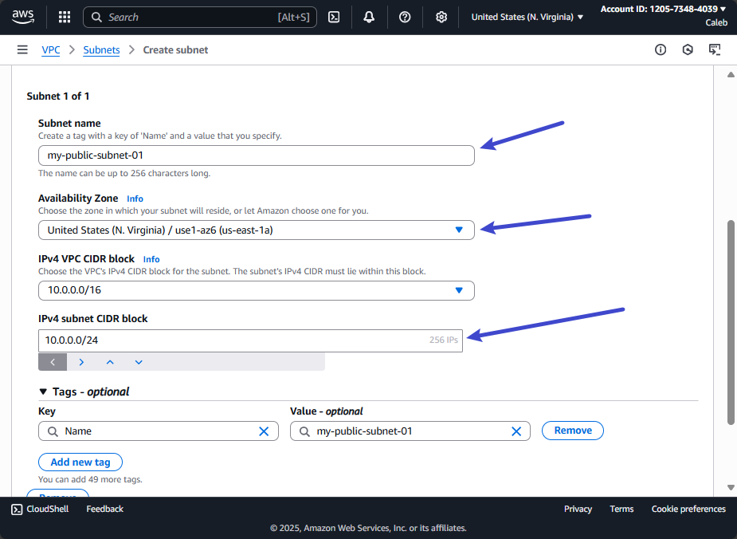
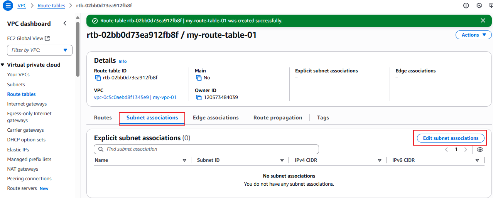

# Network Mastery with AWS VPC mini project

In this project, we will explore the core concepts of Amazon Web Services (AWS), focusing specifically on Virtual Private Clouds (VPCs). Our objective is to understand the fundamental components of VPC infrastructure including subnets, gateways, and routing tables. Through practical demonstrations and interactive exercises, we'll navigate the AWS management console to deploy and manage these critical components effectively.

Before we proceed with setting up VPCs, it's essential to ensure a solid understanding of cloud networking basics. 

### Project Goals: 

- Understand the fundamentals of Virtual Private Cloud (VPC) and its components.

- Gain hands-on experience in setting up and configuring VPC, subnets, internet gateway, NAT gateway, and VPC peering connections.

- Learn how to enable internet connectivity securely within a VPC.

- Implement outbound internet access through the NAT gateway

- Establish direct communication between VPCs using VPC peering.

### Learning Outcomes:

- Acquired knowledge about VPC and its essential components, such as subnets, gateways, and route tables.

- Developed skills in creating and configuring VPC resources using AWS management consoles.

- Learn how to set up routing tables to enable internet access securely.

- Gained understanding of VPC peering and its significance in connecting multiple VPCswithin the same or different regions.

- Enhance Understanding of networking security principles and best practicies for cloud environments.

## Understanding AWS Networking Components

### VPC (Virtual Private Cloud)
A logically isolated section of the AWS cloud where you can launch resources in a virtual network you define.

###  Subnets
Subnets divide your VPC into smaller IP ranges:
- **Public Subnet**: Accessible from the internet (via Internet Gateway).
- **Private Subnet**: Isolated from direct internet access (can use NAT Gateway for outbound traffic).

### Internet Gateway
A horizontally scaled, redundant, and highly available VPC component that allows communication between instances in your VPC and the internet.

### NAT Gateway
Allows instances in a private subnet to connect to the internet or other AWS services, but prevents the internet from initiating a connection with those instances.

## What is an IP Address?

An IP address (Internet Protocol address) is a unique numerical identifier assigned to each device connected to a network. It enables devices to communicate with each other over the internet or within local networks.

---

### Public vs. Private IP Addresses

- **Public IP Address:**  
  Assigned to devices that are directly accessible over the internet, making them reachable from anywhere in the world.

- **Private IP Address:**  
  Used within local networks (such as a home or corporate LAN) and is not routable over the public internet. Private IPs provide an extra layer of security and help conserve global address space.

---

### IPv4 vs. IPv6

- **IPv4:**  
  Uses a 32-bit address scheme, allowing for about 4.3 billion unique addresses. IPv4 addresses are written in dotted decimal format (e.g., 192.168.1.1).

- **IPv6:**  
  Introduced to address IPv4 exhaustion, IPv6 uses a 128-bit address scheme, providing a vastly larger address space. IPv6 addresses are written in hexadecimal separated by colons (e.g., 2001:0db8:85a3:0000:0000:8a2e:0370:7334) and include improvements in routing and network autoconfiguration.

### What is CIDR?

CIDR (Classless Inter-Domain Routing) is a method for allocating IP addresses and routing IP packets more efficiently. Instead of using traditional class-based IP address ranges (Class A, B, or C), CIDR allows for flexible division of IP address space using variable-length subnet masks. CIDR notation combines an IP address with a suffix that indicates the number of bits used for the network portion, written as `IP_address/prefix_length` (for example, `192.168.1.0/24`). This approach enables more efficient use of IP address space, supports the creation of subnets of different sizes, and helps reduce the size of routing tables on the internet.

### What is a Route Table?

A route table in AWS is a set of rules, called routes, that determine how network traffic is directed within a Virtual Private Cloud (VPC). Each route specifies a destination IP address range and the target (such as an internet gateway, NAT gateway, or another network interface) to which the traffic should be sent. Route tables are associated with subnets, and they control how traffic flows between subnets, to the internet, or to other networks. By configuring route tables, you can manage connectivity, enforce security boundaries, and ensure that resources in your VPC can communicate as intended.

### Connection between Gateway and Route table

The connection between gateways and route tables is essential for controlling how network traffic flows within an AWS VPC. Gateways, such as the Internet Gateway and NAT Gateway, act as bridges that connect your VPC to external networks like the internet or other AWS services. Route tables contain rules that decide where network traffic should go based on its destination IP address.

By linking specific routes in a route table to a gateway, you control which traffic can leave or enter your VPC through that gateway. For example, if you add a route that sends all outbound internet traffic (`0.0.0.0/0`) to the Internet Gateway, instances in a public subnet can access the internet. Similarly, a route pointing to a NAT Gateway allows private subnet instances to securely initiate outbound connections.

In summary, route tables define the directions for network traffic, while gateways provide the entry and exit points for that traffic to flow in and out of your VPC.

Now let's come to the practical part

## Steps
1. Setting Up a Virtual Private Cloud (VPC).

2. Configuring Subnets within the VPC

3. Creating Internet Gateway and attaching it to VPC

4. Enabling Internet Connectivity with the Internet Gateway by setting up Routing tables

5. Enabling Outbound Interet Access through NAT Gateway

6. Establising VPC Peering Connections

Lets come to the first one which involves Setting Up a Virtual Private Cloud (VPC).

## Step-by-Step Guide: Setting Up a Virtual Private Cloud (VPC)

Follow these steps to create a new VPC in AWS:

1. **Log in to the AWS Management Console**
   - Open [https://console.aws.amazon.com/](https://console.aws.amazon.com/) and sign in with your credentials.

2. **Navigate to the VPC Dashboard**
   - In the AWS Management Console, type "VPC" in the search bar at the top and select **VPC** from the results.

   

3. **Start the VPC Creation Wizard**
   - Click on **Create VPC**.

4. **Configure VPC Settings**
   - **Name tag:** Enter a name for your VPC (e.g., `MyVPC`).
   - **IPv4 CIDR block:** Enter an IP range for your VPC (e.g., `10.0.0.0/16`).
   - (Optional) **IPv6 CIDR block:** You can choose to add an IPv6 CIDR block if needed.
   - Leave other settings as default unless you have specific requirements.
   - Make sure to select **VPC only**

   

5. **Create the VPC**
   - Review your settings and click **Create VPC**.

   

> If you encounter an error message stating that the CIDR block size must be between "16" and "28" when creating a VPC, it indicates that your provided CIDR block falls outside of this recommended range. Adjusting the CIDR block to fall within the specified range should resoulve the issue 

6. **Verify VPC Creation**
   - After a few moments, you should see a success message.
   - Your new VPC will appear in the VPC dashboard list.

---

## Step-by-Step Guide: Configuring Subnets within the VPC

Follow these steps to create and configure subnets in your VPC:

1. **Navigate to the Subnets Section**
   - In the VPC Dashboard, click on **Subnets** in the left-hand menu.

2. **Click on Create Subnet**
   - Click the **Create subnet** button at the top right.

3. **Select Your VPC**
   - In the VPC field, select the VPC you created earlier (e.g., `MyVPC`)

4. **Add Subnet Details**
   - **Subnet name:** Enter a name for your subnet (e.g., `PublicSubnet` or `PrivateSubnet`).
   - **Availability Zone:** Choose an Availability Zone (e.g., `us-east-1a`). You can create multiple subnets in different zones for high availability.
   - **IPv4 CIDR block:** Enter a subnet range within your VPC’s CIDR block (e.g., `10.0.1.0/24` for public, `10.0.2.0/24` for private).

5. **(Optional) Add More Subnets**
   - Click **Add new subnet** to create additional subnets (e.g., one public and one private).

   

6. **Create the Subnets**
   - Review your settings and click **Create subnet**.

   
7. **Verify Subnet Creation**
   - After creation, you will see your subnets listed in the Subnets section, each associated with your VPC and the specified Availability Zone.

   

---

## Step-by-Step Guide: Creating an Internet Gateway and Attaching It to a VPC

Follow these steps to create an Internet Gateway and attach it to your VPC:

1. **Navigate to the Internet Gateways Section**
   - In the VPC Dashboard, click on **Internet Gateways** in the left-hand menu.

2. **Create a New Internet Gateway**
   - Click the **Create internet gateway** button at the top right.

   

3. **Configure the Internet Gateway**
   - **Name tag:** Enter a name for your Internet Gateway (e.g., `MyInternetGateway`).
   - Click **Create internet gateway**.

   

4. **Attach the Internet Gateway to Your VPC**
   - Select the newly created Internet Gateway from the list.
   - Click **Actions** and choose **Attach to VPC**.
   - In the dialog, select your VPC (e.g., `MyVPC`) and click **Attach internet gateway**.

   

   

   

5. **Verify Attachment**
   - The Internet Gateway should now show as "attached" to your VPC in the status column.

   

---

## Step-by-Step Guide: Enabling Internet Connectivity with the Internet Gateway by Setting Up Routing Tables

Follow these steps to allow resources in your public subnet to access the internet:

1. **Navigate to the Route Tables Section**
   - In the VPC Dashboard, click on **Route Tables** in the left-hand menu.

   

2. **Select the Route Table Associated with Your Public Subnet**
   - Find the route table linked to your public subnet. You can identify it by checking the "Subnet Associations" tab.
   - If needed, create a new route table and associate it with your public subnet.

   
   
   

3. **Edit Routes**
   - With the correct route table selected, go to the **Routes** tab and click **Edit routes**.

   

4. **Add a Route for Internet Traffic**
   - Click **Add route**.
   - For **Destination**, enter `0.0.0.0/0` (this represents all IPv4 internet traffic).
   - For **Target**, select your Internet Gateway from the dropdown list.

   

5. **Save the Route**
   - Click **Save routes** to apply the changes.

6. **Verify Route Table Association**
   - Go to the **Subnet Associations** tab and ensure your public subnet is associated with this route table.
   - If not, click **Edit subnet associations** and select your public subnet.

   
---

## Step-by-Step Guide: Enabling Outbound Internet Access through NAT Gateway

Follow these steps to enable instances in your private subnet to access the internet:

1. **Navigate to the NAT Gateways Section**
   - In the VPC Dashboard, click on **NAT Gateways** in the left-hand menu.

2. **Create a New NAT Gateway**
   - Click the **Create NAT gateway** button at the top right.

   

3. **Configure the NAT Gateway**
   - **Name tag:** Enter a name for your NAT Gateway (e.g., `MyNATGateway`).
   - **Subnet:** Select the public subnet where you want to place the NAT Gateway.
   
   

4. **Create the NAT Gateway**
   - Click **Create NAT gateway**.   

5. **Update Route Table for Private Subnet**
   - Navigate to the **Subnet** section again.
   - Select the route table associated with your private subnet.
   - Click **Edit routes**.

   

6. **Add a Route for NAT Gateway**
   - Click **Add route**.
   - For **Destination**, enter `0.0.0.0/0`.
   - For **Target**, select your NAT Gateway from the dropdown list.

   

7. **Save the Route**
   - Click **Save routes**.

   

8. **Verify NAT Gateway**

   

---

### NAT Gateway vs. Internet Gateway

**Internet Gateway** is a horizontally scaled, redundant, and highly available VPC component that allows communication between instances in your VPC and the internet. It enables resources in public subnets to send and receive traffic directly to and from the internet.

**NAT Gateway** (Network Address Translation Gateway), on the other hand, allows instances in a private subnet to initiate outbound connections to the internet or other AWS services, but prevents the internet from initiating connections with those instances. This means private subnet resources can access the internet for updates or downloads, but remain inaccessible from the public internet.

**In summary:**  
- Use an **Internet Gateway** for resources that need direct, two-way communication with the internet (e.g., web servers in public subnets).
- Use a **NAT Gateway** for resources in private subnets that need outbound internet access but should not be directly reachable from the internet (e.g., databases or application servers).

### VPC Peering

VPC Peering is a networking connection between two Virtual Private Clouds (VPCs) that enables you to route traffic between them using private IP addresses. With VPC peering, resources in different VPCs can communicate with each other as if they are within the same network, even if the VPCs are in different AWS accounts or regions. This connection is neither transitive nor dependent on a gateway, VPN, or separate network appliance. VPC peering is commonly used to enable secure communication between environments (such as development and production), share resources, or connect VPCs across different teams or business units while maintaining network isolation from the public internet.

---

## Step-by-Step Guide: Establishing VPC Peering Connections

Follow these steps to create a VPC peering connection between two VPCs (I decided not to do this walk through because I noticed some cost on my AWS account because of the VPC):

1. **Navigate to the VPC Peering Connections Section**
   - In the VPC Dashboard, click on **Peering Connections** in the left-hand menu.

2. **Create a New VPC Peering Connection**
   - Click the **Create peering connection** button at the top right.

3. **Configure the Peering Connection**
   - **Name tag:** Enter a name for your peering connection (e.g., `MyPeeringConnection`).
   - **VPC (Requester):** Select the VPC that will initiate the peering connection.
   - **Account:** Choose whether the VPC is in the same account or a different AWS account.
   - **VPC (Accepter):** Select the VPC you want to peer with.

4. **Create the Peering Connection**
   - Click **Create peering connection**.

5. **Accept the Peering Connection (Accepter VPC)**
   - Switch to the AWS account or region where the accepter VPC is located (if applicable).
   - Navigate to the **Peering Connections** section.
   - Select the pending peering connection and click **Actions**, then choose **Accept Request**.

6. **Update Route Tables for Peered VPCs**
   - For each VPC involved in the peering connection, update the route tables to allow traffic to the other VPC's CIDR block.

7. **Verify VPC Peering Connection**
   - Check the status of the peering connection in the **Peering Connections** section. It should show as "Active".
   - Test connectivity between instances in the peered VPCs using ping or other network tools.
  

---

# Conclusion

In this mini project, we have explored the fundamental concepts and components of AWS Virtual Private Clouds (VPCs). We started by understanding the basics of cloud networking and the key elements of VPC infrastructure, including subnets, gateways, and routing tables.

Through hands-on exercises, we learned how to set up and configure a VPC, create and manage subnets, and establish internet connectivity using Internet Gateways and NAT Gateways. We also delved into the concept of VPC peering and how it enables communication between multiple VPCs.

By completing this project, you should now have a solid foundation in AWS VPC networking concepts and the practical skills to design and implement VPC infrastructures in the cloud. This knowledge will serve as a stepping stone for further exploration and mastery of advanced AWS networking topics and services.

---

# References and Further Reading

- [AWS VPC Documentation](https://docs.aws.amazon.com/vpc/index.html)
- [AWS Networking and Content Delivery](https://aws.amazon.com/products/networking-content-delivery/)
- [AWS Whitepapers on Networking](https://aws.amazon.com/architecture/whitepapers/)
- [AWS Online Training and Certification](https://aws.amazon.com/training/)

---

# Appendix: Common CIDR Notation Examples

| CIDR Notation | Subnet Mask | Number of Hosts |
|---------------|-------------|-----------------|
| /28           | 255.255.255.240 | 16              |
| /27           | 255.255.255.224 | 32              |
| /26           | 255.255.255.192 | 64              |
| /25           | 255.255.255.128 | 128             |
| /24           | 255.255.255.0   | 256             |
| /16           | 255.255.0.0     | 65,536          |
| /8            | 255.0.0.0       | 16,777,216      |

---

