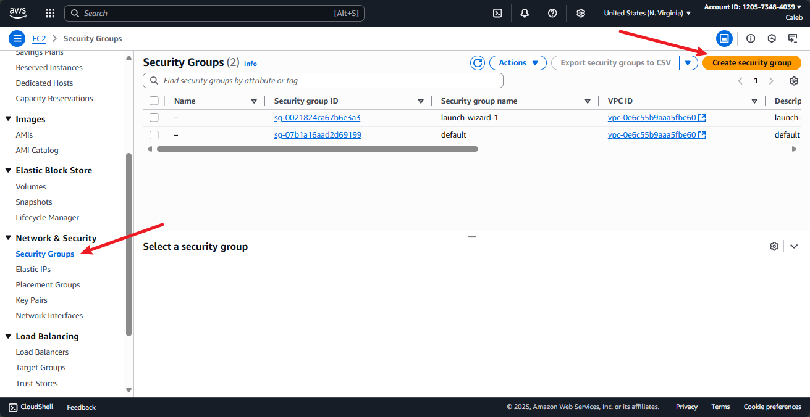
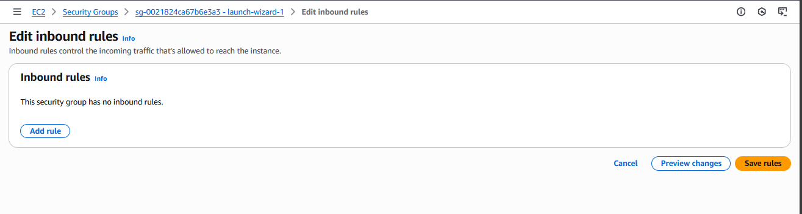

# Security Group & NACL Mini Project 

During this project, we'll explore the core concepts of Amazon Web Services (AWS), specifically focusing on Security Groups and Network Access Control Lists (NACLs). Our objective is to understand these fundamental components of AWS infrastructure, including how Security Groups control inbound and outbound traffic to EC2 instances, and how NACL acts as subnet-level firewalls, regulating traffic entering and exiting subnets. Through practical demonstrations and interactive exercises, we'll navigate the AWS management console to deploy and manage these critical components effectively. 

Before we proceed with setting up Security Groups and NACLs, it's essenctial to ensure a solid understanding of cloud networking basics.

## Security Group (SG):
**Inbound Rules**: Rules that control the incoming traffic from an AA+WS resource.

**Outbound Rules:** Rules that controleds the outgoing traffic from an AWS resource.

**Stateful:** Security groups automatically allow return traffic initiated by the instances to which they are attached.

**Port:** A communication endpoint that processes incoming and outgoing network traffic. Security groups use ports to specify the types of traffic allowed.

**Protocol:** The set of rules that governes the communication between different endpoints in a network. Common protocols include TCP, UDP, and ICMP.

## Network Access Control List (NACL):

**Subnet-level Firewall:** NACLs act as a firewall at the subnet level, controlling traffic entering and exiting the subnet.

**Stateless:** Unlike security groups, NACLs are stateless, meaning they do not automatically allow return traffic. YOu must explicitly configure rules for both inbound and outbound traffic.

**Allow/Deny:** NACL rules can either allow or deny traffic based on the specified criteria.

**Ingress:** Refers to inbound traffic, i.e., traffic entering the subnet.

**Egress:** Refers to outbound traffic. i.e., traffic exiting the subnet.

**CIDR Block:** Specifies a range of IP addresses in CIDR notation (e.g., 10.0.0.0/24) that the NACL rule applies to.

### Default Settings:

**Default Security Groups:** Every VPC comes with a default security group that allows all outbound traffic and denies all inbound traffic by default.

**Default NACL:** Every subnet within a VPC is associated with a default NACL that allows all inbound and outbound traffic by default.

## What is a Security Group?

A security group in AWS acts as a virtual firewall for your EC2 instances and other resources, controlling both inbound and outbound traffic at the instance level. Security groups are stateful, meaning if you allow an incoming request from a specific IP address and port, the response traffic is automatically allowed, regardless of outbound rules. Each security group consists of a set of rules that specify which types of traffic are permitted to reach your resources (inbound rules) and which types of traffic your resources can send out (outbound rules).

You can specify rules based on protocol (such as TCP, UDP, or ICMP), port range, and source or destination IP address or CIDR block. Security groups are attached to network interfaces, and you can assign multiple security groups to a single resource for flexible access control. By default, a security group denies all inbound traffic and allows all outbound traffic, but you can customize these rules to meet your security requirements. Security groups are essential for implementing the principle of least privilege, ensuring that only necessary traffic is allowed to and from your AWS resources.

## What is a NACL?

A Network Access Control List (NACL) in AWS is a virtual firewall that operates at the subnet level within a Virtual Private Cloud (VPC). NACLs control both inbound and outbound traffic to and from subnets by using a set of numbered rules that either allow or deny traffic based on protocol, port range, and source or destination IP address (CIDR block). Unlike security groups, NACLs are stateless, meaning that return traffic must be explicitly allowed by separate rules; if you allow inbound traffic, you must also create a corresponding outbound rule for the response traffic.

Each subnet in a VPC must be associated with a NACL, and a NACL can be associated with multiple subnets. By default, AWS provides a default NACL that allows all inbound and outbound traffic, but you can create custom NACLs with more restrictive rules to enhance security. NACL rules are evaluated in order, starting from the lowest numbered rule, and the first rule that matches the traffic is applied. If no rules match, the traffic is denied by default. NACLs are especially useful for providing an additional layer of security and for scenarios where you need to explicitly block certain IP addresses or ranges at the subnet level.

## Difference between Security Groups and NACL

**Scope:**  
- **Security Groups** operate at the instance level, acting as virtual firewalls for individual EC2 instances or other AWS resources.
- **NACLs (Network Access Control Lists)** operate at the subnet level, controlling traffic entering and exiting entire subnets within a VPC.

**Statefulness:**  
- **Security Groups are stateful:** If you allow an incoming request, the response traffic is automatically allowed, even if there is no explicit outbound rule for it.
- **NACLs are stateless:** You must explicitly allow both inbound and outbound traffic. If you allow inbound traffic, you must also create a corresponding outbound rule for the return traffic.

**Rules:**  
- **Security Groups** only have "allow" rules; you cannot explicitly deny traffic. All traffic not explicitly allowed is denied by default.
- **NACLs** support both "allow" and "deny" rules, giving you more granular control over what traffic is permitted or blocked.

**Rule Evaluation:**  
- **Security Groups** evaluate all rules before deciding whether to allow traffic.
- **NACLs** evaluate rules in order, starting from the lowest numbered rule. The first rule that matches the traffic is applied, and if no rules match, the traffic is denied.

**Default Behavior:**  
- **Default Security Group** allows all outbound traffic and denies all inbound traffic.
- **Default NACL** allows all inbound and outbound traffic.

**Association:**  
- **Security Groups** are associated with network interfaces (and thus with individual resources like EC2 instances). You can assign multiple security groups to a single resource.
- **NACLs** are associated with subnets, and each subnet can be associated with only one NACL at a time, but a NACL can be associated with multiple subnets.

**Use Cases:**  
- **Security Groups** are best for controlling access to specific resources, such as allowing SSH or HTTP access to a particular EC2 instance.
- **NACLs** are useful for providing an additional layer of security at the subnet level, such as blocking specific IP addresses or ranges from accessing any resource within a subnet.

**Summary Table:**

| Feature                | Security Group                | NACL                           |
|------------------------|------------------------------|--------------------------------|
| Level                  | Instance                     | Subnet                         |
| Stateful/Stateless     | Stateful                     | Stateless                      |
| Allow/Deny Rules       | Allow only                   | Allow and Deny                 |
| Rule Evaluation        | All rules                    | In order, lowest to highest    |
| Default Behavior       | Deny inbound, allow outbound | Allow all                      |
| Association            | Network interface/resource   | Subnet                         |
| Typical Use            | Resource-level control       | Subnet-level filtering         |

Now we can go to the practical part.

## 1. Security group
- Initially we will examine the configuration of inbound and outbound rules for security groups.

- Create a security group allowing HTTP for all traffic and attach it to the instance.

**Explore Various Scenarios:**
- Implement inbound traffic rules for HTTP and SSH protocols and allow outbound traffic for all

- Configure inbound rules for HTTP with no outbound rules.

- Remove bothe inbound and outbound rules.

- Have no inbound rules but configure outbound rules for all traffic.

## 2. NACL
- Examine the default settings for both inbound and outbound rules in NACL configuration.

- Modify the inbound rules to permit traffic from any IPV4 CIDR on all ports.

- Adjust the outbound rules to allow traffic to all CIDRs.

# Part 1
Create a quick EC2 instance:

Below, In the inbound rules, only IPv4 SSH traffic on port 22 is permited to access this instance

For the outbound rule, you will nottice that all IPv4 traffic with any protocol on any port number is allowed, meaning this instance has unrestricted access to anywhere on the internet.

Now, let us test accessibility to the website using the public IP address assigned to this instance.

Here, lets retrieve the public IP address.

If you enter "http://54.226.10.121" into the browser, and hit enter, you will notice that the page does not load, it keeps attempting to connect. And finally it'll show this page. After some time, you'll likely see a page indicating that the site can not be reached.

This is because of the security group, because we have not defined HTTP protocol in the security group so whenever the outside world is trying to go inside our instance and trying to get the data, security gtroup is restricting iy and that's why we are unable to see the data.

To resolve this issue, we can create a nes security group that allows HTTP (Port 80) traffic.

1. Navigate to the "Security Groups" section on the left sidebar. Then click on "Create Security Group".

2. Please provide a name and description for the new security group.

    a. Ensure to select your VPC during the creation

    

    b. Click on add rule

    

    c. Now, select "HTTP" as the type.

    

    d. Use 0.0.0.0/0 as the CIDR Block

    

    e. Keep outbound rule as it is

    

    f. Now, click on Create security group

    

Verifying creation of security group

Let us attach this security group to our instance.

3. Now navigate to the instance section of left side bare.
    a. Select the instance.

    b. Click on "Actions."

    

    c. Choose "Security"

    d. Click on "Change security group."

    

4. Choose the security group you created.

a. Click on "Add security
    

    

 b. You can see security group is being added, Click on "save."

> The security group named Launch Wizard you see is  the default security group automatically attached when creating the instance. You can also edit this security group if needed.

5. Now it has been attached successfully,

a. Copy the Public IP addresss,

b. Write http://54.226.10.121 in chrome, we will be able to see the data of our website.

6. Lets see how removing the outbound rule affects the instances connectivity. This means now, no one can go outside this instance. 

    a. Go to the outbound Tab

    b. Click on "edit outbound rules".

    

    c. Clicl on "Delete"

    d. Click on "Save rules."

    

Now that we have removed the outbound rule, lets take a look on how it appears in the configuration.

After making this changes, lets test whetehr we can still access the website.

So even though we have removed the outbound rule that allows all traffic from the instance to the outside world, we can still access the website. This is because security groups are stateful, meaning they automatically allow return traffic initiated by the instances to which they are attached. So, even though we removed the outbound rule, the security group allows the return traffic necessary for displaying the website, hence we can still access it.

7. Delete the inbound rule the same way we deleted the outbound rule

    a. Go to Inbound tab

    b. Click on edit inbound rule

    

    c. Click on Delete

    d. Click on Save rule

    

Currentlt, Let us have a look at how our inbound and outbound rules are configured

Now, as both the inbound and outbound rulses deleted, there's no way for traffic to enter or leave the instance. This means any attempt to access the website from a browser or any other client will fail because there are no rules permitting traffic to reach the instance. In this state, the instance is essentially isolated from both incoming and outgoing traffic.

So you can not access the website now.

.

In the next scenario,

We will add a rule specifically allowing HTTP traffic in the outbound rules. This change will enable the instance to initiate outgoing connections over HTTP.

8. Click on edit outbound rule in the outbound tab,

    a. Click on "add rule"

    b. Choose type

    c. Choose destination

    d. Choose CIDR

    e. Click on "save rules"

Now lets see if we can access the website

.

So we are not able to see it.

But if you look here we are able to go to the outside world from the instance

> curl is a command-line tool that fetches data from a URL

As a result, the instance will be able to fetch data from external sources or communicate with other HTTP-based services on the internet. This adjustment ensures that while incoming connections to the instance may still be restricted, the instance itself can actively communicate over HTTP to external services.

# Part 2

Lets come to NACL

1. First navigate to the serach bar and search for VPC
    a. Then click on VPC

    

2. Navicage to the Network ACLs in the left sidebar.
    a. Click on "Create Network ACL."

3. Now, provide a name for your Network ACL,
    a. Choose the VPC
    b. Then click on "Create network ACL"

4. Select the Network ACL you created.

    a. navigate to the "inbound" tab

By default, you will notice that it is denying all traffic from all ports. 

Similary, if yo look at the outbound rules, you'll observe that its denying all outbound traffic on all ports by default.

    b. Select the NACL.

    c. And navigate to the "Outbound" tab

5. To make chanages

    a. select the NACL

    b. Go to the Inbound tab.

    c. Click on Edit Inbound rules.

6. Now click on Add new rule

7. Now choose the rule number

    a. Specify the type

    b. Select the source

    c. Determine whethet to allow or deny the traffic

    d. Then click on "Save Changes."

Currently, this NACL is not associated with any of the subnets in the VPC

8. Lets associate it

    a. Select your NACL

    b. Click on "Actions"

    c. Choose "Edit subnet association.

    d. Select your public subnet

    e. Click Save Changes

We have now successfully associated the public subnet to this NACL

As soon as you have attached this NACL to your public subnet, and then try to access the website again by typing the URL, you will notice that you are unable to see the site.

Although we have permitted all traffic in the inbound rule of our NACL, we are still unable to access the website. This is because despite permiting inbound traffic in the NACL is because NACL are stateless. They do not automatically allow return traffic. This means er must configure rules for both inbound and outbound traffic.

9. Allowing outbound traffic

    a. Choose your NACL

    b. Go to outbound tab.

    c. Click on "Edit outbound rules."

    d. Click on "Add rule."

    e. Duplicate the process followed for creating the inbound rules to establish the outbound rules in a similar manner

You have successfully createrd the rules.

Upon revisiting the website, you should now be able to access it without any issues.

