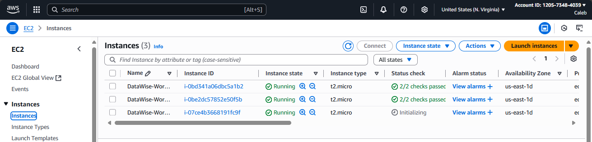

# Elavate your Shell Scripting journey intoCloud Computing

Our objectives for the next series of projects is to advance our shell scripting skills while also integrating and utilsing cloud services.

# Delivering the shell script based on a real world requirement

## Background

**DataWise Solutions** is a forward thinking Data Science Consulting Company that specialises in deploying analytical and machine learning environments to support data-driven decision-making for its clients. Recognising the need for agility and efficiency in setting up such environments, DataWise has decided to streamline its deployment process on AWS, focusing on simplicity and automation.

## Scenario

One of DataWise Solutions' clients, a burgeoning e-commerce startup, is looking to harness the power of data science to analyse customer behaviour and enhance their shopping experience. The startup wishes to deploy their data science workspace on AWS, utilizing EC2 instances for computational tasks and S£ buckets for storing their vast datasets of customer interactions

## Specific Requirements

To meet the client's needs and ensure a practical learning experience, DataWise Solutions plans to develop a script that automates the setup of EC2 instances and S3 buckets. This scripts will incorporate the 5 critical shell scripting concepts previously identfied:

1. **Functions:** Implement custom functions to modularize tasks like creating EC2 instances, configuring S3 buckets, and verifying deployment statuses.

2. **Arrays:** Use arrays to manage a list of resources created, ensuring easy tracking and maniulation.

3. **Environment Variables:**  Leverage environment variables to store sensitive information like AWS credentials, region settings, and configuration parameters, enhancing script portability and security.

4. **Command Line Arguments:** Accept command line arguments to customise the script's behaviour, such as specifying the EC2 instance type or S3 bucket name, allowing for dynamic and flexible deployments.

5. **Error Handling:** Implement robust error handling mechanusms to catch and respond to AWS service exceptions, ensuring the script can recover gracefully from failures.

## Prerequisite

Before implementing the script it is important to ensure AWS CLI is installed and configured with valid credentials. This is because without configuration, these commands will fail with authentication errors. 

### How to configure AWS CLI in Git Bash

1. **Install AWS CLI (if not already installed)**
    - Download from https://docs.aws.amazon.com/cli/latest/userguide/getting-started-install.html

    - verify installation

    ~~~
    aws --version
    ~~~

2. **Configure AWS crednetials**: Run this in Git Bash

~~~ 
aws configure
~~~

You will be prompted to enter:
- AWS Access Key ID
- AWS Secret Access Key
- Default region name- us-east-1
- Default output format- json

3. **Verify configuration:** Run
~~~
aws sts get-caller-identity | cat
~~~

which gives an output like this:
~~~
{
    "UserId": "AIDAEXAMPLE123456789",
    "Account": "123456789012",
    "Arn": "arn:aws:iam::123456789012:user/your-username"
}
~~~

This output gives 
- User ID - your IAM identity
- Account ID - your AWS account number
- ARN - your full identity reference

Now we can move on to the project

## 1. Define the Project Goal

The goal of this project is to automate the deployment of a data science workspace on AWS using shell scripting. This includes:

- Creating an EC2 instances for computation

- Setting up S3 buckets for data storage

## 2. Create the Project Directory
In a folder you would easily remember create a directory
~~~
mkdir -p ~/project/datawise-deployment/{logs,templates}
cd ~project/datawise-deployment
~~~

This creates the datawise deployment directory, as well as creating two other directories; logs (Stores deployment logs), and templates (JSON templates for EC2 or IAM)

## 3.Create the Environment Configuration File
Create a file named `config.env` to store AWS credentials and settings 
~~~
touch config.env
~~~

In this file I will add the following content
~~~
export AWS_ACCESS_KEY_ID="your-access-key"
export AWS_SECRET_ACCESS_KEY="your-secret-key"
export AWS_DEFAULT_REGION="eu-east-1"
export AMI_ID="ami-0abcdef1234567890"  # Replace with a valid AMI
~~~

> Never commit this file to version control. Add it to `.gitignore ` if using Git

~~~
echo "config.env" >> .gitignore
~~~

### Importance of Creating an Environment Configuration File

An environment configuration file, such as `config.env`, is essential for securely and efficiently managing sensitive information and configuration settings in your shell scripting projects. By storing AWS credentials, region settings, and other parameters in a separate file, you keep sensitive data out of your main script, reducing the risk of accidental exposure or hardcoding secrets. This approach also improves portability and maintainability, as you can easily update configuration values without modifying the script itself. Additionally, using an environment file allows you to share scripts without sharing confidential information and supports best practices like adding the file to `.gitignore` to prevent it from being committed to version control.

## 4. Create the function file
Create a file named `function.sh`

~~~
touch function.sh
~~~

In this .sh file we will input the modular functions
~~~
#!/bin/bash

EC2_INSTANCES=()
S3_BUCKETS=()

log() {
  echo "$(date '+%Y-%m-%d %H:%M:%S') - $1" | tee -a ./logs/deploy.log
}

handle_error() {
  log "[ERROR] $1"
  exit 1
}
create_ec2_instance() {
  local instance_type="$1"
  local key_name="$2"
  echo "$(date '+%Y-%m-%d %H:%M:%S') - Creating EC2 instance of type $instance_type..."

  aws ec2 run-instances \
    --image-id "$AMI_ID" \
    --instance-type "$instance_type" \
    --key-name "$key_name" \
    --count 1 \
    --tag-specifications 'ResourceType=instance,Tags=[{Key=Name,Value=DataWise-Workspace}]' \
    --output text || {
      echo "$(date '+%Y-%m-%d %H:%M:%S') - [ERROR] EC2 creation failed"
      return 1
    }
}

create_s3_bucket() {
  local bucket_name="$1"
  echo "$(date '+%Y-%m-%d %H:%M:%S') - Creating S3 bucket: $bucket_name..."

  if [[ "$AWS_REGION" == "us-east-1" ]]; then
    aws s3api create-bucket \
      --bucket "$bucket_name" \
      --region "$AWS_REGION" \
      --profile "$AWS_PROFILE" \
      --output text || {
        echo "$(date '+%Y-%m-%d %H:%M:%S') - [ERROR] S3 bucket creation failed"
        return 1
      }
  else
    aws s3api create-bucket \
      --bucket "$bucket_name" \
      --region "$AWS_REGION" \
      --create-bucket-configuration LocationConstraint="$AWS_REGION" \
      --profile "$AWS_PROFILE" \
      --output text || {
        echo "$(date '+%Y-%m-%d %H:%M:%S') - [ERROR] S3 bucket creation failed"
        return 1
      }
  fi
}

verify_resources() {
  log "Verifying created resources..."
  for id in "${EC2_INSTANCES[@]}"; do
    log "EC2 Instance: $id"
  done
  for bucket in "${S3_BUCKETS[@]}"; do
    log "S3 Bucket: $bucket"
  done
}

~~~
Then make it executionable

~~~
chmod +x function.sh
~~~

## 5. Create the Main Deployment Script

Create `deploy.sh`
~~~
touch deploy.sh
~~~

Add the following
~~~
#!/bin/bash

source ./config.env
source ./functions.sh

if [[ $# -ne 3 ]]; then
  echo "Usage: $0 <instance_type> <key_name> <bucket_name>"
  exit 1
fi

INSTANCE_TYPE=$1
KEY_NAME=$2
BUCKET_NAME=$3

echo "Starting AWS deployment for DataWise Solutions..."
create_ec2_instance "$INSTANCE_TYPE" "$KEY_NAME"
create_s3_bucket "$BUCKET_NAME"
verify_resources
~~~

Make it executable:

~~~
chmod +x deploy.sh
~~~

## 6.Run the Script 
~~~
./deploy.sh t2.micro datawise-key datawise-bucket-001
~~~

## 7. Verify Success 

#  AWS Shell Deployment — Troubleshooting Log

This document outlines the key issues encountered during the development and deployment of the AWS automation script for EC2 and S3 provisioning. Each issue is paired with its resolution to aid future debugging and improve reliability.

---

---

## 🧪 Troubleshooting Summary

| # | Issue | Description | Solution |
|---|-------|-------------|----------|
| 1 | `config.env: No such file or directory` | Script couldn’t locate the environment file. | Moved `deploy.sh` to the project root and ensured `config.env` exists there. |
| 2 | `functions.sh: No such file or directory` | Functions file was misnamed or misplaced. | Renamed to `functions.sh` and placed in the root directory. |
| 3 | `create_ec2_instance: command not found` | Functions weren’t sourced correctly. | Used absolute path sourcing: `SCRIPT_DIR="$(cd "$(dirname "${BASH_SOURCE[0]}")" && pwd)"`. |
| 4 | `InvalidAMIID.NotFound` | AMI ID was invalid for the selected region. | Verified region (`us-east-1`) and replaced with a valid AMI ID. |
| 5 | `MissingParameter: ImageId` | AMI ID wasn’t passed due to malformed `config.env`. | Corrected syntax: `export AMI_ID=ami-xxxxxxxxxxxxxxxxx`. |
| 6 | `AuthFailure` | AWS CLI couldn’t validate credentials. | Set credentials via environment variables or `aws configure --profile datawise`. |
| 7 | `InvalidKeyPair.NotFound` | Key pair didn’t exist in the region. | Created key pair using `aws ec2 create-key-pair` and saved `.pem` file. |
| 8 | `InvalidLocationConstraint` | S3 bucket creation failed in `us-east-1`. | Skipped `LocationConstraint` when region is `us-east-1`. |
| 9 | `'more' is not recognized` | Windows shell didn’t support `more` command. | Removed `| more` or redirected output to a file. |
| 10 | Verbose EC2 output | AWS CLI output was cluttered. | Planned to use `--query` and format output for clarity. |

---

##  Final Status

- EC2 instance successfully launched in `us-east-1`
- S3 bucket created with region-aware logic
- Credentials and key pair validated
- Logging and error handling functional
- Modular structure and sourcing confirmed

---

##  Notes

- Ensure all environment variables are exported correctly in `config.env`
- Use region-specific AMI IDs and key pairs
- Modularize functions for clarity and reuse
- Consider adding a summary output section for instance details

---

# Summary

This project demonstrates how to automate the deployment of AWS resources using shell scripting, focusing on real-world requirements for a data science environment. By leveraging modular shell scripts, environment variables, and robust error handling, the solution streamlines the creation of EC2 instances and S3 buckets. The workflow includes setting up a secure environment configuration file, modularizing deployment functions, and implementing a main script to orchestrate the process. Troubleshooting logs and best practices are documented to ensure reliability and maintainability. Overall, this project provides a practical foundation for integrating shell scripting with AWS services, enabling efficient, repeatable, and secure cloud infrastructure deployments.

---

## How Each Shell Scripting Concept Was Accomplished

1. **Functions:**  
   I created a separate `function.sh` file containing custom functions for modular tasks such as creating EC2 instances (`create_ec2_instance`), configuring S3 buckets (`create_s3_bucket`), and verifying deployment statuses (`verify_resources`). This modular approach keeps the code organized and reusable.

2. **Arrays:**  
   Arrays like `EC2_INSTANCES=()` and `S3_BUCKETS=()` were used to keep track of all created resources. As new instances or buckets are created, their identifiers are added to these arrays, making it easy to manage and verify multiple resources.

3. **Environment Variables:**  
   Sensitive information and configuration parameters (such as AWS credentials, region, and AMI ID) were stored in a separate `config.env` file. This file is sourced at the start of the script, enhancing security and portability while keeping secrets out of the main codebase.

4. **Command Line Arguments:**  
   The main deployment script (`deploy.sh`) accepts command line arguments for instance type, key name, and bucket name. This allows users to customize deployments dynamically without modifying the script, making it flexible for different scenarios.

5. **Error Handling:**  
   Robust error handling was implemented using dedicated functions like `handle_error`. Each AWS CLI command is followed by checks to catch failures, log errors, and exit gracefully if something goes wrong. This ensures the script can recover or provide meaningful feedback during failures.

---