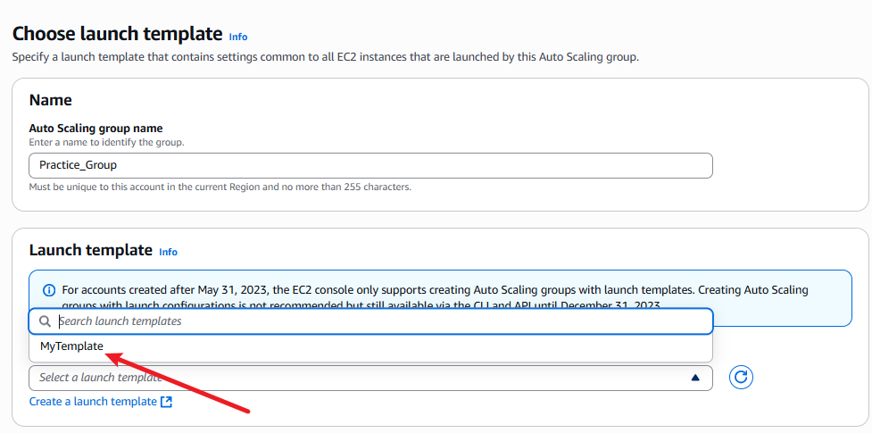

#  Configuring Auto Scaling with ALB using Launch Template

##  Overview
This project demonstrates how to configure **Auto Scaling** in AWS using a **Launch Template** and an **Application Load Balancer (ALB)**. The goal is to automatically adjust EC2 instances based on demand, ensuring scalability and resilience.

---

##  Objectives
- Create a Launch Template with required specifications.
- Set up an Auto Scaling Group using the Launch Template.
- Configure scaling policies for dynamic adjustment.
- Attach an ALB to the Auto Scaling Group.
- Test and validate Auto Scaling behavior.

---

##  Tasks & Implementation

###  Task 1: Create Launch Template
1. Log in to the AWS Management Console.

2. Navigate to **EC2 > Launch Templates**.

3. Click **Create launch template**.

4. Configure:
   - AMI
   - Instance type
   - User data (optional)

###  Task 2: Set Up Auto Scaling Group
1. Go to **EC2 > Auto Scaling Groups**.
2. Click **Create Auto Scaling group**.

3. Choose **Use Launch Template** and select the one created.

4. Configure:
   - Group name
   - Desired capacity
   - Initial instance count
   - Network settings (VPC, subnets)
   - Scaling policies

   

###  Task 3: Configure Scaling Policies
1. In the Auto Scaling Group settings, go to **Scaling policies**.
2. Click **Create scaling policy**.
3. Define:
   - **Scaling out**: Increasing the number of EC2 instances in response to higher demand (e.g., when CPU utilization exceeds a set threshold).
   - **Scaling in**: Reducing the number of EC2 instances when demand drops (e.g., when CPU utilization falls below a set threshold).
   - **Based on demand metrics**: Auto Scaling uses metrics such as CPU utilization, network traffic, or custom CloudWatch alarms to automatically trigger scaling actions, ensuring the application remains responsive and cost-effective.

###  Task 4: Attach ALB to Auto Scaling Group
1. In the Auto Scaling Group settings, go to **Load balancing**.
2. Click **Edit**.
3. Select and attach the existing **Application Load Balancer (ALB)**.

###  Task 5: Test Auto Scaling
1. SSH into an EC2 instance and run:
~~~
   sudo amazon-linux-extras install epel -y
   sudo yum install stress -y
   stress -c 4
~~~

2. Monitor the Auto Scaling Group.
3. Verify instance count adjusts based on traffic load.