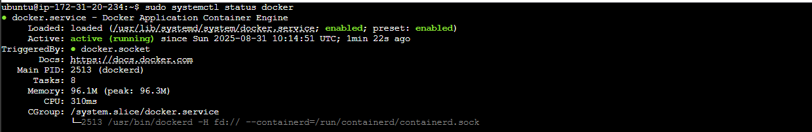
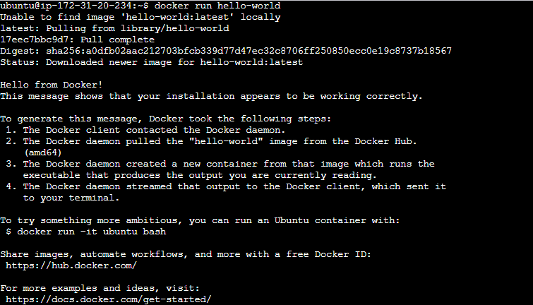
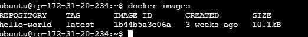
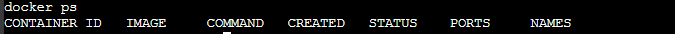
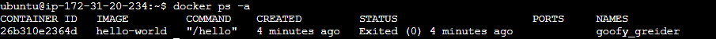
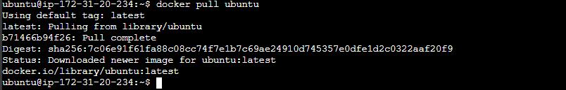

# Introduction to Docker and Containers

## Project Goal

By the end of this mini-project, learners should aim to achieve the following:

1. Grasp the concept of containers, their isolation, and their role in packaging applications.
2. Familiarize themselves with key Docker features, commands, and best practices.
3. Understand how Docker containers contribute to resource efficiency compared to traditional virtual machines.
4. Learn how Docker ensures consistent application behavior across different development, testing, and production environments.
5. Master techniques for quickly deploying and scaling applications using Docker.

---

## What are Containers?

In software development and deployment, professionals often faced a dilemma: code that worked on their local machines sometimes failed elsewhere. The culprit? The notorious "It works on my machine" phenomenon.

A container is a lightweight, standalone package that includes everything an application needs to run—its code, libraries, dependencies, and configuration. Containers ensure that an application remains consistent and behaves the same, whether running on a developer's laptop, a testing server, or a live production environment. Docker has empowered IT professionals to say goodbye to the days of "It works on my machine."

Docker is a tool that emerged to solve a major problem in the IT industry. In 2013, Solomon Hykes unveiled Docker, a containerization platform that revolutionized the way IT professionals build, ship, and run applications.

Docker simplifies deployment, making it easy and reliable. Docker containers provide a standardized, portable environment, ensuring your applications run seamlessly across various platforms.

---

### Advantages of Containers

- **Portability Across Different Environments:**  
  Docker containers encapsulate the entire application, including dependencies and configuration. This ensures your application runs consistently across different platforms, eliminating environment mismatch issues.

- **Resource Efficiency Compared to Virtual Machines:**  
  Docker containers share the host's operating system kernel, making them lightweight and efficient. You can run multiple containers on a single host without the heavy resource demands of traditional virtual machines.

- **Rapid Application Deployment and Scaling:**  
  Docker containers can be quickly started or stopped, enabling fast deployment and scaling. Whether facing a surge in demand or scaling down, Docker makes it easy to manage your application's resources.

---

### Comparison: Docker Containers vs. Virtual Machines

Docker and virtual machines (VMs) are both used for application deployment, but they differ in their approach:

- **Virtual Machines:** Emulate entire operating systems, resulting in higher resource overhead and slower performance.
- **Docker Containers:** Use containerization, encapsulating applications and their dependencies while sharing the host OS's kernel. This lightweight approach reduces resource consumption, provides faster startup times, and ensures portability.

Docker's focus on microservices and standardized packaging fosters scalability and efficiency, making it a preferred choice for modern, agile application development. VMs are better suited for scenarios requiring stronger isolation but at the cost of increased resource usage.

---

### Importance of Docker

- **Technology and Industry Impact:**  
  Docker and containerization have revolutionized software development, deployment, and management. Packaging applications and their dependencies into lightweight, portable containers addresses key challenges such as consistency across environments and efficient resource utilization.

- **Real-World Impact:**  
  Implementing Docker streamlines development, promotes collaboration between development and operations teams, and accelerates application delivery. Docker enhances scalability, facilitates rapid deployment, and ensures consistency across diverse environments—saving time and resources while supporting a resilient, agile software development lifecycle.

---

### Target Audience

This course on Docker is designed for a diverse audience, including:

- **DevOps Professionals:** Interested in container orchestration, efficient application management, improved resource utilization, and system stability.
- **Developers:** Seeking to streamline application development, enhance collaboration, and ensure consistency across development stages.

It also caters to cloud engineers, QA engineers, and other tech enthusiasts eager to enhance their technical skills and establish a strong foundation in Docker and containerization. Professionals seeking to expand their skill set or students preparing for technology roles will find this project beneficial.

---

## Getting Started With Docker

### Installing Docker

Launch an Ubuntu 20.04 LTS instance and connect to it, then follow the steps below.

Before installing Docker Engine for the first time on a new host machine, configure the Docker repository. After setup, you can install and update Docker directly from the repository.

#### Add Docker's Official GPG Key

Learn about GPG keys here:  
https://help.ubuntu.com/community/GnuPrivacyGuardHowto

```bash
sudo apt-get update
```
Refreshes the package list on a Debian-based system.

```bash
sudo apt-get install ca-certificates curl gnupg
```
Installs essential packages: certificate authorities, curl, and GnuPG.

```bash
sudo install -m 0755 -d /etc/apt/keyrings
```
Creates a directory for storing keyring files for Docker authentication.

```bash
curl -fsSL https://download.docker.com/linux/ubuntu/gpg | sudo gpg --dearmor -o /etc/apt/keyrings/docker.gpg
```
Downloads the Docker GPG key.

```bash
sudo chmod a+r /etc/apt/keyrings/docker.gpg
```
Sets read permission for all users on the Docker GPG key file.

#### Add the Repository to APT Sources

```bash
echo \
  "deb [arch=$(dpkg --print-architecture) signed-by=/etc/apt/keyrings/docker.gpg] https://download.docker.com/linux/ubuntu \
  $(. /etc/os-release && echo "$VERSION_CODENAME") stable" | \
  sudo tee /etc/apt/sources.list.d/docker.list > /dev/null
```
Creates a Docker APT repository configuration entry for your Ubuntu system.

```bash
sudo apt-get update
```

- **Install the latest version of Docker:**

```bash
sudo apt-get install docker-ce docker-ce-cli containerd.io docker-buildx-plugin docker-compose-plugin
```

- **Verify Docker installation:**

```bash
sudo systemctl status docker
```



By default, Docker can only be run by the root user or with `sudo`. To run Docker commands without `sudo`, execute:

```bash
sudo usermod -aG docker ubuntu
```
After running this command, you can use Docker without superuser privileges.

---

### Running the "Hello World" Container

#### Using the `docker run` Command

The `docker run` command is the entry point to execute containers in Docker. It creates and starts a container based on a specified Docker image.

- **Run the "Hello World" container:**

```bash
docker run hello-world
```



**What Happens When You Execute This Command:**

1. **Pulls Image (if not available locally):** Docker checks if the `hello-world` image exists locally. If not, it pulls it from Docker Hub.
2. **Creates a Container:** Docker creates a container based on the `hello-world` image.
3. **Starts the Container:** The container executes the predefined command in the image, printing a friendly message.

#### Understanding Docker Image and Container Lifecycle

- **Docker Image:** A lightweight, standalone, executable package that includes everything needed to run software: code, runtime, libraries, and system tools. Images are immutable.
- **Container Lifecycle:** Containers are running instances of images. Lifecycle stages include: create, start, stop, and delete.

Once a container is created from an image, it can be started, stopped, and restarted.

#### Verifying Execution

To check if the image is now available locally:

```bash
docker images
```


If issues arise, ensure Docker is properly installed and your user has permission to run Docker commands.

This simple "Hello World" example serves as a basic introduction to running containers with Docker. It helps verify your Docker environment and provides insight into the image and container lifecycle.

---

## Basic Docker Commands

### Run a Container

```bash
docker run hello-world
```
Pulls the image (if needed) and starts a container.

### List Running Containers

```bash
docker ps
```



To view all containers (including stopped ones):

```bash
docker ps -a
```



### Stop a Container

```bash
docker stop CONTAINER_ID
```
Replace `CONTAINER_ID` with the actual ID of the running container.

### Pull an Image

```bash
docker pull ubuntu
```
Downloads the latest Ubuntu image from Docker Hub.



### Push an Image

```bash
docker push your-username/image-name
```
Make sure you're logged in with `docker login` before pushing.

### List Local Images

```bash
docker images
```

### Remove an Image

```bash
docker rmi IMAGE_ID
```
Replace `IMAGE_ID` with the actual image ID.

## Conclusion

Docker has fundamentally transformed the way applications are developed, shipped, and deployed. By leveraging containers, developers and operations teams can ensure consistency, portability, and efficiency across all stages of the software lifecycle. With its simple commands and powerful features, Docker enables rapid development, testing, and scaling of applications in any environment.

Whether you are a developer, DevOps engineer, or IT professional, mastering Docker is an essential skill in today's technology landscape. This mini-project has provided you with the foundational knowledge and practical steps to get started with Docker. Continue exploring Docker's advanced features, such as Docker Compose, networking, and orchestration, to further enhance your containerization skills and streamline your workflows.
