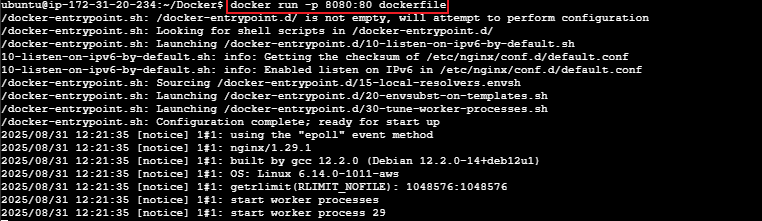

# Working with Docker Images

## Introduction to Docker Images

Docker images are the building blocks of containers. They are lightweight, portable, and self-sufficient packages that contain everything needed to run a software application, including the code, runtime, libraries, and system tools. Images are created from a set of instructions known as a Dockerfile, which specifies the environment and configuration for the application.

---

## Pulling Images from Docker Hub

**Docker Hub** is a cloud-based registry that hosts a vast collection of Docker images. You can pull images from Docker Hub to your local machine using the `docker pull` command.

To explore available images on Docker Hub, Docker provides a `search` subcommand. For example, to find the Ubuntu image, you can execute:

```bash
docker search ubuntu
```

This command allows you to discover and explore various images hosted on Docker Hub by providing relevant search results. The output will be similar to this:


In the "OFFICIAL" column, the "OK" designation signifies that an image has been constructed and is officially supported by the organization responsible for the project. Once you have identified the desired image, you can retrieve it to your local machine using the `pull` subcommand.

To download the official Ubuntu image to your computer, use the following command:

```bash
docker pull ubuntu
```

Executing this command will fetch the official Ubuntu image from Docker Hub and store it locally on your machine, making it ready for use in creating containers.


Once an image has been successfully downloaded, you can proceed to run a container using that image by employing the `run` subcommand. Similar to the 'hello-world' example, if an image is not present locally when the `docker run` subcommand is invoked, Docker will automatically download the required image before initiating the container.

To view the list of images that have been downloaded and are available on your local machine, enter the following command:

```bash
docker images
```

Executing this command provides a comprehensive list of all images stored locally, allowing you to verify the presence of the downloaded image and gather information about its size, version, and other relevant details.


---

## Dockerfile

A Dockerfile is a plaintext configuration file that contains a set of instructions for building a Docker image. It serves as a blueprint for creating a reproducible and consistent environment for your application. Dockerfiles are fundamental to the containerization process, allowing you to define the steps to assemble an image that encapsulates your application and its dependencies.

---

## Creating a Dockerfile

In this example, we will use an NGINX image. **Nginx** is open-source software for web serving, reverse proxying, caching, load balancing, media streaming, and more. It started out as a web server designed for maximum performance and stability. You can read more about [Nginx here](https://www.f5.com/glossary).

To create a Dockerfile, use a text editor of your choice, such as `vim` or `nano`. Start by specifying a base image, defining the working directory, copying files, installing dependencies, and configuring the runtime environment.

Here is a simple example of a Dockerfile for an HTML file. Let's create an image using a Dockerfile. Paste the code snippet below in a file named `Dockerfile`. This example assumes you have a basic HTML file named `index.html` in the same directory as your Dockerfile.

```dockerfile
# Use the official NGINX base image
FROM nginx:latest

# Set the working directory in the container
WORKDIR /usr/share/nginx/html/

# Copy the local HTML file to the NGINX default public directory
COPY index.html /usr/share/nginx/html/

# Expose port 80 to allow external access
EXPOSE 80

# No need for CMD as the NGINX image comes with a default CMD to start the server
```

**Explanation of the code:**

1. **FROM nginx:latest:** Specifies the official NGINX base image from Docker Hub.
2. **WORKDIR /usr/share/nginx/html/:** Sets the working directory in the container.
3. **COPY index.html /usr/share/nginx/html/:** Copies the local `index.html` file to the NGINX default public directory, which is where NGINX serves static content from.
4. **EXPOSE 80:** Informs Docker that the NGINX server will use port 80. This is a documentation feature and doesn't actually publish the port.
5. **CMD:** NGINX images come with a default CMD to start the server, so there is no need to specify it explicitly.

Create an HTML file named `index.html` in the same directory as your Dockerfile:

```bash
echo "Welcome to Docker Project" > index.html
```

To build an image from this Dockerfile, navigate to the directory containing the file and run:

```bash
docker build -t dockerfile .
```


To run a container based on the custom NGINX image you created with the Dockerfile, run the command:

```bash
docker run -p 8080:80 dockerfile
```




Running the command above will create a container that listens on port 8080 using the NGINX image you created earlier. You need to create a new rule in the security group of the EC2 instance to allow access.

1. On your EC2 instance, click on the **Security** tab.


2. Click on **Edit inbound rules** to add new rules. This will allow incoming traffic to the instance associated with the security group. Our aim is to allow incoming traffic on port 8080.


3. Click on **Add rule** to add a new rule.


---

## Managing Containers

To see the list of available containers:

```bash
docker ps -a
```


The image above shows our container is not running yet. We can start it with the command below:

```bash
docker start CONTAINER_ID
```


Now that we have started our container, we can access the content in our web browser at:  
`http://<public_ip_address>:8080`


---

## Pushing Docker Images to Docker Hub

Recall our Git project, where we push changes made on our local computer to a remote repository (GitHub) so everyone can track the changes and collaborate. Now that we have created Docker images on our own computer, we need to think about how to reuse this image in the future or how people in other regions can use this image and possibly collaborate on it. This is where **Docker Hub** comes in.

### Steps to Push an Image to Docker Hub

1. **Create an account on Docker Hub** if you do not have one.

2. **Create a repository** on Docker Hub.

3. **Tag your Docker image**  
   Before pushing, ensure that your Docker image is appropriately tagged. You typically tag your image with your Docker Hub username and the repository name.

   ```bash
   docker tag <your-image-name> <your-dockerhub-username>/<your-repository-name>:<tag>
   ```
   

4. **Login to Docker Hub**

   ```bash
   docker login -u <your-docker-hub-username>
   ```

   Running the command above will prompt you for a password. Authenticate using your Docker Hub password.


5. **Push your image to Docker Hub**

   ```bash
   docker push <your-dockerhub-username>/<your-repository-name>:<tag>
   ```

   

6. **Verify the image is in your Docker Hub repository.**


---

## Troubleshooting Tips and Common Errors

Working with Docker is generally straightforward, but you may encounter some common issues. Here are a few troubleshooting tips and solutions:

### 1. Permission Denied When Running Docker Commands

**Error:**  
`Got permission denied while trying to connect to the Docker daemon socket`

**Solution:**  
- Run the command with `sudo`, e.g., `sudo docker ps`
- Or add your user to the Docker group:  
  ```bash
  sudo usermod -aG docker $USER
  ```
  Then log out and log back in for the changes to take effect.

---

### 2. Port Already in Use

**Error:**  
`Error starting userland proxy: listen tcp 0.0.0.0:8080: bind: address already in use`

**Solution:**  
- Make sure the port is not being used by another process.
- Use a different port mapping, e.g., `-p 8081:80`.

---

### 3. Image Not Found

**Error:**  
`Unable to find image 'myimage:latest' locally`

**Solution:**  
- Check the image name and tag for typos.
- Ensure the image exists locally with `docker images`.
- If pulling from Docker Hub, verify the image exists in the repository.

---

### 4. Container Exits Immediately

**Issue:**  
Container stops right after starting.

**Solution:**  
- Check the container logs with:  
  ```bash
  docker logs <container_id>
  ```
- The container may be running a command that finishes immediately. Consider running an interactive shell or a long-running process.

---

### 5. Cannot Connect to Container from Browser

**Issue:**  
Web application is not accessible at `http://<public_ip>:8080`

**Solution:**  
- Ensure the container is running: `docker ps`
- Verify the correct port mapping: `-p 8080:80`
- Check firewall or security group settings to allow inbound traffic on the specified port.

---

## Conclusion

Working with Docker images is a fundamental skill for modern software development and deployment. By understanding how to pull images from Docker Hub, create custom images using Dockerfiles, manage containers, and push your own images to Docker Hub, you can streamline application delivery and ensure consistency across different environments.

Docker empowers teams to collaborate more efficiently, automate deployments, and scale applications with ease. Continue exploring advanced Docker features such as multi-stage builds, Docker Compose, and orchestration tools like Kubernetes to further enhance your containerization workflow.