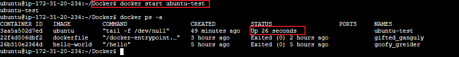

# Working With Docker Containers

## Introduction to Docker Containers

Docker containers are lightweight, portable, and executable units that encapsulate an application and its dependencies. In the previous project, we worked a little with Docker containers. In this module, we will dive deeper into the basics of working with Docker containers, from launching and running containers to managing their lifecycle.

---

## Running Containers

To run a container, use the `docker run` command followed by the name of the image you want to use.

Recall that we pulled an Ubuntu image from the official Ubuntu repository on Docker Hub. Let us create a container from the Ubuntu image. This command launches a container based on the Ubuntu image:

```bash
docker run ubuntu
```


The image above shows that the container is created but not running. We can start the container by running:

```bash
docker start CONTAINER_ID
```

---

## Launching Containers with Different Options

Docker provides various options to customize the behavior of containers. For example, you can specify environment variables, map ports, and mount volumes. Here is an example of running a container with a specific environment variable:

```bash
docker run -e "MY_VARIABLE=my-value" ubuntu
```

---

## Running Containers in the Background

By default, containers run in the foreground, and the terminal is attached to the container's standard input/output. To run a container in the background, use the `-d` option:

```bash
docker run -d ubuntu
```

This command starts a container in the background, allowing you to continue using the terminal.

---

## Container Lifecycle

Containers have a lifecycle that includes creating, starting, stopping, and restarting. Once a container is created, it can be started and stopped multiple times.

### Starting, Stopping, and Restarting Containers

- To start a stopped container:

  ```bash
  docker start container_name
  ```

- To stop a running container:

  ```bash
  docker stop container_name
  ```

- To restart a container:

  ```bash
  docker restart container_name
  ```

---

### Removing Containers

To remove a container, use the `docker rm` command followed by the container's ID or name:

```bash
docker rm container_name
```

This deletes the container, but keep in mind that the associated image remains on your system.

---

## Tasks

1. **Start a Container and Run a Simple Command:**
    - Use an official Ubuntu image to start a container. If you do not have the image, you can pull it from Docker Hub:

      ```bash
      docker pull ubuntu
      ```
      

    - Run a simple command within the container, such as displaying the system information:

      ```bash
      docker run -d --name ubuntu-test ubuntu tail -f /dev/null 
      ```      
      

2. **Stop the Container and Verify Its Status:**
    - Stop the running container:

      ```bash
      docker stop ubuntu-test
      ```


    - Verify that the container has been stopped:

      ```bash
      docker ps -a
      ```

    

    > Take notice on the status column it says exited meaning that the container has been stopped

3. **Restart the Container and Observe Changes:**
    - Restart the stopped container:

      ```bash
      docker start ubuntu-test
      ```


    - Verify the container's status again to ensure it is running.

    


    > The key thing to note is that the status uptime restarted from 0 seconds after restart.


4. **Remove the Container:**
    - Stop the running container (if still running):

      ```bash
      docker stop ubuntu-test
      ```

    - Remove the container:

      ```bash
      docker rm ubuntu-test
      ```

    - Verify that the container is removed:

      ```bash
      docker ps -a
      ```

      


---

## Conclusion

In this module, you have learned the basics of working with Docker containers: launching them, customizing their behavior, managing their lifecycle, and removing them. Understanding these fundamentals is crucial for effectively using Docker in your development and deployment workflows.

