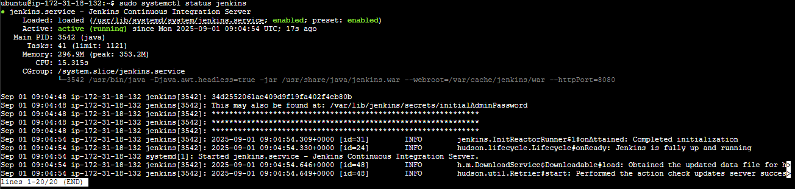
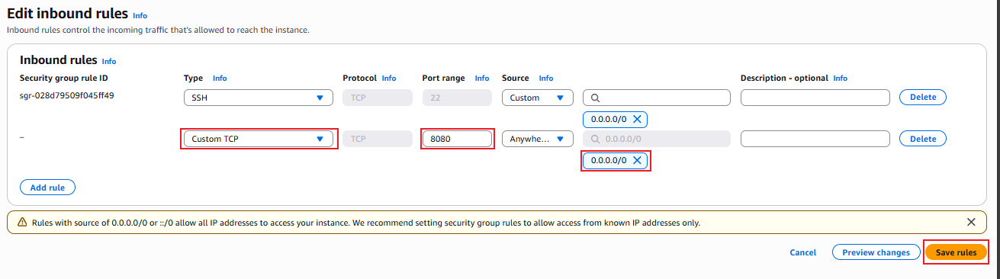
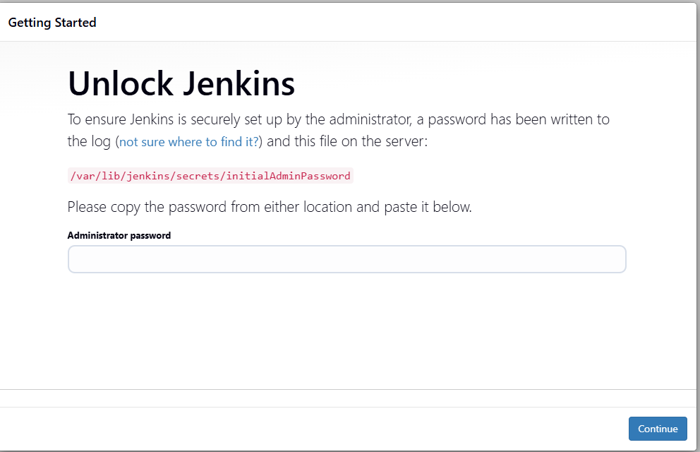
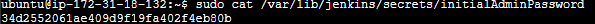
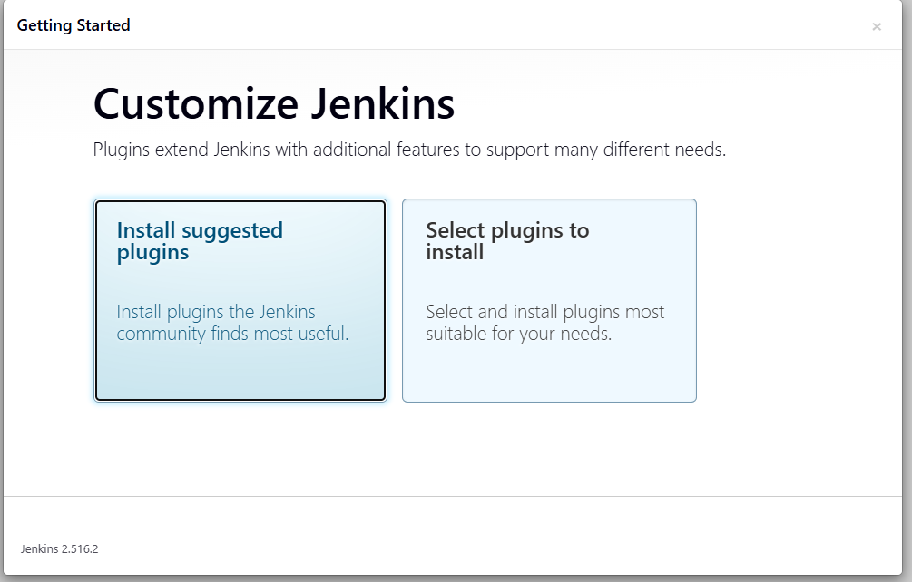
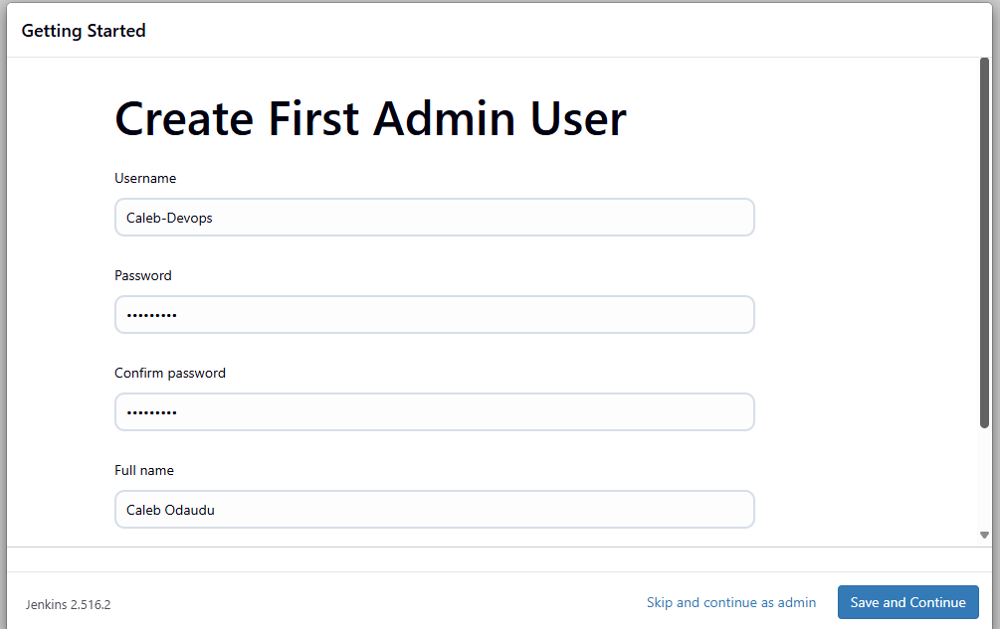
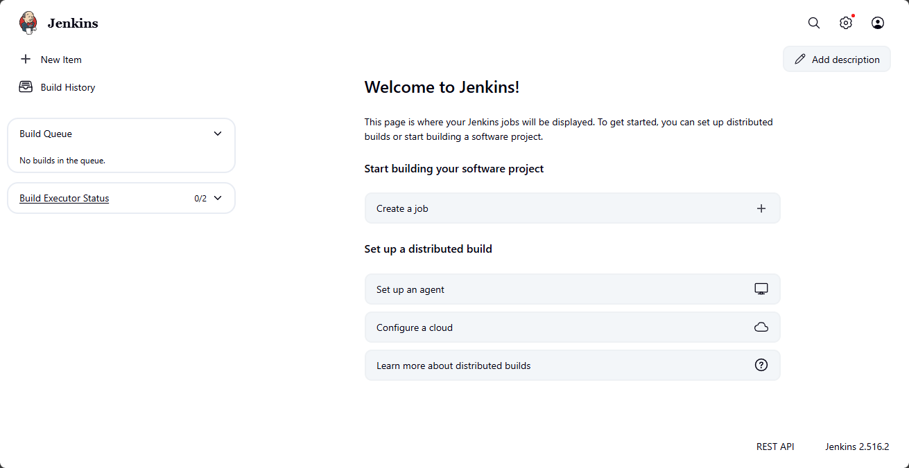

# Introduction to Jenkins

## Introduction to CI/CD

Continuous Integration and Continuous Delivery (CI/CD) are best practices and methodologies that revolutionize the software development lifecycle by enhancing efficiency, reliability, and speed. CI/CD represents a seamless integration of automation and collaboration throughout the development process, aiming to deliver high-quality software consistently and rapidly.

In the realm of CI, developers regularly integrate their code changes into a shared repository, triggering automated builds and tests to detect integration issues early.

CD encompasses both Continuous Delivery and Continuous Deployment, ensuring that software is always in a deployable state and automating the deployment process for swift and reliable releases.

The CI/CD pipeline fosters a culture of continuous improvement, allowing development teams to iterate quickly, reduce manual interventions, and deliver software with confidence.

---

### What is Jenkins?

Jenkins is widely used as a crucial CI/CD tool for automating software development processes. Teams utilize Jenkins to automate building, testing, and deploying applications, streamlining the development lifecycle.

With Jenkins pipelines, developers can define, version, and execute entire workflows as code, ensuring consistent and reproducible builds. Integration with version control systems allows Jenkins to trigger builds automatically upon code changes, facilitating early detection of issues and enabling teams to deliver high-quality software at a faster pace. Jenkins' flexibility, extensibility through plugins, and support for various tools make it a preferred choice for organizations aiming to implement efficient and automated DevOps practices.

---

## Project Goals

By the end of this project, you should be able to:

- Develop a foundational understanding of Continuous Integration (CI) and Continuous Delivery (CD) principles, and articulate their role in improving software development processes.
- Acquire proficiency in using Jenkins by mastering installation, configuration, and navigation through the Jenkins user interface, and gain hands-on experience in creating and managing Jenkins jobs.
- Learn the end-to-end process of automating software builds, running automated tests, and deploying applications using Jenkins, fostering a practical understanding of CI/CD pipelines.
- Apply best practices in CI/CD processes, including parameterized builds, integration with external tools, and leveraging containerization technologies like Docker.

---

## Getting Started With Jenkins

Now that we have an idea of what Jenkins is, let's dive into installing Jenkins.

### Update Package Repositories

```bash
sudo apt update
```

### Install JDK

```bash
sudo apt install default-jdk-headless
```

### Install Jenkins

```bash
wget -q -O - https://pkg.jenkins.io/debian-stable/jenkins.io.key | sudo apt-key add -
sudo sh -c 'echo deb https://pkg.jenkins.io/debian-stable binary/ > /etc/apt/sources.list.d/jenkins.list'
sudo apt update
sudo apt-get install jenkins
```

These commands install Jenkins. They involve importing the Jenkins GPG keys for package verification, adding the Jenkins repository to the system's sources, updating package lists, and finally installing Jenkins through the package manager (`apt-get`).

### Check if Jenkins is Installed and Running

```bash
sudo systemctl status jenkins
```



---

### Configure Security Group for Jenkins

By default, Jenkins listens on port 8080. You need to create an inbound rule for this port in the security group of your Jenkins instance.



---

### Set Up Jenkins on the Web Console

1. Enter your Jenkins instance IP address in your web browser, e.g., `http://public_ip_address:8080`



2. On your Jenkins instance, check `/var/lib/jenkins/secrets/initialAdminPassword` to retrieve your initial admin password:

    ```bash
    sudo cat /var/lib/jenkins/secrets/initialAdminPassword
    ```

    

3. Install the suggested plugins.



4. Create a user account.



5. Log in to the Jenkins console.



---

## Conclusion

By completing this project, you have gained a foundational understanding of Continuous Integration and Continuous Delivery (CI/CD) and learned how Jenkins can automate and streamline the software development lifecycle. You have installed Jenkins, configured it for secure access, and explored its user interface and basic setup.

With these skills, you are now equipped to start building and managing automated pipelines, integrate Jenkins with other tools, and apply best practices in CI/CD. Continue exploring Jenkins’ advanced features, such as pipeline as code, integration with version control systems, and plugin management, to further enhance your DevOps workflows and deliver software more efficiently.

!

