# Jenkins Freestyle Project

## Jenkins Job

In Jenkins, a job is a unit of work or a task that can be executed by the Jenkins automation server.

A Jenkins job represents a specific task or set of tasks that need to be performed as part of a build or deployment process. Jobs in Jenkins are created to automate the execution of various steps such as compiling code, running tests, packaging applications, and deploying them to servers. Each Jenkins job is configured with a series of build steps, post-build actions, and other settings that define how the job should be executed.

---

## Creating a Freestyle Project

Let's create our first build job.

1. From the dashboard menu on the left side, click on **New Item**.

    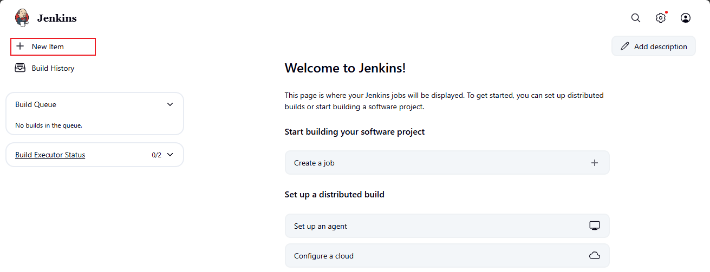

2. Create a freestyle project and name it `my-first-job`.

    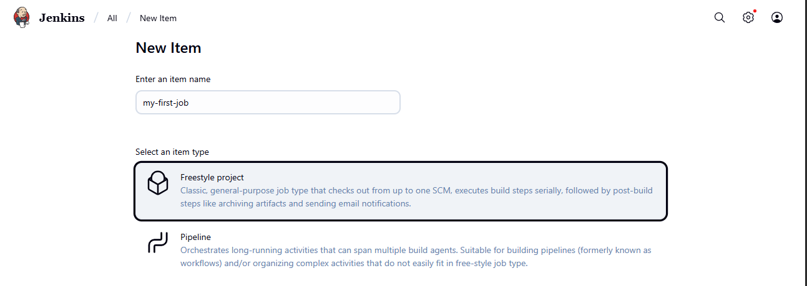

---

## Connecting Jenkins to Source Code Management

Now that we have created a freestyle project, let's connect Jenkins with GitHub.

1. Create a new GitHub repository called `jenkins-scm` with a `README.md` file.

    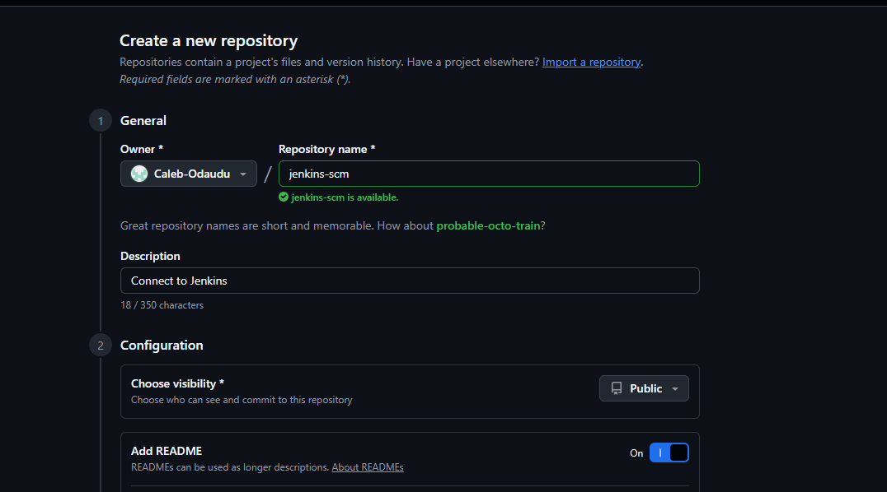

2. Connect Jenkins to the `jenkins-scm` repository by pasting the repository URL in the area shown below. Make sure your current branch is `main`.

    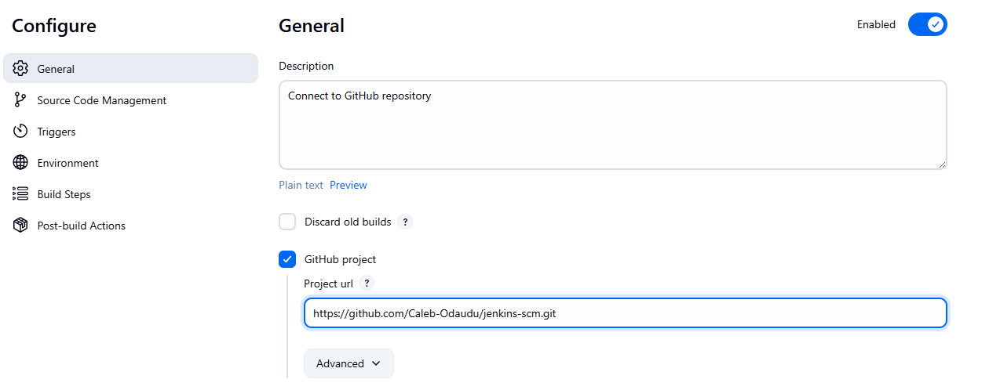

3. Save the configuration and click **Build Now** to connect Jenkins to your repository.

    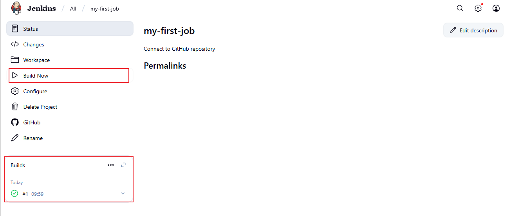

We have successfully connected Jenkins with our GitHub repository (`jenkins-scm`).

---

## Configuring Build Triggers

As engineers, we need to automate tasks and make our work easier whenever possible. We have connected Jenkins to `jenkins-scm`, but currently, we cannot run a new build without clicking on **Build Now**. To eliminate this manual step, we need to configure a build trigger for our Jenkins job. With this, Jenkins will run a new build anytime a change is made to our GitHub repository.

1. Click **Configure** on your job and add the following configurations.

2. Click on **Build Triggers** to configure triggering the job from a GitHub webhook.

    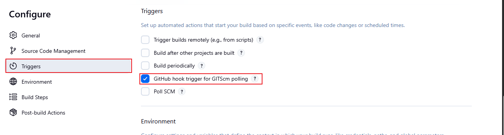

3. Create a GitHub webhook using your Jenkins IP address and port.

    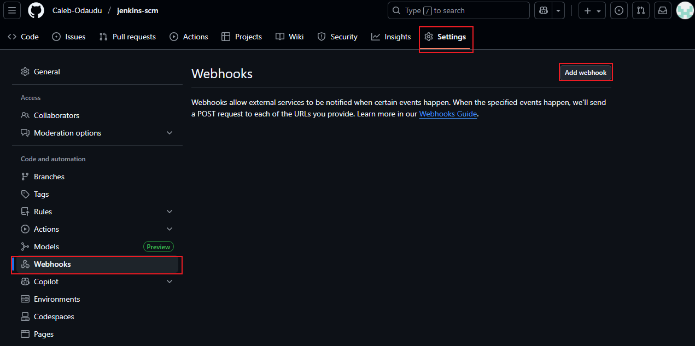

    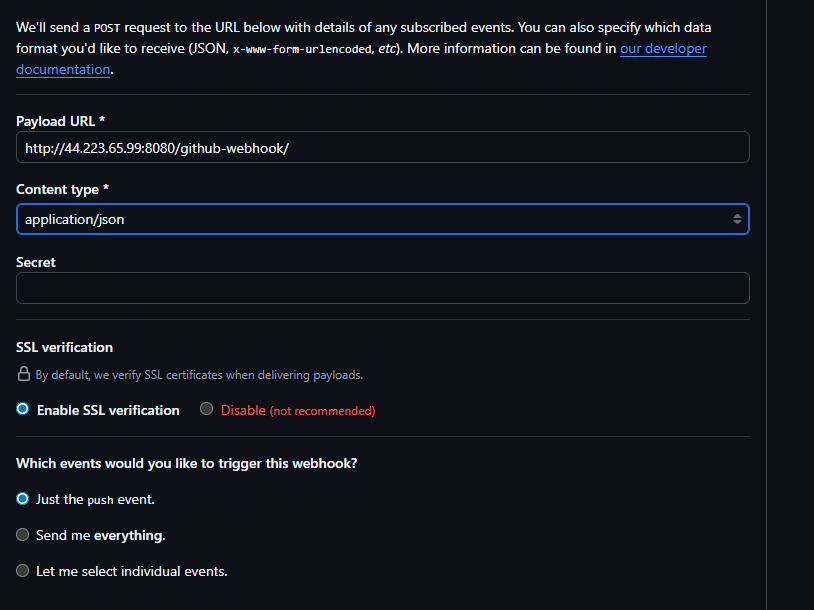

Now, you can make changes to any file in your GitHub repository (e.g., the `README.md` file) and push the changes to the main branch.

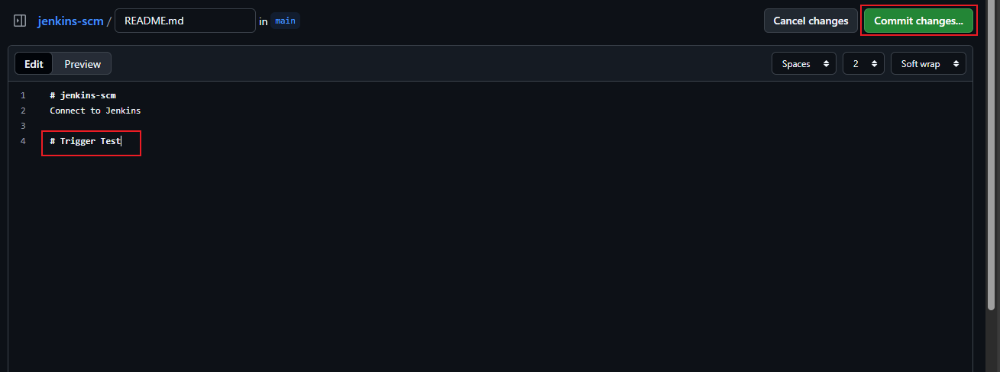

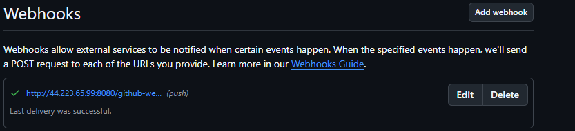

The image above shows a response from GitHub indicating that the push was successful.

You will see that a new build has been launched automatically (by webhook).

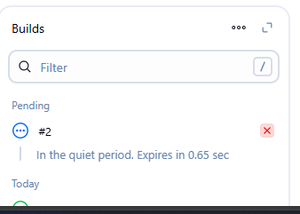

We have witnessed a change in our build history.

---

## Conclusion

In this project, you learned how to create and configure a Jenkins Freestyle Project, connect Jenkins to a GitHub repository, and automate builds using webhooks. By setting up build triggers, you enabled Jenkins to automatically start a new build whenever changes are pushed to your repository, streamlining your development workflow.

This hands-on experience demonstrates the power of Jenkins in automating repetitive tasks, improving collaboration, and ensuring continuous integration. As you continue exploring Jenkins, consider experimenting with more advanced features such as pipeline jobs, integration with testing tools, and deployment automation to further enhance your CI/CD processes.

