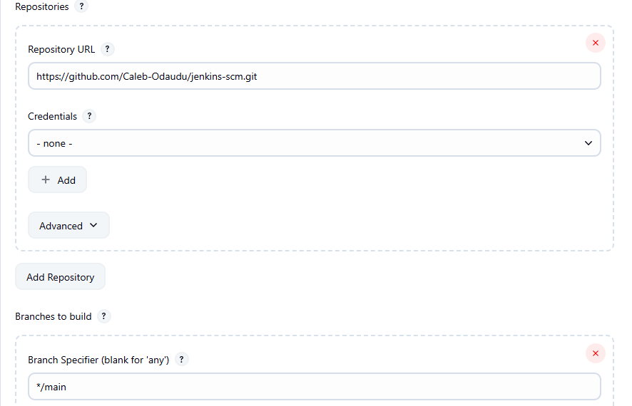

# Jenkins Pipeline Job

## What is a Jenkins Pipeline Job?

A Jenkins pipeline job is a way to define and automate a series of steps in the software delivery process. It allows you to script and organize your entire build, test, and deployment workflow. Jenkins pipelines enable organizations to define, visualize, and execute complex build, test, and deployment processes as code. This facilitates the seamless integration of continuous integration and continuous delivery (CI/CD) practices into software development.

Let's recall our Docker foundation project, where we created a Dockerfile and built a Docker image and container. Now, let's automate the same process with Jenkins pipeline code.

---

## Creating a Pipeline Job

Let's create our first pipeline job.

1. From the dashboard menu on the left side, click on **New Item**.

    

2. Create a pipeline job and name it "My pipeline job".

    

---

## Configuring Build Trigger

As we did previously, create a build trigger for Jenkins to automatically run a new build.

1. Click **Configure** on your job and add the necessary configurations.

2. Click on **Build Trigger** to configure triggering the job from a GitHub webhook.

    

3. Since we have already created a GitHub webhook previously, there is no need to create one again.

---

## Writing Jenkins Pipeline Script

A Jenkins pipeline script defines and orchestrates the steps and stages of a CI/CD pipeline. Jenkins pipelines can be defined using either declarative or scripted syntax.

- **Declarative syntax** is more structured and concise, using a domain-specific language to describe pipeline stages, steps, and configurations.
- **Scripted syntax** provides more flexibility and is suitable for complex scripting requirements.

Let's write our pipeline script:

```groovy
pipeline {
    agent any

    stages {
        stage('Connect To Github') {
            steps {
                checkout scmGit(
                    branches: [[name: '*/main']],
                    extensions: [],
                    userRemoteConfigs: [[url: 'https://github.com/Caleb-Odaudu/jenkins-scm.git']]
                )
            }
        }
        stage('Build Docker Image') {
            steps {
                script {
                    sh 'docker build -t dockerfile .'
                }
            }
        }
        stage('Run Docker Container') {
            steps {
                script {
                    sh 'docker run -itd --name nginx -p 8081:80 dockerfile'
                }
            }
        }
    }
}
```

---

### Explanation of the Script

The provided Jenkins pipeline script defines a series of stages for a CI/CD process:

- **Agent Configuration:**  
  `agent any`  
  Specifies that the pipeline can run on any available agent (master or node).

- **Stages:**  
  Each stage represents a phase in the software delivery process.

    - **Stage 1: Connect to GitHub**  
      Checks out the source code from the GitHub repository (`https://github.com/Caleb-Odaudu/jenkins-scm.git`) using the `main` branch.

    - **Stage 2: Build Docker Image**  
      Builds a Docker image named `dockerfile` using the source code from the repository.

    - **Stage 3: Run Docker Container**  
      Runs a Docker container named `nginx` in detached mode, mapping port 8081 on the host to port 80 in the container.

---

#### Generating Pipeline Syntax for Your GitHub Repository

1. Click on **Pipeline Syntax**.

    

2. Select `checkout: Check out from version control` from the dropdown.

    

3. Paste your repository URL and ensure your branch is `main`.

    

4. Generate your pipeline script and replace the relevant section in your pipeline.

---

## Installing Docker

Before Jenkins can run Docker commands, Docker must be installed on the same instance as Jenkins. Use a shell script to automate the installation:

1. Create a file named `docker.sh`:

    ```bash
    vi docker.sh
    ```

2. Open the file and paste the script below:

    ```bash
    sudo apt-get update -y
    sudo apt-get install ca-certificates curl gnupg -y
    sudo install -m 0755 -d /etc/apt/keyrings
    curl -fsSL https://download.docker.com/linux/ubuntu/gpg | sudo gpg --dearmor -o /etc/apt/keyrings/docker.gpg
    sudo chmod a+r /etc/apt/keyrings/docker.gpg

    # Add the repository to Apt sources:
    echo \
      "deb [arch=$(dpkg --print-architecture) signed-by=/etc/apt/keyrings/docker.gpg] https://download.docker.com/linux/ubuntu \
      $(. /etc/os-release && echo "$VERSION_CODENAME") stable" | \
      sudo tee /etc/apt/sources.list.d/docker.list > /dev/null
    sudo apt-get update -y
    sudo apt-get install docker-ce docker-ce-cli containerd.io docker-buildx-plugin docker-compose-plugin -y
    sudo systemctl status docker
    ```

3. Save and close the file.

4. Make the file executable:

    ```bash
    chmod u+x docker.sh
    ```

5. Execute the file:

    ```bash
    ./docker.sh
    ```

You have successfully installed Docker.


---

## Building Pipeline Script

Now that Docker is installed on the same instance as Jenkins, you need to create a Dockerfile before running your pipeline script. Recall the Dockerfile used in the Docker foundations project.

1. Create a new file named `dockerfile`.

2. Paste the code snippet below into the file:

    ```dockerfile
    # Use the official NGINX base image
    FROM nginx:latest

    # Set the working directory in the container
    WORKDIR /usr/share/nginx/html/

    # Copy the local HTML file to the NGINX default public directory
    COPY index.html /usr/share/nginx/html/

    # Expose port 80 to allow external access
    EXPOSE 80
    ```

3. Create an `index.html` file and paste the content below:

    ```
    Congratulations, you have successfully run your first pipeline code.
    ```

Pushing these files (`dockerfile` and `index.html`) will trigger Jenkins to automatically run a new build for your pipeline.


---

## Accessing Your Application

To access the content of `index.html` in your web browser, first edit inbound rules and open the port mapped to your container (8081).


You can now access the content of `index.html` in your web browser.


---

## Conclusion

In this project, you learned how to create and configure a Jenkins pipeline job, automate Docker image builds and container deployment, and integrate Jenkins with GitHub for continuous integration. By leveraging Jenkins pipelines and Docker, you streamlined your build and deployment process, enabling automated and repeatable workflows.

Continue exploring Jenkins pipeline features, such as advanced scripting, integration with other tools, and deployment automation, to further enhance your CI/CD practices and DevOps capabilities.

