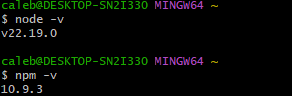
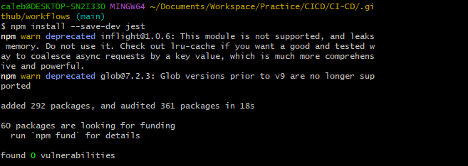
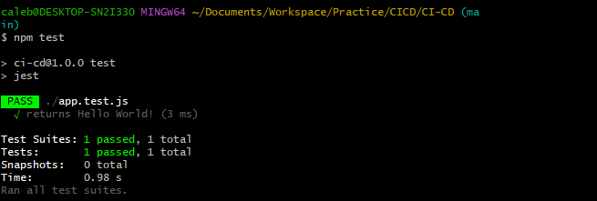
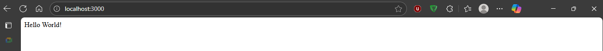

# Introduction to Continuous Integration and Continuous Deployment

This project involves setting up a simple web application (e.g., a Node.js application) and applying CI/CD practices using GitHub Actions. The application will have basic functionality, such as serving a static web page.

## Introduction to GitHub Actions and CI/CD Course Project

This project is designed to provide a hands-on learning experience, guiding you through the essentials of automating software development processes using GitHub Actions.

### Why Is This Relevant?

Imagine you are a chef in a busy restaurant. Every dish you prepare is like a piece of software code. Without a systematic approach, you might end up with orders being mixed up, dishes taking too long to prepare, or worse, the quality of the food being inconsistent. This is where a well-organized kitchen, with clear processes and automation (like having appliances that precisely time and cook parts of the dishes), comes into play. In software development, CI/CD is akin to this efficient kitchen. It ensures that your "dishes" (software builds) are consistently "cooked" (built, tested, and deployed) with precision and efficiency. By learning GitHub Actions and CI/CD, you are essentially learning how to set up and manage your high-tech kitchen in the software world, allowing you to serve "dishes" faster, with higher quality, and with fewer "kitchen mishaps" (bugs and deployment issues).

This mini-project will help you understand and implement these practices, making your software development process more efficient and error-free, much like a well-orchestrated kitchen. Whether you are working on personal projects, contributing to open source, or building enterprise-level applications, mastering CI/CD with GitHub Actions will be an invaluable skill in your development toolkit.

## Prerequisites

1. **Basic Knowledge of Git and GitHub**
    - Understanding of version control concepts.
    - Familiarity with basic Git operations like clone, commit, push, and pull.
    - A GitHub account and knowledge of repository management on GitHub.

2. **Understanding of Basic Programming Concepts**
    - Foundational programming knowledge, preferably in JavaScript, as the example project uses Node.js.
    - Basic understanding of how web applications work.

3. **Familiarity with Node.js and npm**
    - Basic knowledge of Node.js and npm (Node Package Manager).
    - Ability to set up a simple Node.js project and install dependencies using npm.

4. **Text Editor or IDE**
    - A text editor or Integrated Development Environment (IDE) like Visual Studio Code, Atom, Sublime Text, or any preferred editor for writing and editing code.

5. **Local Development Environment**
    - Node.js and npm installed on the local machine.
    - Access to the command line or terminal.

6. **Internet Connection**
    - Stable internet connection to access GitHub and other online resources or documentation.

7. **Basic Understanding of CI/CD Concepts**
    - General awareness of Continuous Integration and Continuous Deployment concepts.
    - This can be part of the learning in the course, but prior knowledge is beneficial.

## Project Implementation

### Setting Up the Project

1. **Initialize a GitHub Repository**
    - Create a new repository on GitHub.

    - Clone it to your local machine.
    ```bash
    git clone <repository-url>
    ```

2. **Install Node.js**

    **Step 1: Download Node.js**  
    Visit the official Node.js website: [https://nodejs.org](https://nodejs.org)  
    Choose the LTS (Long Term Support) version for stability.

    **Step 2: Install Node.js**  
    Download the installer for your operating system (Windows, macOS, or Linux).  
    Run the installer and follow the setup instructions.  
    The installer will also install npm automatically.

    **Step 3: Verify Installation**  
    Open a terminal or command prompt and run the following commands to check the installation:

    ```bash
    node -v   # Displays the Node.js version
    npm -v    # Displays the npm version
    ```

    

3. **Create a Simple Node.js Application**
    - Initialize a Node.js project (`npm init`).
    ~~~bash
    npm init -y
    ~~~

    - Install Express.js as a dependency.
    ~~~bash
    npm install express
    ~~~

    - Create a simple server using Express.js to serve a static web page.
    ```bash
    touch index.js
    ```
    - Open `index.js` in your text editor and add the following code:.

    ```js
    // Example: index.js
    const express = require('express');
    const app = express();
    const port = process.env.PORT || 3000;

    app.get('/', (req, res) => {
      res.send('Hello World!');
    });

    app.listen(port, () => {
      console.log(`App listening at http://localhost:${port}`);
    });
    ```

4. **Write Your First GitHub Action Workflow**
    - Create a `.github/workflows` directory in your repository.
    ```bash
    mkdir -p .github/workflows
    ```

    ```bash
    cd .github/workflows
    ```


    - Add a workflow file (e.g., `node.js.yml`):

    ```bash
    vim node.js.yml
    ```

    ```yaml
    # Example: .github/workflows/node.js.yml

    name: Node.js CI

    on:
      push:
        branches: [ main ]
      pull_request:
        branches: [ main ]

    jobs:
      build:
        runs-on: ubuntu-latest

        strategy:
          matrix:
            node-version: [14.x, 16.x]

        steps:
          - uses: actions/checkout@v2

          - name: Use Node.js ${{ matrix.node-version }}
            uses: actions/setup-node@v1
            with:
              node-version: ${{ matrix.node-version }}

          - run: npm ci

          - run: npm run build --if-present

          - run: npm test
    ```

#### Explanation

1. **`name`**: The name of your workflow as it appears on GitHub.
2. **`on`**: Defines when the workflow is triggered. Here, it activates on push and pull request events to the main branch.
3. **`jobs`**: Jobs are sets of steps that execute on the same runner. In this example, there is one job named `build`.
4. **`runs-on`**: Defines the type of machine to run the job on. Here, it uses the latest Ubuntu virtual machine.
5. **`strategy.matrix`**: Allows you to run the job on multiple versions of Node.js, ensuring compatibility.
6. **`steps`**: A sequence of tasks executed as part of the job.
    - `actions/checkout@v2`: Checks out the repository under `$GITHUB_WORKSPACE`.
    - `actions/setup-node@v1`: Sets up the Node.js environment.
    - `npm ci`: Installs dependencies defined in `package-lock.json`.
    - `npm run build --if-present`: Runs the build script from `package.json` if it's present.
    - `npm test`: Runs tests specified in `package.json`.

This workflow is a basic example for a Node.js project, demonstrating how to automate testing across different Node.js versions and ensuring that your code integrates and works as expected in a clean environment.

---

5. **Testing and Deployment**
    - Add automated tests for your application.
    ```bash
    npm install --save-dev jest
    ```
    

    • 	: This is the testing framework you're installing. It helps you write and run unit tests for your code.
    • 	: This flag tells npm to add Jest to your  in .
    That means:
    • 	Jest is only needed during development (e.g. for testing).
    • 	It won’t be installed when someone runs , which skips dev tools to keep production lean.

    - Create a test case
    Outside the .gitignore file, create a new file named app.js and add the following code:
    ```app.js
function getGreeting() {
  return 'Hello World!';
}
module.exports = getGreeting;
```
    - Create a new file named app.test.js and add the following code:
    ```app.test.js
const getGreeting = require('./app');

test('returns Hello World!', () => {
  expect(getGreeting()).toBe('Hello World!');
});
```
    - Update `package.json` to include a test script:
    ```json
    {
      "scripts": {
        "test": "jest"
      }
    }

Now, you can run your tests using the command:
    ```bash
    npm test
    ```
    

This output means your Jest test suite ran successfully and passed without a hitch. You’ve now got:
• 	 A working Express app
• 	 Modular logic in app.js
• 	 A test case in app.test.js
• 	 Automated testing with Jest
• 	 CI-ready test script in package.json




    - Update the workflow to include test execution.

    In `.github/workflows/node.js.yml`, notice there is a test step:

    ```yaml
          - run: npm test
    ```
This ensures your tests run automatically on every push or pull request.

    - Create a workflow for deployment (e.g., to a cloud service like Heroku or AWS).

In this example we will use AWS for deployment.

We will start by creating a new file named deploy.yml in the .github/workflows directory and add the following code:

```yaml
name: Deploy to AWS EC2

on:
  push:
    branches:
      - main

jobs:
  deploy:
    runs-on: ubuntu-latest

    steps:
      - name: Checkout code
        uses: actions/checkout@v2

      - name: Set up SSH
        uses: webfactory/ssh-agent@v0.7.0
        with:
          ssh-private-key: ${{ secrets.EC2_SSH_KEY }}

      - name: Deploy to EC2
        run: |
          ssh -o StrictHostKeyChecking=no ec2-user@${{ secrets.EC2_HOST }} << 'EOF'
            cd /home/ec2-user/your-app-folder
            git pull origin main
            npm install
            pm2 restart index.js || pm2 start index.js
        EOF
```

    - **Explanation:**
      - This workflow triggers on pushes to the `main` branch.
      - It checks out the code, sets up SSH using a private key stored in GitHub Secrets, and deploys the application to an AWS EC2 instance.
      - Make sure to replace `your-app-folder` with the actual folder name where your app resides on the EC2 instance.

You’ll need to add these secrets to your GitHub repository:
        - `EC2_SSH_KEY`: Your private SSH key for accessing the EC2 instance.
        - `EC2_HOST`: The public DNS or IP address of your EC2 instance.

You can add secrets via Settings → Secrets and variables → Actions → New repository secret.
6. **Experiment and Learn**
    - Modify workflows to see how changes affect the CI/CD process.
    - Try adding different types of tests (unit tests, integration tests).

## Glossary

### 1. Definition and Benefits of CI/CD

- **Continuous Integration (CI)** is the practice of merging all developers' working copies to a shared mainline several times a day.
- **Continuous Deployment (CD)** is the process of releasing software changes to production automatically and reliably.
- **Benefits:** Faster release rate, improved developer productivity, better code quality, and enhanced customer satisfaction.

### 2. Overview of the CI/CD Pipeline

- **CI Pipeline** typically includes steps like version control, code integration, automated testing, and building the application.
- **CD Pipeline** involves steps like deploying the application to a staging or production environment, and post-deployment monitoring.
- **Tools:** Version control systems (e.g., Git), CI/CD platforms (e.g., GitHub Actions), testing frameworks, and deployment tools.

### 3. Introduction to GitHub Actions

- **GitHub Actions:** A CI/CD platform integrated into GitHub, automating the build, test, and deployment pipelines of your software directly within your GitHub repository.
- **Documentation Reference:** Explore the [GitHub Actions Documentation](https://docs.github.com/en/actions) for in-depth understanding.

#### Key Concepts and Terminology

1. **Workflow**
    - **Definition:** A configurable automated process made up of one or more jobs. Workflows are defined by a YAML file in your repository.
    - **Example:** A workflow to test and deploy a Node.js application upon a Git push.
    - **Documentation:** Learn more about workflows in the [GitHub Docs on Workflows](https://docs.github.com/en/actions/how-to/write-workflows).

2. **Event**
    - **Definition:** A specific activity that triggers a workflow. Events include activities like push, pull request, issue creation, or even a scheduled time.
    - **Example:** A `push` event triggers a workflow that runs tests every time code is pushed to any branch in a repository.
    - **Documentation:** Review different types of events in the [Events that trigger workflows section](https://docs.github.com/en/actions/using-workflows/events-that-trigger-workflows).

3. **Jobs**
    - **Definition:** A set of steps in a workflow that are executed on the same runner. Jobs can run sequentially or in parallel.
    - **Example:** A job that runs tests on your application.
    - **Documentation:** Understand jobs in detail in the [GitHub Docs on Jobs](https://docs.github.com/en/actions/using-jobs/choosing-the-runner-for-a-job).

4. **Steps**
    - **Definition:** An individual task that can run commands within a job. Steps can run scripts or actions.
    - **Example:** A step in a job to install dependencies (`npm install`).
    - **Documentation:** Learn about steps in the [Steps section of GitHub Docs](https://docs.github.com/en/actions/using-jobs/using-steps-in-a-job).

5. **Actions**
    - **Definition:** Standalone commands combined into steps to create a job. Actions can be written by you or provided by the GitHub community.
    - **Example:** Using `actions/checkout` to check out your repository code.
    - **Documentation:** Explore GitHub Actions in the [Marketplace](https://github.com/marketplace?type=actions) and learn how to create your own in the [Creating actions guide](https://docs.github.com/en/actions/creating-actions/about-custom-actions).

6. **Runner**
    - **Definition:** A server that runs your workflows when they are triggered. Runners can be hosted by GitHub or self-hosted.
    - **Example:** A GitHub-hosted runner that uses Ubuntu.
    - **Documentation:** Delve into runners in the [GitHub Docs on Runners](https://docs.github.com/en/actions/using-github-hosted-runners/about-github-hosted-runners).

**Additional Resources:**

- **GitHub Learning Lab:** Interactive courses to learn GitHub Actions. Visit [GitHub Learning Lab](https://github.com/apps/github-learning-lab).
- **GitHub Action Quickstart:** For a hands-on introduction, check out the [GitHub Action Quickstart](https://docs.github.com/en/actions/quickstart).
- **Community Forums:** Engage with the GitHub community for questions and discussions at [GitHub Community Forums](https://github.com/orgs/community/discussions/).