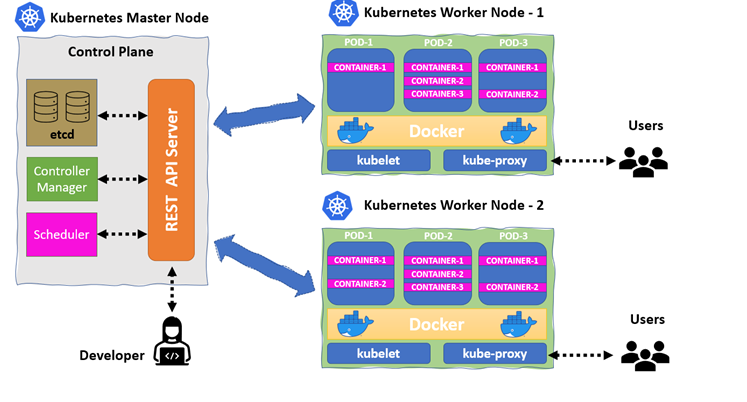
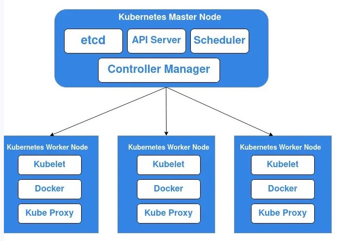
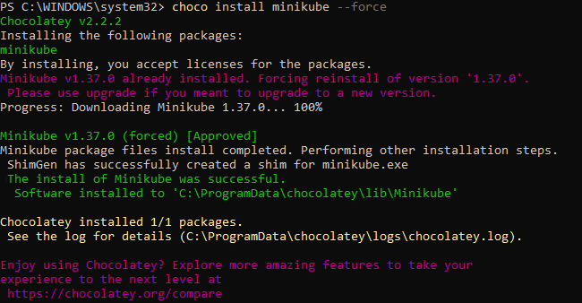
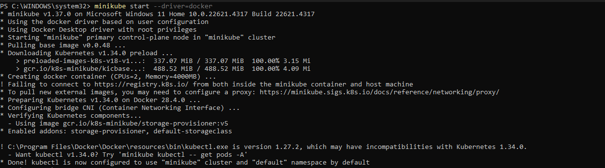

# Setting Up Minikube

## Container Orchestration With Kubernetes

Imagine orchestrating a vibrant culinary event with various chefs preparing different dishes. Container orchestration seamlessly coordinates each chef (container) to ensure perfect serving, timing, and overall dining experience. Just as a skilled event planner brings order to chaos, Kubernetes, a notable orchestrator, manages containers, making it the go-to choice for handling the intricate dance of modern applications. Container orchestration is a critical aspect of managing and scaling containerized applications efficiently. It involves automating the deployment, scaling, and operation of containerized applications, ensuring seamless coordination among multiple containers to deliver high availability and optimal performance. One widely used container orchestration tool is Kubernetes. Developed by Google, Kubernetes has become the de facto standard for automating the deployment, scaling, and management of containerized applications.

### What is Kubernetes?

Kubernetes, often abbreviated as K8s, is an open-source container orchestration platform that automates the deployment, scaling, and management of containerized applications. It provides a robust framework for running distributed systems resiliently, handling the complexities of container management so developers can focus on building applications. Kubernetes offers features such as automated rollouts and rollbacks, service discovery, load balancing, storage orchestration, and self-healing capabilities. It abstracts the underlying infrastructure, allowing applications to run consistently across different environments, whether on-premises or in the cloud.

### Components of a Kubernetes Cluster



**Control Plane or Master Node:** The control plane is the brain of the Kubernetes cluster, responsible for managing the overall state of the cluster. It consists of several key components, like the API server, scheduler, controller manager, and etcd (a distributed key-value store).

**Node:** Nodes are individual machines within the Kubernetes cluster. Each node is equipped with a container runtime (like Docker), kubelet (an agent that communicates with the control plane), and a kube-proxy (which manages network communication). Nodes execute and manage containers, distribute workloads, and communicate with the control plane to maintain the desired state of the applications. The collaboration of multiple nodes creates a scalable and resilient environment, forming the foundation for deploying and managing containerized applications.

**Pods:** Pods are the fundamental deployment units in Kubernetes, representing one or more closely related containers that share the same network namespace, storage, and set of specifications. Containers within a pod can communicate with each other using localhost, making it easy to manage and scale applications. Pods are ephemeral by nature, meaning they can be created, destroyed, and replaced as needed. They provide a level of abstraction that allows developers to focus on application logic rather than the underlying infrastructure.

**Containers:** Containers in Kubernetes encapsulate and package applications, along with their dependencies and runtime environment, ensuring consistency across various computing environments. Leveraging containerization technology, such as Docker, containers provide a lightweight and portable way to deploy applications. In Kubernetes, containers are organized into Pods, the smallest deployable units.



**API Server:** The API server is the central management entity of the Kubernetes control plane. It exposes the Kubernetes API, allowing users and components to interact with the cluster. The API server processes RESTful requests, validates them, and updates the cluster state accordingly. It serves as the primary interface for managing resources, such as pods, services, and deployments.

**Controller Manager:** The controller manager is responsible for maintaining the desired state of the cluster by running various controllers. Controllers are control loops that monitor the state of the cluster and make adjustments as needed. For example, the replication controller ensures that the specified number of pod replicas are running at all times.

**Scheduler:** The scheduler is responsible for assigning pods to nodes based on resource availability and other constraints. It evaluates the resource requirements of each pod and selects an appropriate node to host it. The scheduler considers factors such as CPU, memory, and affinity rules to ensure optimal placement of pods within the cluster.

**etcd:** etcd is a distributed key-value store that serves as the backing store for all cluster data. It stores the configuration data, state information, and metadata of the Kubernetes cluster. etcd is designed to be highly available and consistent, ensuring that the cluster state is reliably maintained even in the face of failures.

**Kubelet:** The kubelet is an agent that runs on each node in the cluster. It communicates with the control plane and ensures that the containers specified in the pod definitions are running and healthy. The kubelet monitors the state of the pods and reports back to the control plane, allowing it to make decisions about scaling and resource allocation.

**Kube-Proxy:** The kube-proxy is responsible for managing network communication within the cluster. It maintains network rules on each node, allowing pods to communicate with each other and with external services. The kube-proxy handles load balancing and service discovery, ensuring that traffic is routed correctly to the appropriate pods.

## Project Goals

By the end of this project, you should have:

- Gained a comprehensive understanding of Kubernetes and its components.
- Mastered the usage of Minikube for local Kubernetes cluster deployment and experimentation.
- Acquired hands-on experience in deploying and managing containerized applications using Kubernetes.
- Built and deployed applications on Minikube.

## Minikube

Now that we have an idea of what Kubernetes is, let's set up Minikube. But what is Minikube?

Minikube is an open-source tool that enables us to run Kubernetes clusters locally on our machines. As we now know, Kubernetes is a container orchestration platform that automates the deployment, scaling, and management of containerized applications. Minikube streamlines the creation of a local Kubernetes environment, providing a user-friendly playground where we can safely build and test our applications before deploying them to a production setting.

Let us get started with setting up Minikube.

### Installing Minikube on Windows

> To install Minikube on Windows, we need to use Chocolatey. This is a Windows package manager for installing, updating, and removing software packages.

1. Go to the Windows search bar and launch a terminal with administrative access.

2. Install Minikube:

```bash
choco install minikube --force
```


3. Minikube needs Docker as a driver and also to pull its base image. Therefore, we need to install Docker Desktop for Windows.

Go to the [Docker Desktop official documentation](https://docs.docker.com/desktop/setup/install/windows-install/) to install it if not already installed.

4. Run the command below to start Minikube using Docker as the driver:

```bash
minikube start --driver=docker
```



### Installing Minikube on Linux

For Linux users, let's install Minikube.

1. Launch a terminal with administrative access.

2. We need to install Docker as a driver for Minikube and also for Minikube to pull base images for the Kubernetes cluster.

```bash
sudo apt-get update
```
This command refreshes the package list on a Debian-based system, ensuring the latest software information is available for installation.

```bash
sudo apt-get install ca-certificates curl gnupg
```
This command installs essential packages including certificate authorities, a data transfer tool (curl), and GNU Privacy Guard for secure communications and package verification.

```bash
sudo install -m 0755 -d /etc/apt/keyrings
```
This command creates a directory (`/etc/apt/keyrings`) with specific permissions (0755) for storing keyring files, which are used for Docker authentication.

```bash
curl -fsSL https://download.docker.com/linux/ubuntu/gpg | sudo gpg --dearmor -o /etc/apt/keyrings/docker.gpg
```
This downloads the Docker GPG key using `curl`.

```bash
sudo chmod a+r /etc/apt/keyrings/docker.gpg
```
Sets read permissions for all users on the Docker GPG key file within the APT keyring directory.

**Let's add the repository to Apt sources:**

```bash
echo \
  "deb [arch=$(dpkg --print-architecture) signed-by=/etc/apt/keyrings/docker.gpg] https://download.docker.com/linux/ubuntu \
  $(. /etc/os-release && echo "$VERSION_CODENAME") stable" | \
  sudo tee /etc/apt/sources.list.d/docker.list > /dev/null
```

```bash
sudo apt-get update
```

Install the latest version of Docker:

```bash
sudo apt-get install docker-ce docker-ce-cli containerd.io docker-buildx-plugin docker-compose-plugin
```

Verify that Docker has been successfully installed:

```bash
sudo systemctl status docker
```

3. Install Minikube:

```bash
curl -LO https://storage.googleapis.com/minikube/releases/latest/minikube_latest_amd64.deb
```
If you get an error after running the command above, reach out to technical support.

```bash
sudo dpkg -i minikube_latest_amd64.deb
```
The command above downloads Minikube's binary and installs Minikube using dpkg.

4. Start Minikube:

```bash
minikube start --driver=docker
```

5. Kubectl is the command line interface (CLI) tool for interacting with and managing Kubernetes clusters, allowing users to deploy, inspect, and manage applications within the Kubernetes environment. Let's install kubectl:

```bash
sudo snap install kubectl --classic
```

#### Minikube Installation on Linux (Automation)

```bash
sudo apt-get update
sudo apt-get install ca-certificates curl gnupg
sudo install -m 0755 -d /etc/apt/keyrings
curl -fsSL https://download.docker.com/linux/ubuntu/gpg | sudo gpg --dearmor -o /etc/apt/keyrings/docker.gpg
sudo chmod a+r /etc/apt/keyrings/docker.gpg
echo \
  "deb [arch=$(dpkg --print-architecture) signed-by=/etc/apt/keyrings/docker.gpg] https://download.docker.com/linux/ubuntu \
  $(. /etc/os-release && echo "$VERSION_CODENAME") stable" | \
  sudo tee /etc/apt/sources.list.d/docker.list > /dev/null
sudo apt-get update
sudo apt-get install docker-ce docker-ce-cli containerd.io docker-buildx-plugin docker-compose-plugin

curl -LO https://storage.googleapis.com/minikube/releases/latest/minikube_latest_amd64.deb
sudo dpkg -i minikube_latest_amd64.deb

minikube start --driver=docker
sudo snap install kubectl --classic
```

### Installing Minikube on Mac

For Mac users, let's install Minikube.

1. Launch a terminal with administrative access.

2. Install Minikube:

```bash
curl -LO https://storage.googleapis.com/minikube/releases/latest/minikube-darwin-amd64

sudo install minikube-darwin-amd64 /usr/local/bin/minikube
```
The command above downloads Minikube's binary and installs Minikube.

3. Just like Windows and Linux, we need Docker Desktop as a driver for Minikube. To install Docker Desktop for Mac, go to the Docker Desktop official documentation and install it if not already installed.

4. Run the command below to start Minikube using Docker as the driver:

```bash
minikube start --driver=docker
```

## Conclusion

In this project, we have explored the fundamentals of Kubernetes and its components, gaining a solid understanding of container orchestration. We have successfully set up Minikube on various operating systems, providing us with a local Kubernetes environment for experimentation and learning. With hands-on experience in deploying and managing containerized applications using Kubernetes, we are now equipped to build and deploy applications on Minikube, paving the way for further exploration and mastery of Kubernetes in real-world scenarios.