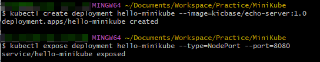
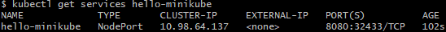
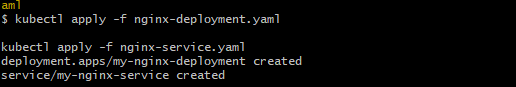
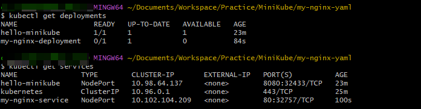
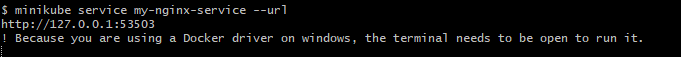
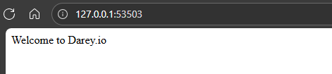

# Working with Kubernetes Resources

## Introduction to YAML

A Kubernetes YAML file is a text file written in YAML syntax that describes and defines Kubernetes resources. YAML is a human-readable data serialization format that is commonly used for configuration files. In the context of Kubernetes, these YAML files serve as a declarative way to specify the desired state of resources such as pods, containers, services, and deployments you want to deploy and manage within a Kubernetes cluster.

### Basic Structure of YAML

YAML uses indentation to represent the hierarchy of data, and it uses whitespace (usually spaces, not tabs) for indentation.

```yaml
key1: value1
key2:
  subkey1: subvalue1
  subkey2: subvalue2
key3:
  - item1
  - item2
```

### Data Types

**Scalar:** Scalars are single values.

- **Strings:**
    ```yaml
    name: John Doe
    ```

- **Numbers:**
    ```yaml
    age: 25
    ```

- **Booleans:**
    ```yaml
    is_student: true
    ```

**Collections**

- **Lists (arrays):**
    ```yaml
    fruits:
      - apple
      - banana
      - orange
    ```

- **Maps (key-value pairs):**
    ```yaml
    person:
      name: Alice
      age: 30
    ```

**Nested Structure:** YAML allows nesting of structures.

    ```yaml
    employee:
      name: John Doe
      position: developer
      skills:
        - Python
        - JavaScript
    ```

**Comments:** In YAML, comments start with `#`.

    ```yaml
    # This is a comment
    key: value
    ```

**Multiline Strings:** Multiline strings can be represented using `|` or `>` characters.

    ```yaml
    description: |
      This is a multiline
      string in YAML.
    ```

**Anchors and Aliases:** You can use `&` to create an anchor and `*` to create an alias.

    ```yaml
    first: &name John
    second: *name
    ```

In this example, `second` has the same value as `first`.

---

## Deploying Applications in Kubernetes

In Kubernetes, deploying applications is a fundamental skill that every beginner needs to grasp. Deploying involves the process of taking your application code and running it on a Kubernetes cluster, ensuring that it scales, manages resources efficiently, and stays resilient. This hands-on project will guide you through deploying your application using Minikube, a lightweight, single-node Kubernetes cluster perfect for beginners.

### Deployment in Kubernetes

In Kubernetes, a **Deployment** is a declarative approach to managing and scaling applications. It provides a blueprint for the desired state of your application, allowing Kubernetes to handle the complexities of deploying and managing replicas. Whether you are running a simple web server or a more complex microservices architecture, Deployments are the cornerstone for maintaining application consistency and availability.

### Services in Kubernetes

Once your application is deployed, it needs a way to be accessed by other parts of your system or external users. This is where **Services** come into play. In Kubernetes, a Service is an abstraction that defines a logical set of Pods and a policy by which to access them. It acts as a stable endpoint to connect to your application, allowing for easy communication within the cluster or from external sources. Some of the several types of Services in Kubernetes are:

- **ClusterIP:** The default type. Exposes the Service on a cluster-internal IP. Accessible only within the cluster.
- **NodePort:** Exposes the Service on each Node's IP at a static port (NodePort). Accessible externally using `NodeIP`.
- **LoadBalancer:** Exposes the Service externally using a cloud provider's load balancer. Accessible externally through the load balancer's IP.

---

### Deploying a Minikube Sample Application

Using YAML files for deployment and services in Kubernetes is like crafting a detailed plan for your application, while direct deployment with `kubectl` commands is more like giving quick, on-the-spot instructions to launch and manage your application. Let's create a Minikube deployment and service with `kubectl`.

```bash
kubectl create deployment hello-minikube --image=kicbase/echo-server:1.0
```

The command above creates a Kubernetes Deployment named "hello-minikube" running the "kicbase/echo-server:1.0" container image.

```bash
kubectl expose deployment hello-minikube --type=NodePort --port=8080
```

The command above exposes the Kubernetes deployment named "hello-minikube" as a NodePort service on port 8080.



```bash
kubectl get services hello-minikube
```



The easiest way to access this service is to let Minikube launch a web browser for your Minikube service hello-minikube.

---

### Working with YAML Files

Let's recall our Docker foundations project when we pushed an image we built to Docker Hub. Now let us reuse our image in our YAML script for deployment.

1. Create a new folder `my-nginx-yaml`.

2. Create a new file `nginx-deployment.yaml` and paste the content below.

```yaml
apiVersion: apps/v1
kind: Deployment
metadata:
  name: my-nginx-deployment
spec:
  replicas: 1
  selector:
    matchLabels:
      app: my-nginx
  template:
    metadata:
      labels:
        app: my-nginx
    spec:
      containers:
      - name: my-nginx
        image: dareyregistry/my-nginx:1.0
        ports:
        - containerPort: 80
```

The provided YAML snippet defines a Kubernetes Deployment for deploying an instance of the Nginx web server. Let's break down the key components:

- **apiVersion: apps/v1**: Specifies the API version of the Kubernetes resource being defined. In this case, it indicates that we are using the `apps/v1` API group, which is commonly used for managing applications.
- **kind: Deployment**: Indicates that the resource being defined is a Deployment. Deployments are used to manage stateless applications and ensure that a specified number of replicas of a pod are running at any given time.
- **metadata**: Contains metadata about the Deployment, including its name (`my-nginx-deployment`).
- **spec**: This section defines the desired state of the Deployment.
  - **replicas: 1**: Specifies that we want to run one replica of the pod defined in the template.
  - **selector**: Defines how the Deployment identifies the pods it manages. In this case, it matches pods with the label `app: my-nginx`.
  - **template**: This section defines the pod template that will be used to create the pods managed by the Deployment.
    - **metadata**: Contains metadata for the pods, including labels. Here, the label `app: my-nginx` is assigned to the pods.
    - **spec**: Defines the specification for the containers within the pod.
      - **containers**: A list of containers that will run in the pod. In this case, there is one container defined.
        - **name: my-nginx**: The name of the container.
        - **image: dareyregistry/my-nginx:1.0**: Specifies the Docker image to be used for the container. In this case, it is using a custom Nginx image hosted on Docker Hub.
        - **ports**: Defines the ports that will be exposed by the container. Here, port 80 is exposed, which is the default port for Nginx.

> Note: You can replace the image with your own image.

3. Create a new file called `nginx-service.yaml` and paste the content below.

```yaml
apiVersion: v1
kind: Service
metadata:
  name: my-nginx-service
spec:
  selector:
    app: my-nginx
  ports:
    - protocol: TCP
      port: 80
      targetPort: 80
  type: NodePort
```

The provided YAML snippet defines a Kubernetes Service for exposing the Nginx application to the external world. Let's break down the key components:

- **apiVersion: v1**: Specifies the API version of the Kubernetes resource being defined. In this case, it indicates that we are using the `v1` API group, which is commonly used for core resources like Services.
- **kind: Service**: Indicates that the resource being defined is a Service. Services are used to expose applications running on a set of pods as a network service.
- **metadata**: Contains metadata about the Service, including its name (`my-nginx-service`).
- **spec**: This section defines the desired state of the Service.
  - **selector**: Defines how the Service identifies the pods it routes traffic to. In this case, it matches pods with the label `app: my-nginx`, which corresponds to the pods created by the Deployment defined earlier.
  - **ports**: A list of ports that the Service will expose.
    - **protocol: TCP**: Specifies the protocol used by the Service. In this case, it is TCP.
    - **port: 80**: The port on which the Service will be exposed. This is the port that clients will use to access the Nginx application.
    - **targetPort: 80**: The port on the pods that the Service will forward traffic to. In this case, it is also port 80, which is the default port for Nginx.
  - **type: NodePort**: Specifies the type of Service. A NodePort Service exposes the Service on a static port on each node's IP address, allowing external access to the application.

---

4. Run the commands below to deploy to the cluster:

```bash
kubectl apply -f nginx-deployment.yaml

kubectl apply -f nginx-service.yaml
```



5. Verify your deployment:

```bash
kubectl get deployments

kubectl get services
```



6. Access your deployment in a web browser:

```bash
minikube service my-nginx-service --url
```





---

## Conclusion

In this project, you learned how to define and deploy Kubernetes resources using YAML files, including Deployments and Services. You practiced applying, verifying, and accessing your application running on a Minikube cluster. Understanding how to structure YAML files and use `kubectl` commands is essential for managing applications in Kubernetes. By following these steps, you have built a strong foundation for deploying, exposing, and scaling applications in a real-world Kubernetes environment.

