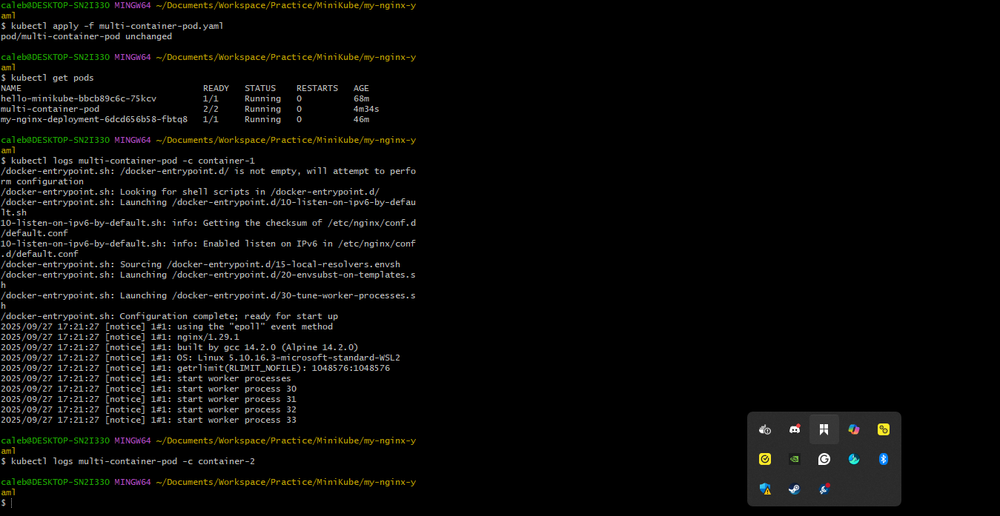
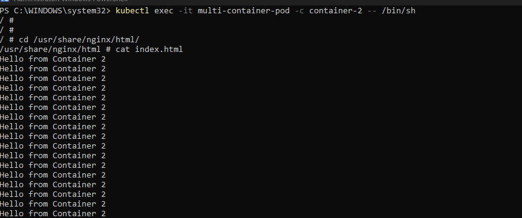

# Networking in Kubernetes

Networking refers to the mechanics and configuration that allow communication between different components (pods, services, and other resources) within a Kubernetes cluster. Kubernetes provides a flexible and powerful networking model to enable seamless interaction between containers and services, whether they are running on the same node or across different nodes in a cluster.

## Key Aspects of Networking in Kubernetes

**Pod Networking:** Containers within a pod share the same network namespace, allowing them to communicate with each other using `localhost`. This enables tight coupling between containers within the same pod.

**Service Networking:** Kubernetes Services provide a way to expose a group of pods as a single, stable network endpoint. Services have an associated cluster IP that allows other pods to communicate with the service. Services can be exposed internally within the cluster or externally to the outside world.

**Pod-to-Pod Communication:** Pods communicate with each other using their individual IP addresses. Kubernetes ensures that pods can reach each other directly, regardless of the node they are running on, by using an overlay network.

**Ingress:** Ingress is a Kubernetes resource that manages external access to services within a cluster, typically HTTP and HTTPS traffic. Ingress controllers handle the routing of incoming requests to the appropriate services based on defined rules.

**Network Policies:** Network policies allow you to define rules for how pods can communicate with each other and with external resources. This provides a way to enforce security and control traffic flow within the cluster.

**Container Network Interface (CNI):** Kubernetes uses CNI plugins to manage network interfaces for pods. Different CNI plugins provide various networking features and capabilities, such as IP address management, network isolation, and traffic routing.

---

Let's get hands-on with pod networking in Kubernetes by deploying a pod with multiple containers, showcasing how they share the same network namespace and can communicate with each other using `localhost`. Here’s a step-by-step guide using Kubernetes and `kubectl`:

---

## 1. Create a Multi-Container Pod YAML File (e.g., `multi-container-pod.yaml`)

```yaml
apiVersion: v1
kind: Pod
metadata:
  name: multi-container-pod
spec:
  containers:
  - name: container-1
    image: nginx:alpine
  - name: container-2
    image: busybox
    command:
      - '/bin/sh'
      - '-c'
      - 'mkdir -p /usr/share/nginx/html && while true; do echo "Hello from Container 2" >> /usr/share/nginx/html/index.html; sleep 10; done'
```

**Explanation of the YAML snippet above:**

- `apiVersion: v1` and `kind: Pod`: Specifies that we are creating a Pod resource.
- `metadata`: Contains metadata about the pod, including its name (`multi-container-pod`).
- `spec`: Defines the specification of the pod, including the containers it will run.
- `containers`: Lists the containers within the pod. In this case, we have two containers:
  - `container-1`: Uses the `nginx:alpine` image to run an Nginx web server.
  - `container-2`: Uses the `busybox` image and runs a command that continuously appends "Hello from Container 2" to an HTML file served by Nginx.

The pod has two containers—one running the Nginx web server and the other running BusyBox with a simple command to continuously append "Hello from Container 2" to the Nginx default HTML file.

---

## 2. Apply the Pod Configuration

```bash
kubectl apply -f multi-container-pod.yaml
```

---

## 3. Check Pod Status and Logs

```bash
kubectl get pods
kubectl logs multi-container-pod -c container-1
kubectl logs multi-container-pod -c container-2
```

You will observe both containers are running within the same pod, and they share the same network namespace. The Nginx container serves its default page, and the BusyBox container continuously updates the HTML file.



---

## 4. Access Nginx from the BusyBox Container

It is recommended to use PowerShell or the Command Prompt as the command line interface.

```bash
kubectl exec -it multi-container-pod -c container-2 -- /bin/sh
```



---

## Conclusion

In this guide, we explored the networking capabilities of Kubernetes by deploying a multi-container pod. We saw how containers within the same pod share the same network namespace, allowing them to communicate with each other using `localhost`. This setup is particularly useful for tightly coupled applications where multiple containers need to work together seamlessly. Understanding pod networking is essential for designing and deploying applications in a Kubernetes environment, as it enables efficient communication and resource sharing between containers.