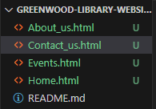
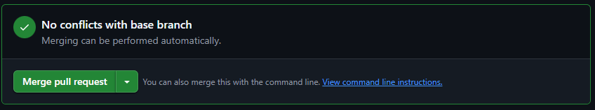
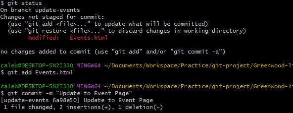
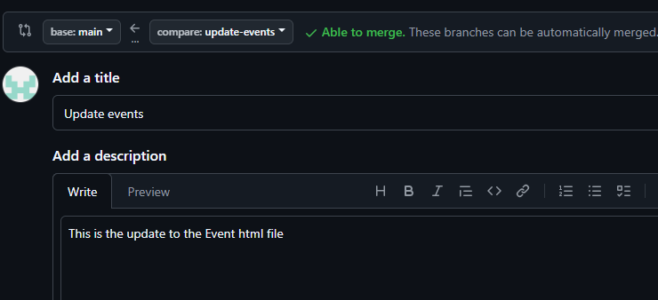

# Enhancing a Community Libary Website

## Scenerio
You are part of a development team tasked with enhancing the website for the "`Greenwood Community Libary.`" The website aims to be more engaging and informative for visitors. It currently includes basic sections: `Home,` `About Us,` `Events,` and `Contact Us`. Your team decides to add a "`Book Reviews`" section and update the "`Events`" page to feature upcoming community events.

You will simulate the roles of two contributors: "`Morgan`" and "`Jamie`", Morgan will focus on adding the "`Book Reviews`" section, while Jamie will update the "`Events`" page with new community events.

## Objectives

* Practice cloning a repository and working with branches in Git

* Gain experience in staging, committing and pushing changes from both developers

* Create pull requests and merge them after resolving any potential conflicts

## Set-up
Before we start it is important to create a repository on Git-Hub. Although it is possible to create the repository through GitBash and pull the request, but for this project I will use the GitHub Dashboard to show the set-up

On the top right of the GitHub dashboard there is a '+' button as you click that you have the possibility to create a new repository

For this Project, as shown in the image below, we are going to to name the project "greenwood-libary-website". We also made the repository public as well as initialising it with a README.md file

Now we will need to clone the repository into the local machine:

Copying repository

In a desired place to clone your directory use git clone to place the file

In this project you are going to use Visual Studio Code editor to create the files for the webpage. The reason to use the editor is because it is easier to showcase all the components of the directory

You will need to create four html files naming them: 'Home','About Us','Events',and 'contact Us'. You will also need to add content into each files.

We are now able to simulate the teams existing code base for the website. Staging, committing, and pushing the channges to the main directory

## Morgans Work: Adding Book Reviews

Before starting Morgan's work it is important to configure the name and email to showcase that Morgan is the person working.

Now it is possible to create a new branch for Morgan

In the image above, you can see that I named the branch "add-book-review" and with the command chosen it automatically switches us to the new created branch.

Morgan can now add a new html file, this will be called "Book_review.html" to represent the book review section. This is where we are able to add content into the file.

We are now able to stage, commit, and Push changes.

Image below showcases stage and commit commands:

Image below showcases push command

### Raise a Pull Request and Merge Morgan's workto the main branch

We will now open the repository on GitHub. Then navigate to the pull request tab.

You need to ensure the base branch is the `main` and the compare branch is `add-book-review`. You will also need to add a meaningful description highlightin the changes.

 

 I can now create a pull request. When that is done, we will need to wait for team member (or yourself) to review the PR, if necessary, resolving any merg conflicts. Once approved click "Merge Pull Request", then "Confirm Merge".

 

After merging, delete the branch with

## Jamie's Work
You will need to repeat the same flow for Jamie's work on Events Page.

As you did for Morgan, it is important to change configuration to showcase Jamie's work

We will now create a new branch called "update-events" and switch to the new branch.

We will now make modifications to the `event.html` file 

We are now able to stage commit the changes

Before raising a Pull request we will need to pull the latest changes to the main branch to the update-events branch. Then we wil be able to push the branch and raise a PR

We are now able to push the branch

Go to the Pull Requests tab, Select "New Pull Request", ensuring  is the base and  is the compare branch.Then submit for review.

We will now be able to delete the branch

## Conclusion

 This project successfully improved the Greenwood Community Library’s website by making it more engaging and informative for visitors. Through collaborative development, Morgan introduced a Book Reviews section, allowing users to share insights and recommendations, while Jamie revamped the Events page to showcase upcoming community activities more effectively.

By following a structured Git workflow, the team practiced essential development skills, including branching, staging, committing, pushing changes, and creating pull requests to merge updates efficiently. Resolving potential conflicts before merging ensured a smooth integration of new features into the main codebase.
The updated website now provides a richer experience for library patrons, fostering community engagement through book discussions and event participation. This project highlights the importance of version control, teamwork, and iterative improvement in web development.

As the website continues to evolve, future enhancements can include features like user book ratings, event RSVP functionality, and interactive discussion forums. This initiative sets a strong foundation for further digital growth, making Greenwood Community Library a more connected and vibrant space for all!