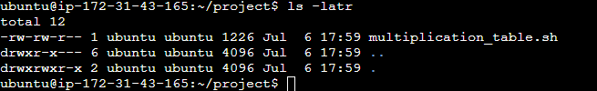
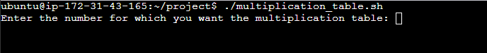
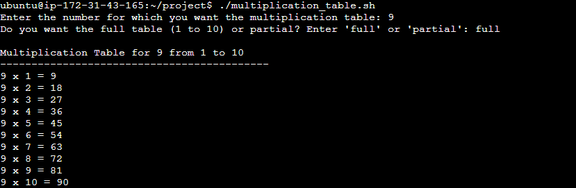
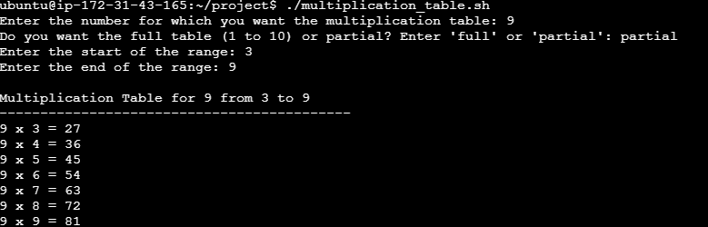
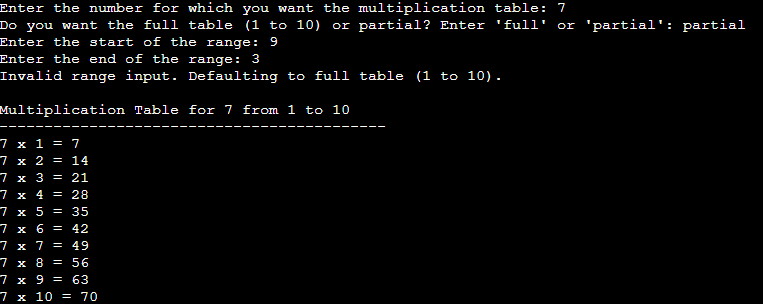

# Bash Script For Generating a Multiplication Table

## Objective
Creating a Bash script that generates a multiplication table for a number entered by the user. This project helps with the usage of loops, handling user inmput, and applying conditional logic in Bash scripting.

## Project Description
The script should prompt the user to enter a number and then ask if they prefer to see a full multiplication table from 1 to 10 or a partial tabel within a specified range. Based on the user's choice, the script will display the corresponding multiplication table.

## Project Requirement

- **User Input for Number**: The script must first ask the user to input a number for which the multiplication table will be generated.
- **Choice of Table Range**: Ask the user if they want a full multiplication table (1 to 10) or a partial table. If they choose partial, prompt them for the start and end of the range.
- **Use of Loops**: Implement the logic to generate the multiplication table using loops. Based on what is appropriate, use either the list form or C-style for loops,

- **Conditionlal Logic**: Use if-else statement to handle the logic based on what the user's choices (full vs. partial table and valid range input)

- **Input Vallidation**: Ensure that the user enters valid numbers for the multiplication table and the specified range. Provide feedback for invalid inputs and default to a full table if the range is incorrect.

- **Readable Output**: Display the multiplication table in a clear and readable format, adhering to the user's choice of range.

- **Comments and Code Quality**: Your script should be well-commented, explainiing the purpose of different sections and any important variables or logic used. Ensure the code is neatly formatted for easy readablity.

## Step-by-Step Explanation of the Multiplication Table Script

### Step 1: Script Creation
You start by creating a new Bash script file named `multiplication_table` using the `vim` editor:
```bash
vim multiplication_table
```
This opens a new file where you will write your script.

---

### Step 2: Input Validation Function
You define a function called `validate_number` to check if the input is a positive integer:
```bash
validate_number() {
    if [[ "$1" =~ ^[0-9]+$ ]]; then
        return 0
    else
        return 1
    fi
}
```
- This function uses a regular expression to ensure the input contains only digits (0-9).
- If the input is valid, it returns 0 (success); otherwise, it returns 1 (failure).

---

### Step 3: Prompting the User for Input
You prompt the user to enter the number for which they want the multiplication table:
```bash
read -p "Enter the number for which you want the multiplication table: " number
```
- The `read -p` command displays a message and stores the user's input in the variable `number`.

---

### Step 4: Validating the User's Input
You check if the entered number is a positive integer using the validation function:
```bash
if ! validate_number "$number"; then
    echo "Invalid number. Please input a positive integer."
    exit 1
fi
```
- If the input is not valid, the script prints an error message and exits.

---

### Step 5: Asking for Table Type
You ask the user if they want a full table (1 to 10) or a partial table:
```bash
read -p "Do you want the full table (1 to 10) or partial? Enter 'full' or 'partial': " choice
```
- The user's choice is stored in the variable `choice`.

---

### Step 6: Handling Partial Table Logic
If the user chooses "partial," you prompt for the start and end of the range:
```bash
if [[ "$choice" == "partial" ]]; then
    read -p "Enter the start of the range: " start
    read -p "Enter the end of the range: " end

    if ! validate_number "$start" || ! validate_number "$end" || [ "$start" -gt "$end" ] || [ "$start" -lt 1 ]; then
        echo "Invalid range input. Defaulting to full table (1 to 10)."
        start=1
        end=10
    fi
else
    start=1
    end=10
fi
```
- The script checks if both `start` and `end` are valid numbers, that `start` is not greater than `end`, and that `start` is at least 1.
- If any check fails, it defaults to the full table (1 to 10).

---

### Step 7: Displaying the Multiplication Table
The script prints the multiplication table for the specified number and range:
```bash
echo
echo "Multiplication Table for $number from $start to $end"
echo "-------------------------------------------"

for ((i=start; i<=end; i++)); do
    echo "$number x $i = $((number * i))"
done
```
- The `for` loop iterates from `start` to `end`, printing each line of the multiplication table in a clear format.

---

### Full script
~~~
#!/bin/bash

# Function to validate that input is a positive integer
validate_number() {
    if [[ "$1" =~ ^[0-9]+$ ]]; then
        return 0
    else
        return 1
    fi
}

# Prompt user for the base number
read -p "Enter the number for which you want the multiplication table: " number

if ! validate_number "$number"; then
    echo "Invalid number. Please enter a positive integer."
    exit 1
fi

# Ask user for full or partial table
read -p "Do you want the full table (1 to 10) or partial? Enter 'full' or 'partial': " choice

if [[ "$choice" == "partial" ]]; then
    read -p "Enter the start of the range: " start
    read -p "Enter the end of the range: " end

    if ! validate_number "$start" || ! validate_number "$end" || [ "$start" -gt "$end" ] || [ "$start" -lt 1 ]; then
        echo "Invalid range input. Defaulting to full table (1 to 10)."
        start=1
        end=10
    fi
else
    # Default to full table
    start=1
    end=10
fi

# Generate the multiplication table
echo
echo "Multiplication Table for $number from $start to $end"
echo "-------------------------------------------"

for ((i=start; i<=end; i++)); do
    echo "$number x $i = $((number * i))"
done
~~~

This script demonstrates user input handling, input validation, conditional logic, and loop usage in Bash. It provides a user-friendly way to generate either a full or partial multiplication table, with safeguards for invalid input.

---
## Permission handling  and execution

After inputing the code save the sh file using `:wq` lets first check the permission using 

~~~
ls -latr
~~~
This shows what permission is on the `multiplication_table.sh`.



As shown in the image above the user does not have the execution permission. We can add the execution permission using this command

~~~
chmod u+x multiplication_table.sh
~~~

After using the command we can now execute the .sh file using this command

~~~
./multiplication_table.sh
~~~

 
This allows us to execute the file.

### Full multiplication table



This shows the full table works 

### Partial multiplication table



This shows the partial table works

### Invalid Table



This shows if the user inputs a invalid table they would display the full table of the input table

## Summary
In this project, I developed a Bash script that generates a multiplication table for a user-specified number, allowing the user to choose between a full table (1 to 10) or a partial table within a custom range. Through this process, I practiced essential Bash scripting concepts such as user input handling, input validation, conditional logic, and the use of loops. I also learned how to handle invalid input gracefully by providing default behavior and clear feedback to the user. Additionally, I gained experience with file permissions and script execution in Linux. This project reinforced the importance of writing user-friendly, robust, and well-documented scripts for automating repetitive tasks.
