# Introduction to Cloud Computing

## Scenario
You have been assigned to develop an e-commerce website for a new online marketplace named 'MarketPeak'. This platform will feature product listings, a shopping cart, and user authentication. Your objective is to utilize Git for version control, develop the platform in a Linux environment, and deploy it on an AWS EC2 instance. You will use https://www.tooplate.com to find a suitable template for the website.

## Tasks

### 1. Implement Version Control with Git

**1.1 Initialize Git Repository**
- Begin by creating a project directory named **"MarketPeak_Ecommerce"**.
- Inside the directory, initialize a Git repository to manage your version control:
~~~
mkdir MarketPeak_Ecommerce
cd MarketPeak_Ecommerce
git init
~~~

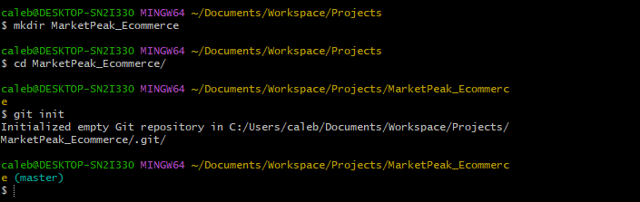

This is what it looks like to initialize the repository. A key way to notice success is the blue writing saying 'master'.

-----

**1.2 Obtain and Prepare the E-commerce Website Template**

Instead of developing the website from scratch, I'll use a pre-existing e-commerce website template. This approach allows me to focus on deployment and operational aspects, rather than on web development. The actual web development is done by web/software developers on the project.
- Download a Website Template: In this case, I will use a Tooplate template and download an e-commerce website template. It will look like this:

**Stage and Commit the Template to Git**

- Add your website files to the Git repository.

For this stage, I did it remotely since I saved it in a directory with many paths, but it is also possible to move the zip file using Git Bash:
~~~
mv Downloads/2130_waso_strategy Documents/Project/MarketPeak_Ecommerce
~~~

- Set your Git global configuration to your username and email.

- Commit your changes with a clear, descriptive message:

~~~
git add .
git config --global user.name "Username"
git config --global user.email "email@email.com"
git commit -m "Initial commit with basic e-commerce site structure"
~~~

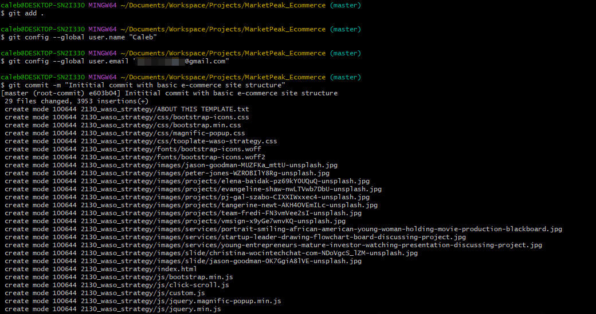

**1.4 Push the Code to My GitHub Repository**

After initializing the Git repository and adding the e-commerce website template, the next stage is to push your code to a remote repository on GitHub. This step is crucial for version control and collaboration.

- Create a remote repository on GitHub:

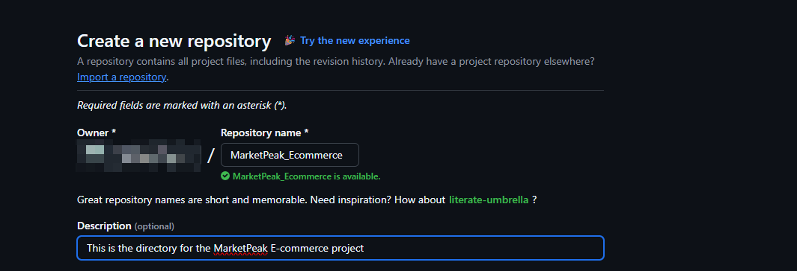

I left the repository empty without initializing it with a README.md, .gitignore, or a license.

- Link the local repository to GitHub:

~~~
git remote add origin https://github.com/Caleb-Odaudu/MarketPeak_Ecommerce
~~~

- Push the code:
~~~
git push -u origin main
~~~
This command pushes your code from your main branch to the remote repository on GitHub, enabling you to store your project in the cloud and share it with others.

**Note**: It is important to look out for what it says in the local branch, as it might say "master".

If that is the case, there are two options to troubleshoot the problem: one is to use `git push -u origin master`, the other is to change the branch name to `main`.

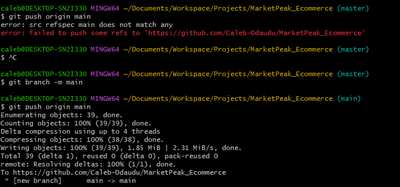

Proof the repository has been pushed:

### 2. AWS Deployment

To deploy the **"MarketPeak_Ecommerce"** platform, you will start by setting up an AWS EC2 Instance.

#### 2.1. Set Up an AWS EC2 Instance

- Log in to the AWS Management Console.

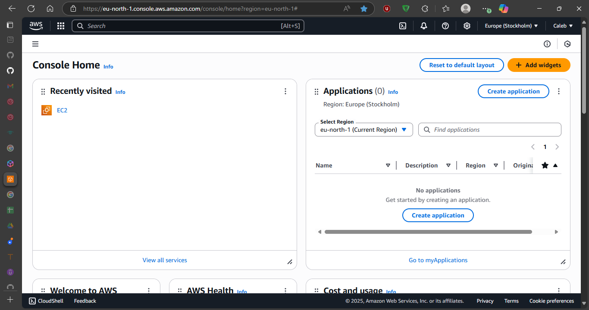

- Launch an EC2 instance using an Amazon Linux AMI.

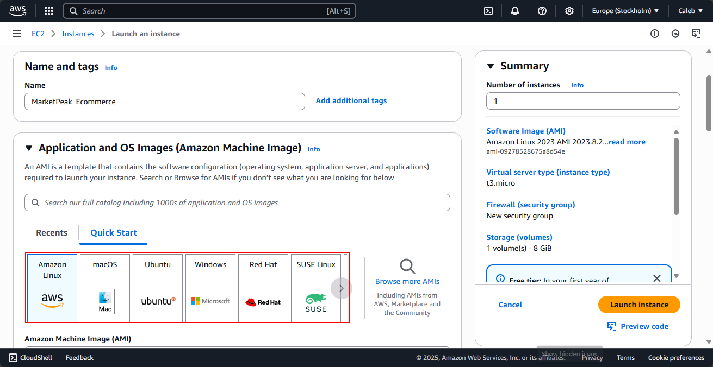

- Connect to the instance using SSH:

~~~
ssh -i ~/Downloads/Linux.pem ec2-user@51.21.255.124
~~~

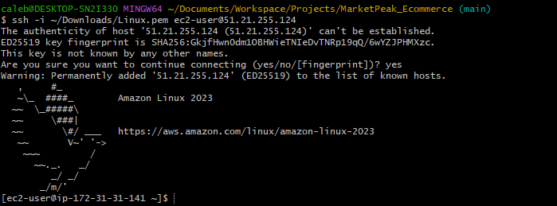

#### Clone the Repository on the Linux Server

Before deploying the e-commerce platform, you need to clone the GitHub repository to your AWS EC2 Instance. This process involves authenticating with GitHub and choosing between two primary methods of cloning a repository: **SSH** and **HTTPS**.

**SSH (Secure Shell)**
Using SSH involves generating a key pair and linking your public key to GitHub. Once set up, it offers several advantages:

- **No Repeated Credentials**: After initial setup, you won’t have to enter your username or password every time you interact with the repo.
- **Enhanced Security**: SSH keys provide strong encryption and authentication, making it harder for attackers to compromise.
- **Reliable for Automation**: Since it doesn’t rely on password prompts, SSH is great for automated scripts or server deployments (like from your EC2 instance).

**HTTPS (Hypertext Transfer Protocol Secure)**
HTTPS connects over a secure SSL/TLS connection and uses username/password authentication:

- **Simple Setup**: You don’t need to configure any keys—just use your GitHub credentials when prompted.
- **Universal Compatibility**: HTTPS works even when SSH access is restricted (e.g., in some corporate networks).
- **Token Integration**: GitHub supports using personal access tokens instead of passwords, enhancing security.

**When to Use What**
Use SSH for long-term development, automation, and environments like EC2 where you deploy your project.

Use HTTPS when you're accessing the repo quickly, working behind firewalls, or haven’t set up SSH yet.

For this project, SSH is the better method overall—especially given your environment and goals.

**SSH Method**
On your EC2 instance, generate an SSH key pair using ssh-keygen:

~~~
ssh-keygen -t rsa -b 4096 -C "your_email@example.com"
~~~

Display and copy your public key:
~~~
cat /home/ubuntu/.ssh/id_rsa.pub
~~~

- Add the SSH public key to your GitHub repository:

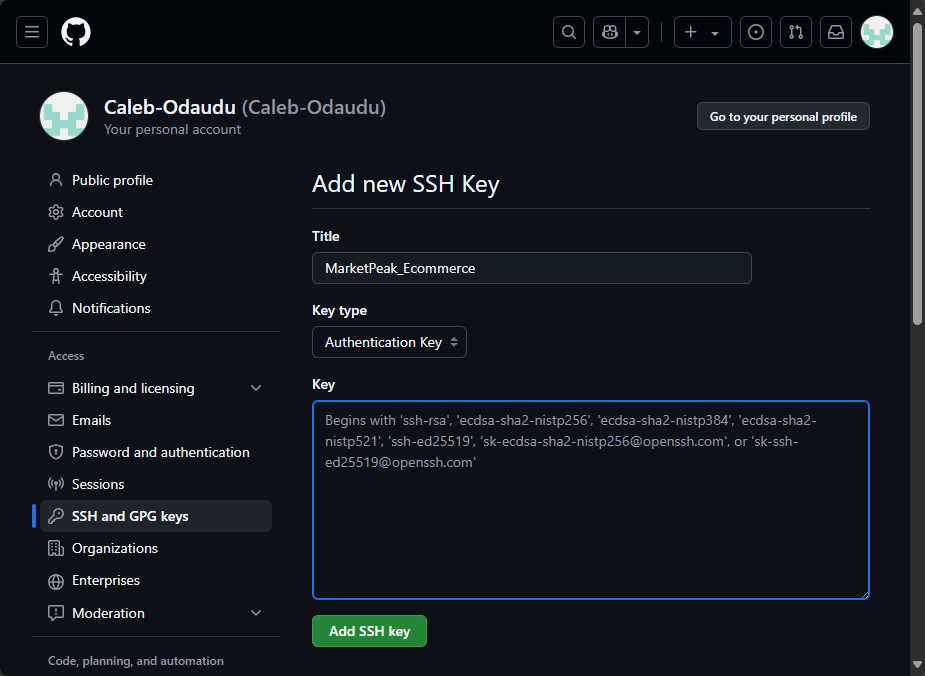

- It is important to make sure Git is installed on the EC2 instance:
~~~
sudo yum update -y
sudo yum install git -y
~~~

- Now you are able to clone the repository:
~~~
git clone git@github.com:yourusername/MarketPeak_Ecommerce.git
~~~

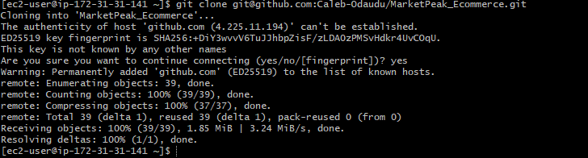

However, if you want to use the HTTPS method, it is easier as you just need to input this syntax in the EC2 instance:
~~~
git clone https://github.com/yourusername/MarketPeak_Ecommerce.git
~~~

#### 2.3. Install a Web Server on EC2
Apache HTTP Server (httpd) is a widely used web server that serves HTML files and content over the internet. Installing it on a Linux EC2 server allows you to host the **MarketPeak E-commerce** site:

-   Install Apache web server on the EC2 instance:

~~~
sudo yum update -y
sudo yum install httpd -y
sudo systemctl start httpd
sudo systemctl enable httpd
~~~

This first updates the Linux server, then installs httpd (Apache), starts the web server, and ensures it automatically starts on server boot.

#### 2.4 Configure httpd for Website
To serve the website from the EC2 instance, configure **httpd** to point to the directory on the Linux server where the website code files are stored, usually in `/var/www/html`.

-   **Prepare the Web Directory:** Clear the default web directory and copy MarketPeak Ecommerce website files to it:
~~~
sudo rm -rf /var/www/html/*
sudo cp -r ~/MarketPeak_Ecommerce/* /var/www/html/
~~~

-    Reload httpd: Apply the changes by reloading the httpd service.
~~~
sudo systemctl reload httpd
~~~

#### 2.5. Access Website from Browser
- With `httpd` configured and website files in place, the **MarketPeak Ecommerce** platform is now live on the internet.

- Open a web browser and access the public IP of the EC2 instance to view the deployed website:

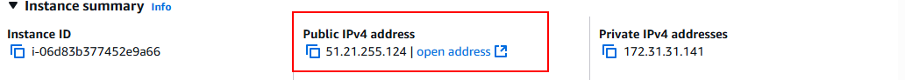

After entering this IP address, it displayed an image stating I was unable to connect to the page.

To solve this issue, I created a new inbound rule allowing HTTP from anywhere.

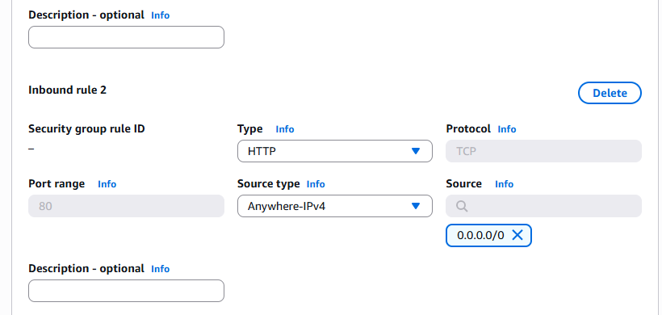

Sometimes incorrect file ownership or permissions can prevent content from rendering:

~~~
sudo chown -R apache:apache /var/www/html
sudo chmod -R 755 /var/www/html
~~~

### 3. Continuous Integration and Deployment Workflow

To ensure a smooth workflow for developing, testing, and deploying your e-commerce platform, follow this structured approach. It covers making changes in the deployment environment, utilizing version control with Git, and deploying updates to the production server.

#### Step 1: Developing New Features and Fixes
- Create a Development Branch: This isolates new features and bug fixes from the stable version of your website.
~~~
git branch development
git checkout development
~~~

- Implement changes: On the development branch, add your new features or bug fixes. This might include updating web pages, adding new products, or fixing known issues.

#### Step 2: Version Control with Git
- Stage your changes:
~~~
git add .
~~~
- Commit your changes:
~~~
git commit -m "Add new features or fix bugs"
~~~
- Push changes to GitHub:
~~~
git push origin development
~~~
#### Step 3: Pull Requests and Merging to the Main Branch

- **Create a Pull Request (PR)**  
  On GitHub, open a PR to merge the `development` branch into `main`. This allows for code review and collaboration.

- **Review and Merge the PR**  
  Use the following commands to merge your changes locally (or do it directly on GitHub):
  ~~~
  git checkout main
  git merge development
  ~~~
  Push merged changes to GitHub. Upload the updated main branch:
  ~~~
  git push origin main
  ~~~
#### Step 4: Deploying Updates to the Production Server
- Pull the latest changes on the EC2 instance. SSH into your EC2 instance and run:
~~~
git pull origin main
~~~
- Reload Apache to apply the changes:

~~~
sudo systemctl reload httpd
~~~
#### Step 5: Testing the New Changes
Access the website. Open your browser and go to your EC2 public IP.

Verify live updates. Confirm the new features or fixes are active and functioning as expected.

## Summary
In this project, I implemented a complete workflow for developing, versioning, and deploying an e-commerce website called "MarketPeak" using Git, Linux, and AWS EC2. I learned how to initialize a Git repository, manage code changes with branches, and push updates to GitHub for version control and collaboration. I also gained hands-on experience setting up an EC2 instance, configuring Apache as a web server, and deploying website files to the cloud. Additionally, I practiced troubleshooting common deployment issues, such as network rules and file permissions, to ensure the site was accessible online. Finally, I established a continuous integration and deployment workflow, enabling efficient updates and testing of new features. This project reinforced the importance of automation, version control, and cloud deployment in modern DevOps practices.