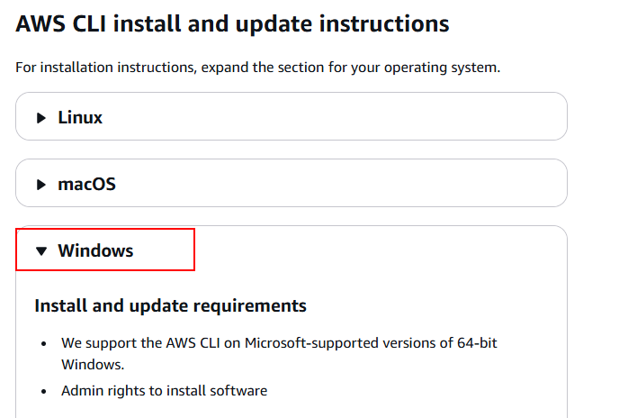
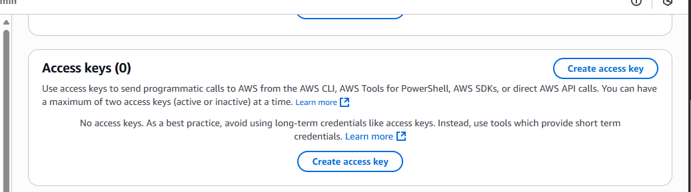
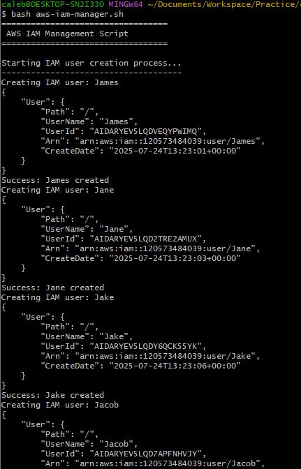

#  Shell Script for AWS IAM Management

##  Project Scenario

CloudOps Solutions is a growing company that recently adopted AWS to manage its cloud infrastructure. As the company scales, they have decided to automate the process of managing AWS Identity and Access Management (IAM) resources. This includes the creation of users, user groups, and the assignment of permissions for new hires, especially for their DevOps team.

## Purpose

You will extend your shell scripting capabilities by creating more functions inside the `aws-iam-manager.sh` script to fulfill the objectives below. Ensure that you have already configured AWS CLI in your terminal and the configured AWS Account have the appropriate permissions to manage IAM resources.

## Objectives

Extend the provided script to include IAM management by:

- Defining IAM User Names Array to store the names of the five IAM users in an array for easy iteration during user creation.
- Create the IAM Users as you iterate through the array using AWS CLI commands.
- Define and call a function to create an IAM group named `admin` using the AWS CLI commands.
- Attach an AWS-managed administrative policy (e.g., `AdministratorAccess`) to the `admin` group to grant administrative privileges.
- Iterate through the array of IAM user names and assign each user to the `admin` group using AWS CLI commands.

## Provided Script

~~~
#!/bin/bash
# AWS IAM Manager Script for CloudOps Solutions
# This script automates the creation of IAM users, groups, and permissions

# Define IAM User Names Array
IAM_USER_NAMES=()

# Function to create IAM users
create_iam_users() {
 echo "Starting IAM user creation process..."
 echo "-------------------------------------"

 echo "---Write the loop to create the IAM users here---"

 echo "------------------------------------"
 echo "IAM user creation process completed."
 echo ""
}

# Function to create admin group and attach policy
create_admin_group() {
 echo "Creating admin group and attaching policy..."
 echo "--------------------------------------------"

 # Check if group already exists
 aws iam get-group --group-name "admin" >/dev/null 2>&1
 echo "---Write this part to create the admin group---"

 # Attach AdministratorAccess policy
 echo "Attaching AdministratorAccess policy..."
 echo "---Write the AWS CLI command to attach the policy here---"

 if [ $? -eq 0 ]; then
   echo "Success: AdministratorAccess policy attached"
 else
   echo "Error: Failed to attach AdministratorAccess policy"
 fi

 echo "----------------------------------"
 echo ""
}

# Function to add users to admin group
add_users_to_admin_group() {
 echo "Adding users to admin group..."
 echo "------------------------------"

 echo "---Write the loop to handle users addition to the admin group here---"

 echo "----------------------------------------"
 echo "User group assignment process completed."
 echo ""
}

# Main execution function
main() {
 echo "=================================="
 echo " AWS IAM Management Script"
 echo "=================================="
 echo ""

 # Verify AWS CLI is installed and configured
 if ! command -v aws &> /dev/null; then
   echo "Error: AWS CLI is not installed. Please install and configure it first."
   exit 1
 fi

 # Execute the functions
 create_iam_users
 create_admin_group
 add_users_to_admin_group

 echo "=================================="
 echo " AWS IAM Management Completed"
 echo "=================================="
}

# Execute main function
main
exit 0
~~~

## Pre-requisite
Ensure that you have already configured AWS CLI in your terminal and the configured AWS Account have the appropriate permissions to manage IAM resources.

## Downloading AWSCLI into the terminal
 The first thing to do before starting the project is to configure AWS CLI to the git bash terminal, this is done by first downloading the CLI into the terminal using this website - https://docs.aws.amazon.com/cli/latest/userguide/getting-started-install.html -

 
 
 In the AWS documentation it gives you option on which type of device your operating system is. Select the appropriate operating system and follow the instruction.

 

 To confirm the installation, open the Start menu, search for cmd to open a command prompt window, and at the command prompt use the `aws --version` command

 

 Once we have confirmed that the installation is complete we can now configure the terminal to the AWS account

 ## Using Git Bash for AWS CLI Scripts

1. **Open Git Bash**
    * Launch it like any terminal

2. __Verify AWS CLI is installed__
~~~
aws --version
~~~
> In not recognized, check that AWS CLI is installed and its path is in your systems `Environment Variables`

3. Create IAM User with permissions
- Log in to AWS Console
- Go to **IAM > Users > Create User**

 
- Choose a username, for this case I will name it cloudops-admin

- Attach existing policies directly: 
    - Choose AdministratorAccess for full IAM control
 

- **Finish and download the .csv file**

- Create Access Key
    * Click on the new IAM
    * Navigate to the Security Credentials
    * Scroll down to the access key and click on Create access key

    

    * Select the use case for the accesskey
    
    * Finish and download the .csv file - with your Access Key ID and Secret Access Key

4. **Run** `AWS configure`

~~~
aws configure
~~~

* enter Access Key ID
* Secret Access Key
* Default Region Name
* Default output format

>This creates credentials in `~/.aws/credentials` and config in `~/.aws/config`

5. Test a simle command to verify

~~~
aws iam list-users
~~~

> Troubleshooting: "'more' is not recognized as an internal or external command,
operable program or batch file." AWS CLI tries to use a default pager (like more) to display long outputs. But Git Bash on Windows doesn’t always recognize more because it’s a Windows-native command, not a Unix one. To skip the pager and print directly to the terminal

 ~~~
 export AWS_PAGER=""
 ~~~

Now that the CLI is configured to the CLI we can now run the script in a .sh file

## Organise your project directory

It is important to create a folder in a place you can remember

- Create a folder to keep things neat:
~~~
mkdir cloudops-iam-manager
cd cloudops-iam-manager
~~~

-  Add the working script file:
~~~ 
touch aws-iam-manager.sh
~~~

Paste the provided script to the .sh file Now we can complete the project objectives

## Defining IAM User Names Array to store the names of the five IAM users in an array 

~~~
IAM_USER_NAMES=("James" "Jane" "Jake" "Jacob" "Jade")
~~~

## Loop to Create IAM Users
 Inside `create_iam_users`, add a `for` loop to create users:
 ~~~
 for user in "${IAM_USER_NAMES[@]}"; do
  echo "Creating IAM user: $user"
  aws iam create-user --user-name "$user"

  if [ $? -eq 0 ]; then
    echo "User $user created successfully."
  else
    echo "Failed to create user $user."
  fi
done
~~~

## Create Admin Group and Attach Policy
Update `Create_admin_group` to:
~~~
if [ $? -ne 0 ]; then
  aws iam create-group --group-name "admin"
  echo "Admin group created."
else
  echo "Admin group already exists."
fi

aws iam attach-group-policy \
  --group-name "admin" \
  --policy-arn "arn:aws:iam::aws:policy/AdministratorAccess"
~~~
This checks for existence, creates the group if needed, and attaches the AdministratorAccess policy.

## Add Users to the Admin Group
Loop through your array in `add_users_to_admin_group`:
~~~
for user in "${IAM_USER_NAMES[@]}"; do
  echo "Adding $user to admin group..."
  aws iam add-user-to-group --group-name "admin" --user-name "$user"

  if [ $? -eq 0 ]; then
    echo "$user added to admin group."
  else
    echo "Failed to add $user to group."
  fi
done
~~~

Now all users are in the admin group with full privileges

This is what the `.sh` script looks like
~~~
#!/bin/bash
# AWS IAM Manager Script for CloudOps Solutions
# This script automates the creation of IAM users, groups, and permissions

# Define IAM User Names Array
IAM_USER_NAMES=("James" "Jane" "Jake" "Jacob" "Jade")

# Function to create IAM users
create_iam_users() {
  echo "Starting IAM user creation process..."
  echo "-------------------------------------"

  for user in "${IAM_USER_NAMES[@]}"; do
    echo "Creating IAM user: $user"
    aws iam create-user --user-name "$user"

    if [ $? -eq 0 ]; then
      echo "Success: $user created"
    else
      echo "Error: Failed to create $user"
    fi
  done

  echo "------------------------------------"
  echo "IAM user creation process completed."
  echo ""
}

# Function to create admin group and attach policy
create_admin_group() {
  echo "Creating admin group and attaching policy..."
  echo "--------------------------------------------"

  # Check if group already exists
  aws iam get-group --group-name "admin" >/dev/null 2>&1

  if [ $? -ne 0 ]; then
    aws iam create-group --group-name "admin"
    echo "Admin group created successfully."
  else
    echo "Admin group already exists."
  fi

  # Attach AdministratorAccess policy
  echo "Attaching AdministratorAccess policy..."
  aws iam attach-group-policy \
    --group-name "admin" \
    --policy-arn "arn:aws:iam::aws:policy/AdministratorAccess"

  if [ $? -eq 0 ]; then
    echo "Success: AdministratorAccess policy attached"
  else
    echo "Error: Failed to attach AdministratorAccess policy"
  fi

  echo "----------------------------------"
  echo ""
}

# Function to add users to admin group
add_users_to_admin_group() {
  echo "Adding users to admin group..."
  echo "------------------------------"

  for user in "${IAM_USER_NAMES[@]}"; do
    echo "Adding $user to admin group..."
    aws iam add-user-to-group \
      --group-name "admin" \
      --user-name "$user"

    if [ $? -eq 0 ]; then
      echo "Success: $user added to admin group"
    else
      echo "Error: Failed to add $user to admin group"
    fi
  done

  echo "----------------------------------------"
  echo "User group assignment process completed."
  echo ""
}

# Main execution function
main() {
  echo "=================================="
  echo " AWS IAM Management Script"
  echo "=================================="
  echo ""

  # Verify AWS CLI is installed and configured
  if ! command -v aws &> /dev/null; then
    echo "Error: AWS CLI is not installed. Please install and configure it first."
    exit 1
  fi

  # Execute the functions
  create_iam_users
  create_admin_group
  add_users_to_admin_group

  echo "=================================="
  echo " AWS IAM Management Completed"
  echo "=================================="
}

# Execute main function
main
exit 0
~~~

## Run a Dry Test for the script

~~~
bash aws-iam-manager.sh
~~~

This image above shows that the user has been created

The image above shows the admin group has been created and allocated to all the users.

Now to confirm if it has been created in the AWS console.

The screenshot above proves that this project was a success.

## Summary

This project demonstrates how to automate AWS IAM management using a Bash shell script. By leveraging the AWS CLI, the script efficiently creates multiple IAM users, sets up an admin group, attaches the necessary administrative policy, and assigns users to the group. This approach streamlines user and permission management, reduces manual errors, and ensures consistent access control across the organization. The successful execution and verification steps confirm that all objectives were met, making this solution practical for real-world DevOps and CloudOps environments.