# WordPress Site on AWS

## Project Scenario

A small to medium-sized digital marketing agency, **"DigitalBoost"**, wants to enhance its online presence by creating a hagh-performance **WordPress-based** website for their clients. The agency needs a scalable, secure, and cost -effective solution that can handle increasing traffic and seamlessly intergrate with their existing infrastructure. Yor task as an AWS solutions Architect is to design and implement a WordPress solution using various AWS services, such as Networking, Computue, Object Storage, and Databases.

## Pre-requisite

- Knowledge of TechOps Essentials
- Comletion of Core 2 Courses and Mini Projects

The project overview with necessary architecture have been provided as you help **DigitalBoost** with the WordPress Based website. 

## Project Deliverables

- **Documentation:**
    - Detailed documentation for each component setup
    - Explanation of security measures implemented

- **Demonstation:**
    - Live demonstation of the WordPress site.
    - Showcase auto-scaling by simulating increased traffic

## Project Overview
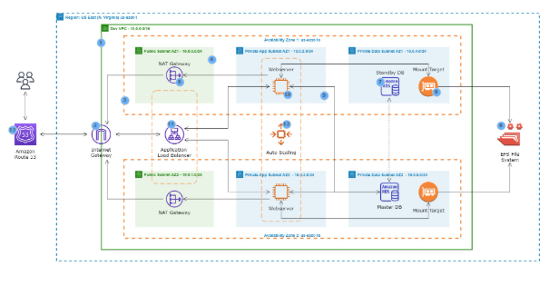

1. **VPC** with public and private subnets in 2 availability zones

2. An **Internet Gateway** is used to allow communication between instances in VPC and the internet 

3. We are using 2 **availbility zones** for high availability and fault tolerance.

4. Resources such as Nat Gateway, Bastion Host, and Application Load Balancers uses public subnet

5. We will put the webservers and database server in the Private Subnets to protect them.

6. The **Nat Gateway** allows the instances in the private App subnets and private Data subnets to access the internet.

7. We are using an **MySQL RDS** database.

8. We are using Amazon EFS so that the webservers cn have access to shared files.

9. The **EFS Mount Targets** are in each Availability Zones in the VPC

10. We are using **EC2 Instances** to host our website

11. **Application Load Balancer** is used to distribute web traffic accross an Auto Scaling Group of EC2 Instances in multiple AZs

12. Using **Auto-scalling Group** to dynamically create our EC2 instances to make our website highly available scalable, fault tolerance, and elastic

13. We are using **Route 53** to register our domain name and create a record set

## Project Components 

### 1. VPC Setup

**VPC ARCHITECTURE**
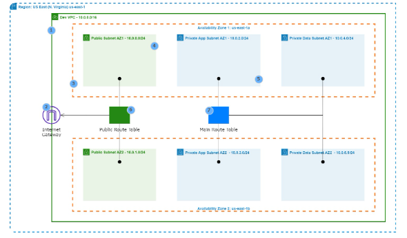

1. **VPC** with public and private subnets in 2 availability zones.

2. An **Internet Gateway** is used to allow communication between instances in VPC and the internet.

3. We are using 2 **Availability Zones** for high availability and fault tolerance.

4. Resources such as Nat Gateway, Bastion Host, and Application Load Balancer uses **Public Subnets**.

5. We will put the webserver and database server in the **Private Subnets** to protect them.

6. The **Public Route Table** us associated with the public subnets and routes traffic to the internet through the internet gateway.

7. The **Main Route Table** is associated with the private subnets

#### Objectives and Steps
- **Objective:** Create a Virtual Private Cloud (VPC) to isolate and secure the WordPress infrastructure.

- **Steps**
    - Define IP address range for the VPC.
    - Create VPC with public and private subnets.
    - Configure route tables for each subnet.

### 2. Public and Private Subnet with NAT Gateway
**NAT GATEWAY ARCHITECTURE**

1. The **Nat Gateway** allows the instances in the private App subnets and private Data subnets to access the internet.

2. The **Private Route Table** is associated with the private subnets and routes traffic to the internet through the nat gateway.

#### Objectives and Steps

- **Objective:** Implement a secure network architecture with ublic and private subnets. Use a NAT Gateway for private subnet internet access.

- **Steps:**
    - Set up public subnet for resources accessible from the internet.
    - Create private subnet for resources with no direct internet access.
    - Configure a NAT Gateway for private subnet internet access

### 3. AWS MySQL RDS Setup

**SECURITY GROUP ARCHITECTURE**

1. **ALB Security Group**

    **Port**= 80 and 443       |     **Source**= 0.0.0.0/0

2. **SSH Security Group**

    **Port**=22   | **Source**= Your IP Address

3. **Webserver Security Group**

    **Port**= 80 and 443 | **Source**= ALB Security Group

    **Port**= 22 | **Source**= SSH Security Group

4. **Database Security Group**

    **Port**= 3306 | **Source**= Webserver Security Group

5. **EFS Security Group**

    **Port**=2049 | **Source**= Webserver Security Group,EFS Security Group

    **Port**=22 | **Source**= SSH Security Group

#### Objectives and Steps
- **Objectives:** Deploy a managed MySQL database using Amazon RDS for WordPress data storage.

- **Steps:**
    - Create an Amazon RDS instance with MySQL engine
    - Confugure security groups for RDS instances.
    - Connect WordPress to the RDS dab=tabase.

### 4. EFC Setup for WordPress Files 

- **Objective:** Utilise amazon Elastic File System (EFS) to store WordPress files for scalable and shared access.

- **Steps:**
    - Create an EFS file system.
    - Mount the EFS file system on WordPress instances.
    - Configure Wordpress to use the shared file system.

### 5. Application Load Balancer
- **Objective:** Set up an Application Load Balancer to distribute incoming traffic among multiple instances, ensuring high availability and fault tolerance.

- **Steps**
    - Create an Application Load Balancer.
    - Configure listener rules for routing traffic to instances.
    - Integrate Load Balancer with Auto Scaling group.

### 6. Auto Scaling Group

- **Objective:** Implement Auto Scaling to automatically adjust the number of instances based on traffic load.

- **Steps:**
    - Create an Auto Scaling group
    - Define scaling policies based on metrics like CPU utilisation.
    - Configure launch configurations for instances.

## Core Architecture Summary
Here’s a simplified view of the major components and their roles:

| Component | Purpose | 

| VPC | Isolates resources into public/private subnets across 2 AZs |

| Internet Gateway | Enables internet access for public subnet resources | 

| NAT Gateway | Allows private subnet instances to access the internet securely | 

| EC2 Instances | Hosts the WordPress application | 

| Application Load Balancer | Distributes traffic across EC2 instances | 

| Auto Scaling Group | Dynamically adjusts EC2 count based on traffic | 

| Amazon RDS (MySQL) | Stores WordPress data in a managed DB | 

| Amazon EFS | Provides shared file storage for WordPress instances | 

| Route 53 | Manages domain name and DNS records | 

| Security Groups | Controls inbound/outbound traffic for each component | 

## WalkThrough

###  Create VPC

1. Navigate to VPC and create a new VPC

    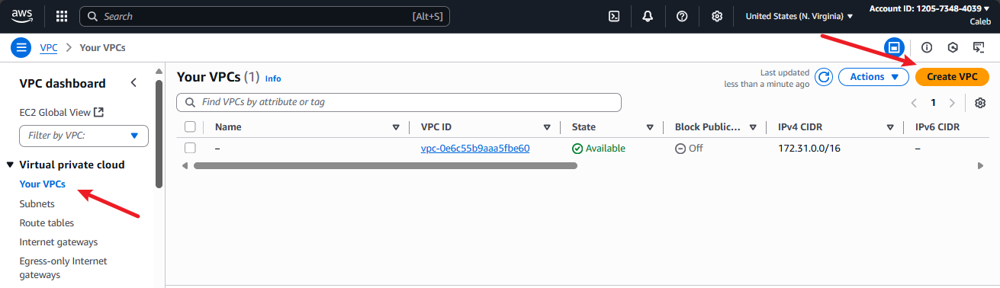

2. Set Up VPC

    

    - Gave it the name DigitalBoost-VPC
    - CIDR block= 10.0.0.0/16

3. Create VPC

### Create Subnets

1. Navigate to Subnet and create a new subnet

    

> We are going to create 6 subnets for each availability zones

2. Link to the VPC Created

    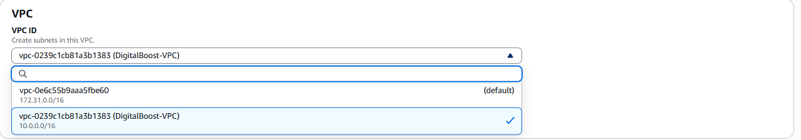

3. Create Public Subnets
- (a). Public Subnet 1- (CIDR=10.0.1.0/24)
    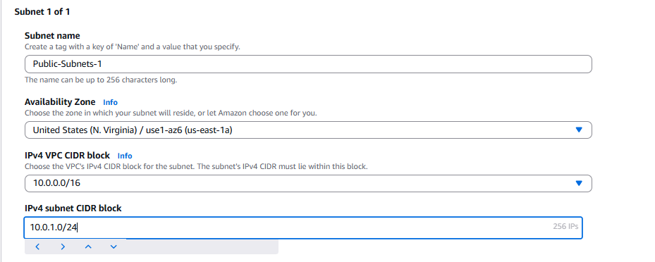

- (b). Public Subnet 2- (CRDR=10.0.2.0/24)
    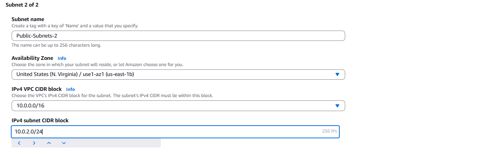

4. Create Private App Subnets
- (a). Private App Subnet 1- (CIDR=10.0.3.0/24)
    

- (b). Private App Subnet 2- (CIDR=10.0.4.0/24)
    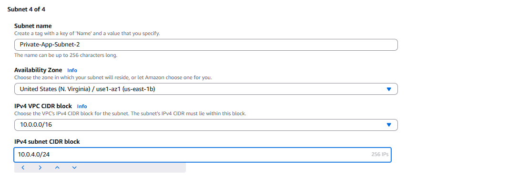

5. Create Private DB Subnets
- (a). Private DB Subnet 1- (CIDR=10.0.5.0/24)
    

- (b). Private DB Subnet 2- (CIDR=10.0.6.0/24)
    

> When creating subnets, make sure each pair is split across two distinct AZs (e.g., us-east-1a and us-east-1b for North Virginia region). This ensures high availability.

6. Create VPC

7. Verify all Subnet has been created
    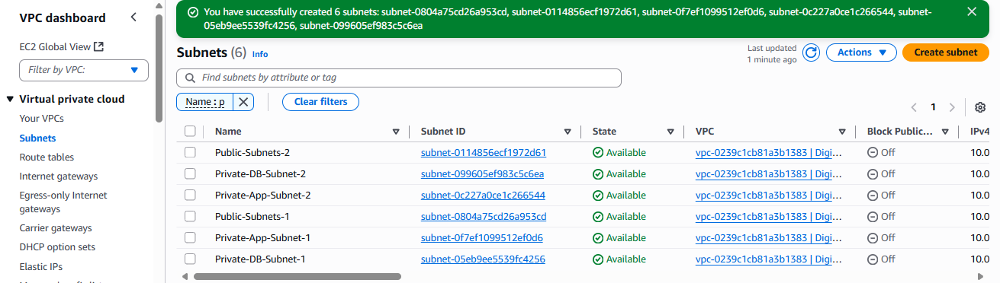

### Create Internet Gateway
1. Navigate to Internet Gateway
    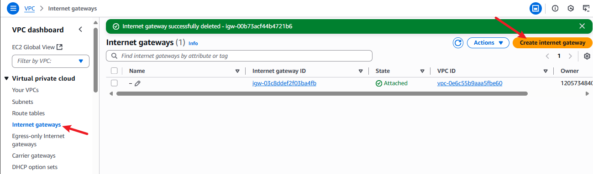

2. Create Internet Gateway
    

3. Attach it to VPC
    

    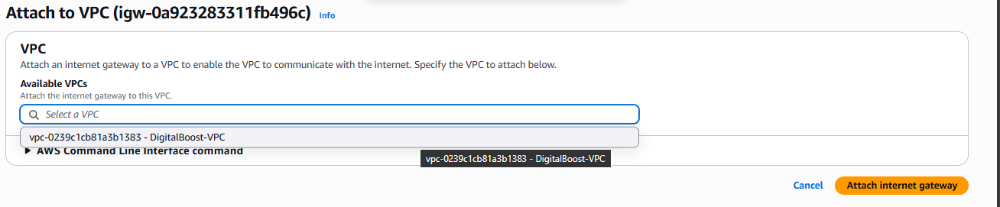

4. Verify 
    

### Create Route Table 
1. Navigate to Route Table
    

2. Create Public Route Table
    

3. Route to Internet Gateway
    

    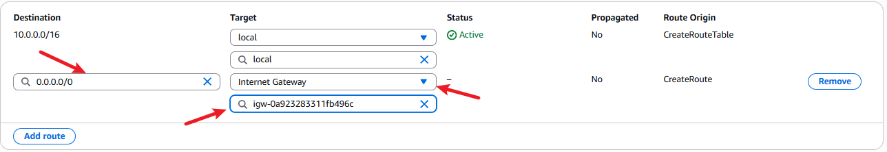

    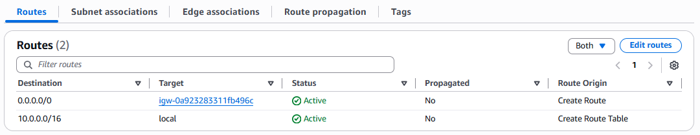

4. Create Private Route Table

Since I did not set the Public Route Table as the main, another route table has been created and is classed as the main

We are going to rename the route table to Private Route Table.

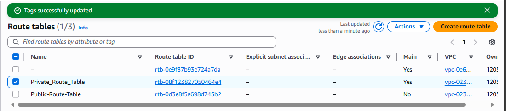

### Associate Route Table

1. Public subnets → Public Route Table
    

    

2. Private subnets → Private Route Table

    

    

----

### Create an Elastic IP

This is needed for NAT Gateway

1. Navigate to Elastic IP
    

2. Allocate Elastic IP
    

### Create NAT Gateway

1. Navigate to NAT Gateway
    

2. Create NAT Gateway
    
 - Place it in one of the public subnet
 - Associate it with the elastic IP created

### Update Private Route Table

1. Edit Route 
    

2. Add NAT Gateway

    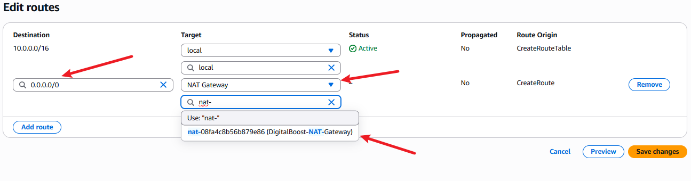

3. Verify Changes

    

### Create Bastion Host 
1. Launch an EC2 instance in a public subnet.
    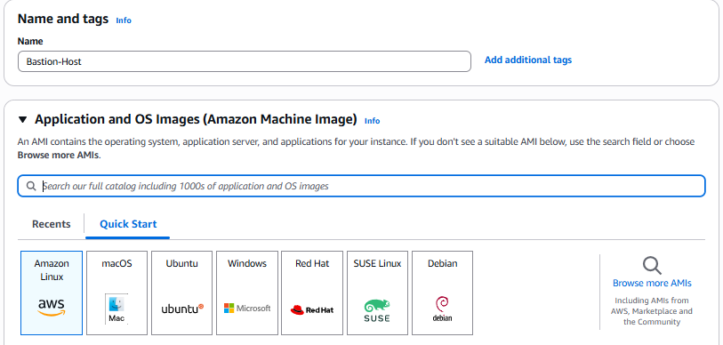

    

2. Assign a security group that allows SSH (port 22) only from trusted IPs.

    

> I set the source type as My IP as I am working by myself.

3. Launch Instance

    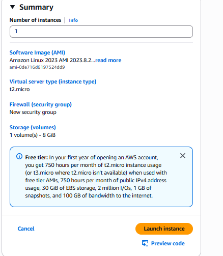

4. Verify EC2 Creation
    

----

### Create Launch Template

1. Navigate to Launch Template
    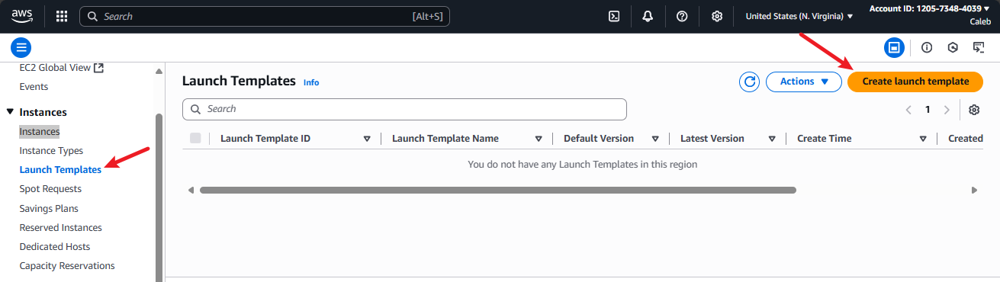

2. Name Template
    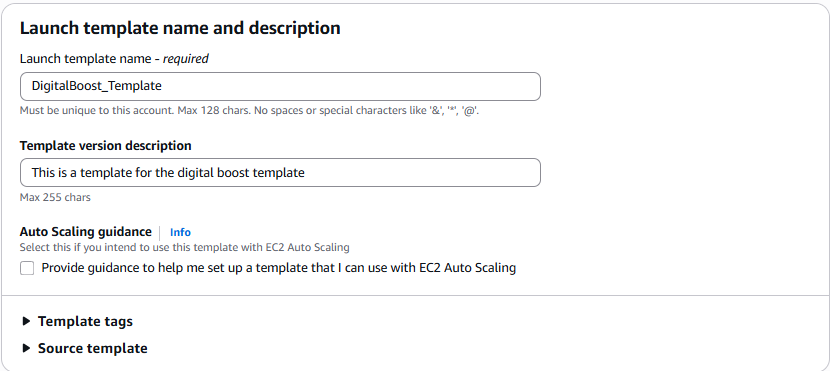

3. Link AMIs
    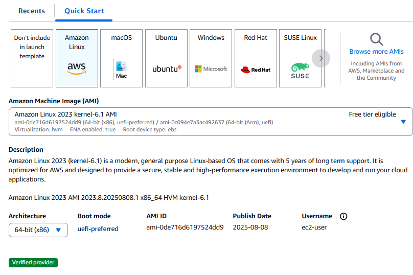
    - I used Amazon Linux AMI but it is also possible to use Ubuntu

4. User Data

Input this code into the user data

~~~
#1. create the html directory and mount the efs to it
sudo su
yum update -y
mkdir -p /var/www/html
sudo mount -t nfs4 -o nfsvers=4.1,rsize=1048576,wsize=1048576,hard,timeo=600,retrans=2,noresvport fs-03c9b3354880b36a6.efs.us-east-1.amazonaws.com:/ /var/www/html

#2. install apache 
sudo yum install -y httpd httpd-tools mod_ssl
sudo systemctl enable httpd 
sudo systemctl start httpd

#3. install php 7.4
sudo amazon-linux-extras enable php7.4
sudo yum clean metadata
sudo yum install php php-common php-pear -y
sudo yum install php-{cgi,curl,mbstring,gd,mysqlnd,gettext,json,xml,fpm,intl,zip} -y

#4. install mysql5.7
sudo rpm -Uvh https://dev.mysql.com/get/mysql57-community-release-el7-11.noarch.rpm
sudo rpm --import https://repo.mysql.com/RPM-GPG-KEY-mysql-2022
sudo yum install mysql-community-server -y
sudo systemctl enable mysqld
sudo systemctl start mysqld

#5. set permissions
sudo usermod -a -G apache ec2-user
sudo chown -R ec2-user:apache /var/www
sudo chmod 2775 /var/www && find /var/www -type d -exec sudo chmod 2775 {} \;
sudo find /var/www -type f -exec sudo chmod 0664 {} \;
chown apache:apache -R /var/www/html 

#6. download wordpress files
wget https://wordpress.org/latest.tar.gz
tar -xzf latest.tar.gz
cp -r wordpress/* /var/www/html/

#7. create the wp-config.php file
cp /var/www/html/wp-config-sample.php /var/www/html/wp-config.php

#8. edit the wp-config.php file
nano /var/www/html/wp-config.php

#9. restart the webserver
service httpd restart
~~~

5. Create Launch Template
    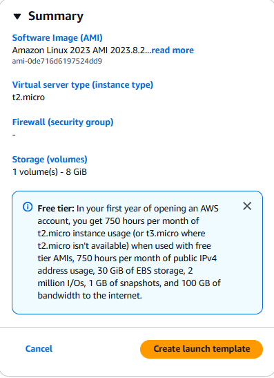

### Create Auto Scaling Group

1. Navigate to AutoScaling Group
    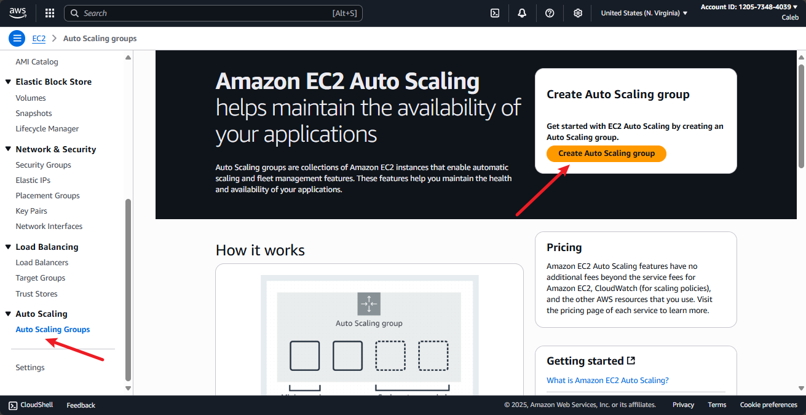

2. Use Launch Template
    

3. Assign two Availability Zones

For best practice, the wordpress EC2 instance should not be directly exposed to the internet. Instead, they receive traffic via the application Load balancers, which lives in the public subnet. This setup enhances security, scalability, and fault tolerance.

- **Network**: Select your VPC
    

- **Subnets**: Choose the private app subnets
    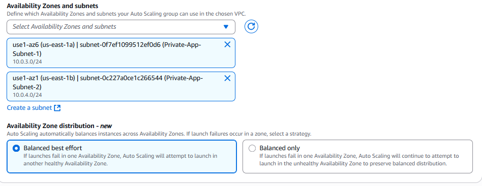

4. Create **Auto Scaling Group**

5. Attach to target group for ALB

- Target type: Instances 
- Name: Something like wordpress-asg-tg
- Protocol/Port: HTTP on port 80
- VPC: Select the one where your EC2 instances will live
- Health checks: Use / or /wp-login.php for WordPress

> From This Point on I will be transitioning to AWS CLI because there are many benefits such as:

- Scriptability: Automate repetitive tasks (e.g., provisioning, updates, teardown)
- Documentation: Your CLI commands become part of your project’s reproducible workflow
- Speed: Faster than clicking through the console
- Modularity: Easily integrate with shell scripts or CI/CD pipelines
- Consistency: Avoid human error from manual configuration

## Configure GitBash to AWS CLI

1. Ensure AWS CLI is installed 
~~~
aws --version
~~~

2. Configure Your Credentials

~~~ 
aws configure
~~~
You’ll be prompted for:
- Access Key ID
- Secret Access Key
- Default region (e.g., us-east-1)
- Output format (recommend json or table)

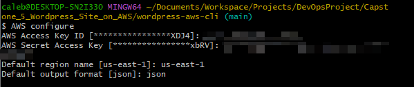

3. Create Project Directory 

~~~
mkdir wordpress-aws-cli
cd wordpress-aws-cli
touch setup-alb.sh
~~~

4. Run CLI Commands in Git Bash
Here’s an example to describe your VPCs:
~~~
aws ec2 describe-vpcs --output table
~~~
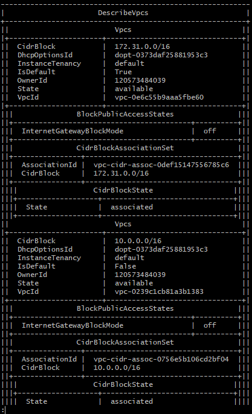

5. Use Environment Variables for Modularity

Create a .env file:
~~~
vi wordpress.env
~~~

In this .env file I will input
~~~
# VPC and Networking
export VPC_ID=vpc-0239c1cb81a3b1383
export IGW_ID=igw-0a923283311fb496c
export NAT_GW_ID=nat-08fa4c8b56b879e86
export EIP_ALLOC_ID=eipassoc-065360fab0bbae844

# Subnets
export PUBLIC_SUBNET_1=subnet-0804a75cd26a953cd
export PUBLIC_SUBNET_2=subnet-0114856ecf1972d61
export PRIVATE_APP_SUBNET_1=subnet-0f7ef1099512ef0d6
export PRIVATE_APP_SUBNET_2=subnet-0c227a0ce1c266544
export PRIVATE_DB_SUBNET_1=subnet-05eb9ee5539fc4256
export PRIVATE_DB_SUBNET_2=subnet-099605ef983c5c6ea

# Other Resources
export LAUNCH_TEMPLATE_ID=lt-0620e905fd66244dd
export ASG_NAME=DigitalBoost_ASG

# Security Group
export DB_SG_ID=sg-016c5855d406b4c8c

# Route Tables
export PUBLIC_RT_ID=rtb-0d3e8f5a698d745b2
export PRIVATE_RT_ID=rtb-08f123827050464e4

~~~
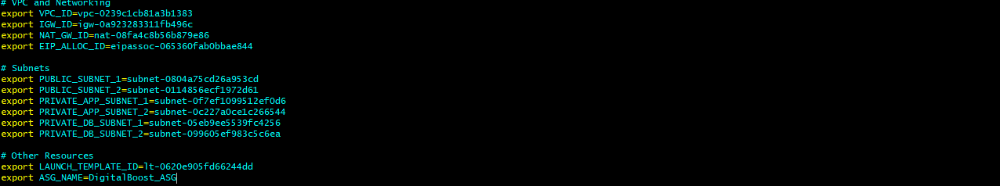

Then source it in your script:
source wordpress.env
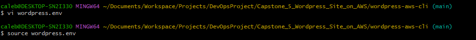

## Create Application Load Balancers

1. In the setup-alb.sh file we created earlier, input this bash script.

~~~
#!/bin/bash
set -euo pipefail

source wordpress.env

validate_env_vars() {
  for var in PUBLIC_SUBNET_1 PUBLIC_SUBNET_2 VPC_ID; do
    if [ -z "${!var:-}" ]; then
      echo "❌ Error: $var is not set"
      exit 1
    fi
  done
}

validate_env_vars

# Check if the security group already exists
EXISTING_SG_ID=$(aws ec2 describe-security-groups \
  --filters Name=group-name,Values=wordpress-alb-sg Name=vpc-id,Values="$VPC_ID" \
  --query 'SecurityGroups[0].GroupId' \
  --output text 2>/dev/null || echo "")

if [ -n "$EXISTING_SG_ID" ] && [ "$EXISTING_SG_ID" != "None" ]; then
  echo "ℹ️ Security group 'wordpress-alb-sg' already exists. Using existing SG_ID: $EXISTING_SG_ID"
  SG_ID="$EXISTING_SG_ID"
else
  echo "🔧 Creating ALB security group..."
  SG_ID=$(aws ec2 create-security-group \
    --group-name wordpress-alb-sg \
    --description "Security group for WordPress ALB" \
    --vpc-id "$VPC_ID" \
    --query 'GroupId' \
    --output text)

  # Add inbound rules (HTTP and HTTPS)
  for port in 80 443; do
    aws ec2 authorize-security-group-ingress \
      --group-id "$SG_ID" \
      --protocol tcp \
      --port "$port" \
      --cidr 0.0.0.0/0
  done
fi

# Create the ALB
echo "🚀 Creating Application Load Balancer..."
aws elbv2 create-load-balancer \
  --name wordpress-alb \
  --subnets "$PUBLIC_SUBNET_1" "$PUBLIC_SUBNET_2" \
  --security-groups "$SG_ID" \
  --scheme internet-facing \
  --type application

~~~

2. Make it executionable
~~~
chmod +x setup-alb.sh
~~~

3. Run it
~~~ 
./setup-alb.sh | less
~~~

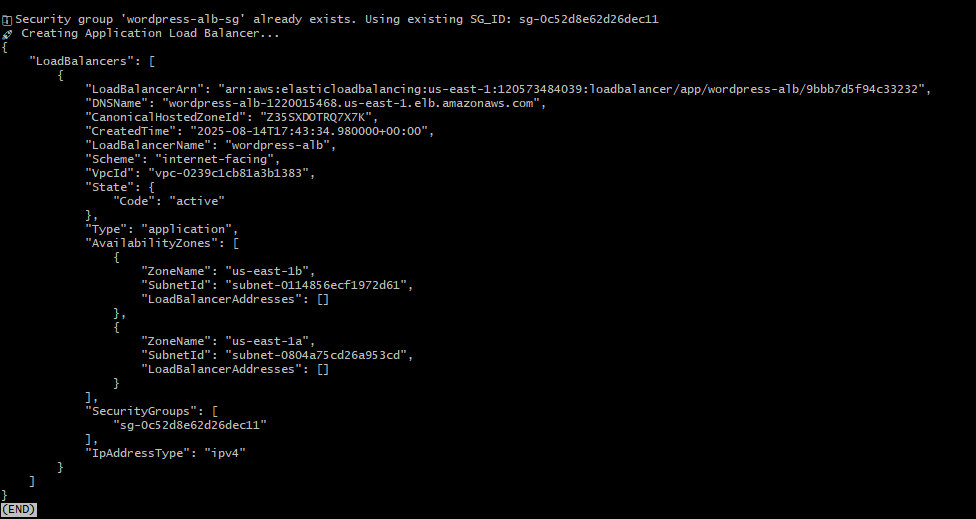

## Create and Attach the Target Group + Listene

### Create New .sh file

~~~ 
touch setup-listener.sh
~~~

### Create New Target Group
~~~
aws elbv2 create-target-group \
  --name wordpress-asg-tg \
  --protocol HTTP \
  --port 80 \
  --target-type instance \
  --vpc-id "$VPC_ID" \
  --health-check-path "/wp-login.php" \
  --health-check-protocol HTTP
~~~

### Create Listener on ALB
~~~
# Get ALB ARN
ALB_ARN=$(aws elbv2 describe-load-balancers \
  --names wordpress-alb \
  --query 'LoadBalancers[0].LoadBalancerArn' \
  --output text)

# Get Target Group ARN
TG_ARN=$(aws elbv2 describe-target-groups \
  --names wordpress-asg-tg \
  --query 'TargetGroups[0].TargetGroupArn' \
  --output text)

# Create Listener
aws elbv2 create-listener \
  --load-balancer-arn "$ALB_ARN" \
  --protocol HTTP \
  --port 80 \
  --default-actions Type=forward,TargetGroupArn="$TG_ARN"
  ~~~

  ### Attach Target Group to Autoscaling Group
  ~~~
  aws autoscaling attach-load-balancer-target-groups \
  --auto-scaling-group-name "$ASG_NAME" \
  --target-group-arns "$TG_ARN"
  ~~~

  ### Overall Script
  ~~~
  #!/bin/bash
set -euo pipefail

source wordpress.env

validate_env_vars() {
  for var in VPC_ID ASG_NAME; do
    if [ -z "${!var:-}" ]; then
      echo "❌ Error: $var is not set"
      exit 1
    fi
  done
}

validate_env_vars

echo "🔧 Creating Target Group..."
TG_ARN=$(MSYS_NO_PATHCONV=1 aws elbv2 create-target-group \
  --name wordpress-asg-tg \
  --protocol HTTP \
  --port 80 \
  --target-type instance \
  --vpc-id "$VPC_ID" \
  --health-check-path '/wp-login.php' \
  --health-check-protocol HTTP \
  --query 'TargetGroups[0].TargetGroupArn' \
  --output text)

echo "✅ Target Group created: $TG_ARN"

# Get ALB ARN
ALB_ARN=$(aws elbv2 describe-load-balancers \
  --names wordpress-alb \
  --query 'LoadBalancers[0].LoadBalancerArn' \
  --output text)

# Create Listener
echo "🔗 Creating Listener..."
aws elbv2 create-listener \
  --load-balancer-arn "$ALB_ARN" \
  --protocol HTTP \
  --port 80 \
  --default-actions Type=forward,TargetGroupArn="$TG_ARN"

echo "✅ Listener created and linked to Target Group"

# Attach Target Group to Auto Scaling Group
echo "🔗 Attaching Target Group to Auto Scaling Group..."
aws autoscaling attach-load-balancer-target-groups \
  --auto-scaling-group-name "$ASG_NAME" \
  --target-group-arns "$TG_ARN"

echo "✅ Target Group attached to Auto Scaling Group"
~~~

2. Set Permission to execute

~~~
chmod +x setup-listener.sh
~~~

3. Execute the .sh file

~~~ 
./setup-listener.sh
~~~

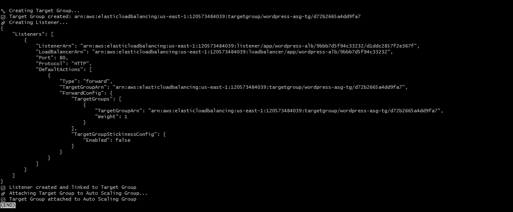

## Setup Security Group

### Create a new .sh file

~~~ 
vi setup-security-group.sh
~~~

### Input this code
~~~
#!/bin/bash
set -euo pipefail

# Region and VPC setup
REGION="eu-west-2"
VPC_ID="$(aws ec2 describe-vpcs --region "$REGION" --query 'Vpcs[0].VpcId' --output text)"

# Security group definitions
declare -A SG_NAMES=(
  [ALB]="wordpress-alb-sg"
  [SSH]="wordpress-ssh-sg"
  [WEB]="wordpress-web-sg"
  [DB]="wordpress-db-sg"
  [EFS]="wordpress-efs-sg"
)

declare -A SG_DESCRIPTIONS=(
  [ALB]="Allow HTTP/HTTPS traffic to ALB"
  [SSH]="Allow SSH access"
  [WEB]="Allow web traffic to EC2"
  [DB]="Allow MySQL access from web tier"
  [EFS]="Allow NFS access from web tier"
)

declare -A SG_IDS

# Create SG if not exists
create_security_group() {
  local key="$1"
  local name="${SG_NAMES[$key]}"
  local desc="${SG_DESCRIPTIONS[$key]}"

  echo "🔍 Checking for Security Group '$name' in VPC '$VPC_ID'..."

  SG_ID=$(aws ec2 describe-security-groups \
    --region "$REGION" \
    --filters Name=group-name,Values="$name" Name=vpc-id,Values="$VPC_ID" \
    --query 'SecurityGroups[0].GroupId' \
    --output text 2>/dev/null || echo "")

  if [[ -n "$SG_ID" && "$SG_ID" != "None" ]]; then
    echo "ℹ️ Security Group '$name' already exists. Using SG_ID: $SG_ID"
  else
    echo "🛠️ Creating Security Group '$name'..."
    SG_ID=$(aws ec2 create-security-group \
      --group-name "$name" \
      --description "$desc" \
      --vpc-id "$VPC_ID" \
      --region "$REGION" \
      --query 'GroupId' \
      --output text)
    echo "✅ Created Security Group '$name' with ID: $SG_ID"
  fi

  SG_IDS[$key]="$SG_ID"
}

# Add ingress rule if not duplicate
authorize_ingress_rule() {
  local sg_id="$1"
  local protocol="$2"
  local port="$3"
  local cidr="$4"

  echo "🔐 Authorizing ingress: $protocol $port from $cidr on SG $sg_id..."

  output=$(aws ec2 authorize-security-group-ingress \
    --group-id "$sg_id" \
    --protocol "$protocol" \
    --port "$port" \
    --cidr "$cidr" 2>&1)

  if echo "$output" | grep -q "InvalidPermission.Duplicate"; then
    echo "ℹ️ Rule already exists, skipping."
  elif echo "$output" | grep -q "error"; then
    echo "❌ Error adding rule: $output"
  else
    echo "✅ Rule added: $protocol $port from $cidr"
  fi
}

# Main execution
for key in "${!SG_NAMES[@]}"; do
  create_security_group "$key"
done

# Ingress rules
authorize_ingress_rule "${SG_IDS[ALB]}" "tcp" 80 "0.0.0.0/0"
authorize_ingress_rule "${SG_IDS[ALB]}" "tcp" 443 "0.0.0.0/0"
authorize_ingress_rule "${SG_IDS[SSH]}" "tcp" 22 "0.0.0.0/0"
authorize_ingress_rule "${SG_IDS[WEB]}" "tcp" 80 "0.0.0.0/0"
authorize_ingress_rule "${SG_IDS[WEB]}" "tcp" 443 "0.0.0.0/0"

# Assume web tier CIDR is internal (adjust as needed)
WEB_SG_CIDR="10.0.0.0/16"
authorize_ingress_rule "${SG_IDS[DB]}" "tcp" 3306 "$WEB_SG_CIDR"
authorize_ingress_rule "${SG_IDS[EFS]}" "tcp" 2049 "$WEB_SG_CIDR"

echo "✅ Security group provisioning complete."

~~~

### Set execute permission

~~~
chmod +x setup-security-group.sh
~~~

### Execute .sh file

~~~
./seup-security-group.sh
~~~

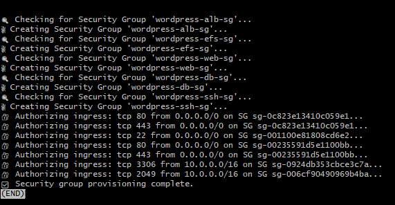

##  Provision Amazon RDS (MySQL)

1. Create an .sh file

~~~
vi setup-rds.sh
~~~

2. Input this code in the .sh file

~~~
#!/bin/bash
set -euo pipefail

source wordpress.env

# Validate required environment variables
validate_env_vars() {
  for var in PRIVATE_DB_SUBNET_1 PRIVATE_DB_SUBNET_2 VPC_ID DB_SG_ID; do
    if [ -z "${!var:-}" ]; then
      echo "❌ Error: $var is not set in wordpress.env"
      exit 1
    fi
  done
}

validate_env_vars

# Check if DB Subnet Group exists
SUBNET_GROUP_NAME="wordpress-db-subnet-group"
EXISTING_SUBNET_GROUP=$(aws rds describe-db-subnet-groups \
  --query "DBSubnetGroups[?DBSubnetGroupName=='$SUBNET_GROUP_NAME'].DBSubnetGroupName" \
  --output text)

if [ "$EXISTING_SUBNET_GROUP" == "$SUBNET_GROUP_NAME" ]; then
  echo "ℹ️ DB Subnet Group '$SUBNET_GROUP_NAME' already exists. Skipping creation."
else
  echo "🔧 Creating DB Subnet Group..."
  aws rds create-db-subnet-group \
    --db-subnet-group-name "$SUBNET_GROUP_NAME" \
    --db-subnet-group-description "Subnet group for WordPress RDS" \
    --subnet-ids "$PRIVATE_DB_SUBNET_1" "$PRIVATE_DB_SUBNET_2"
  echo "✅ DB Subnet Group created."
fi

# Check if RDS instance already exists
DB_IDENTIFIER="wordpress-db"
EXISTING_DB=$(aws rds describe-db-instances \
  --query "DBInstances[?DBInstanceIdentifier=='$DB_IDENTIFIER'].DBInstanceIdentifier" \
  --output text)

if [ "$EXISTING_DB" == "$DB_IDENTIFIER" ]; then
  echo "ℹ️ RDS instance '$DB_IDENTIFIER' already exists. Skipping creation."
else
  echo "🚀 Creating RDS instance '$DB_IDENTIFIER'..."
aws rds create-db-instance \
    --db-instance-identifier "$DB_IDENTIFIER" \
    --db-instance-class db.t3.micro \
 --engine mysql \
    --master-username admin \
    --master-user-password YourSecurePassword123 \
    --allocated-storage 20 \
    --vpc-security-group-ids "$DB_SG_ID" \
    --db-subnet-group-name "$SUBNET_GROUP_NAME" \
    --multi-az \
    --backup-retention-period 7
  echo "✅ RDS instance creation initiated."
fi

  ~~~

  3. Set execute permissions

  ~~~
  chmod +x setup-rds.sh
  ~~~

  4. Execute the .sh file

    ~~~
    ./setup-rds.sh | less
    ~~~

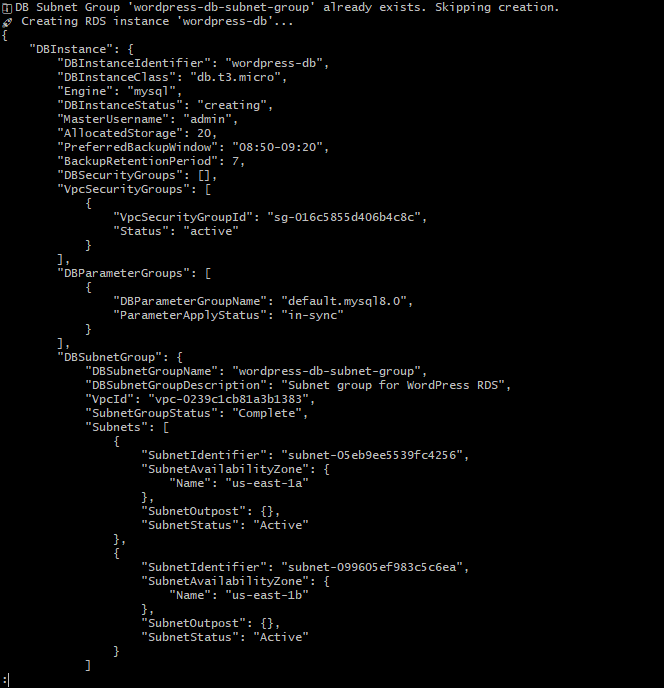

## Set Up EFS
~~~
#!/bin/bash
set -euo pipefail

# === Load Environment ===
source wordpress.env

# === Config ===
REGION="${AWS_REGION:-us-east-1}"
EFS_NAME="${EFS_NAME:-Digitalboost-efs}"
SECURITY_GROUP_ID="${DB_SG_ID}"  # Or use a dedicated SG for EFS
MOUNT_POINT="${MOUNT_POINT:-/mnt/efs}"

# === Subnet Array ===
SUBNET_IDS=(
  "$PRIVATE_APP_SUBNET_1"
  "$PRIVATE_APP_SUBNET_2"
  "$PRIVATE_DB_SUBNET_1"
  "$PRIVATE_DB_SUBNET_2"
)

# === Functions ===

create_efs() {
  echo "Creating EFS file system..." >&2
  local token="${EFS_NAME}-$(date +%s)"
  local fs_id
  fs_id=$(aws efs create-file-system \
    --creation-token "$token" \
    --performance-mode generalPurpose \
    --throughput-mode bursting \
    --tags Key=Name,Value="$EFS_NAME" \
    --region "$REGION" \
    --query 'FileSystemId' --output text)
  echo "EFS created: $fs_id" >&2
  echo "$fs_id"
}

wait_for_efs() {
  local fs_id="$1"
  echo "Waiting for EFS $fs_id to become available..."

  local attempts=0
  local max_attempts=30  # ~2.5 minutes

  while [[ $attempts -lt $max_attempts ]]; do
    local status
    status=$(aws efs describe-file-systems \
      --file-system-id "$fs_id" \
      --region "$REGION" \
      --query 'FileSystems[0].LifeCycleState' \
      --output text)

    echo "Current status: $status"

    if [[ "$status" == "available" ]]; then
      echo "EFS $fs_id is now available."
      return 0
    fi

    ((attempts++))
    sleep 5
  done

  echo "Timeout: EFS $fs_id did not become available after $((max_attempts * 5)) seconds."
  return 1
}

create_mount_targets() {
  local fs_id="$1"
  echo " Creating mount targets for EFS $fs_id..."

  for subnet_id in "${SUBNET_IDS[@]}"; do
    echo "Subnet: $subnet_id"
    aws efs create-mount-target \
      --file-system-id "$fs_id" \
      --subnet-id "$subnet_id" \
      --security-groups "$SECURITY_GROUP_ID" \
      --region "$REGION"
  done

  echo "All mount targets created."
}

# === Main ===
main() {
  echo "Starting EFS provisioning..."
  local fs_id
  fs_id=$(create_efs)
  wait_for_efs "$fs_id"
  create_mount_targets "$fs_id"
  echo "EFS setup complete."
}

main "$@"
~~~

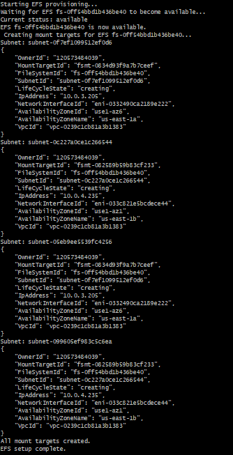

## Connecting to ALB EC2 instance

1. Retrieve the RDS Endpoint

    Once the RDS status is `available` , run:
~~~
aws rds describe-db-instances \
  --db-instance-identifier wordpress-db \
  --query 'DBInstances[0].Endpoint.Address' \
  --output text
~~~

Save the output — this is your `DB_Host` .

wordpress-db.csrgcouua1xy.us-east-1.rds.amazonaws.com

2. SSH into EC2 via Bastion Host

~~~
ssh -i your-key.pem ec2-user@<bastion-public-ip>
~~~

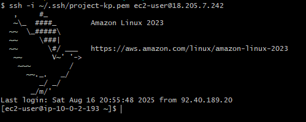
3. Run this command
~~~
aws ec2 describe-instances \
  --region "$AWS_REGION" \
  --filters "Name=vpc-id,Values=$VPC_ID" \
  --query 'Reservations[*].Instances[*].[InstanceId,PrivateIpAddress,SubnetId]' \
  --output table

~~~

This gives information on the private IP of the instance

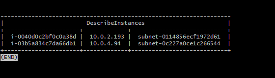

4. Transfer PEM File to Bastion Host

From your Windows machine, use  to copy the PEM file to the Bastion Host:
~~~
scp -i /WordPress.pem WordPress.pem ec2-user@<Bastion-IP>:/home/ec2-user/
~~~

Replace <Bastion-IP>  with the public IP of your Bastion Host

> Note that it is important to do this in the local environment 

5. SSH from Bastion to WordPress EC2

Once the PEM file is on the Bastion Host:
~~~
chmod 400 WordPress.pem
ssh -i WordPress.pem ec2-user@10.0.4.94
~~~
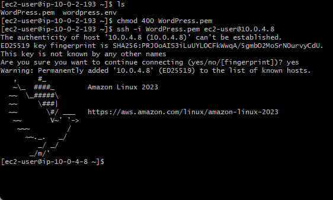

I used the script from https://github.com/dareyio/script-2 to configure my instance but make sure to configure using your FS id

## Configure WordPress to Use RDS
1. Edit wp-config.php

~~~
nano /var/www/html/wp-config.php
~~~

2. Input this:
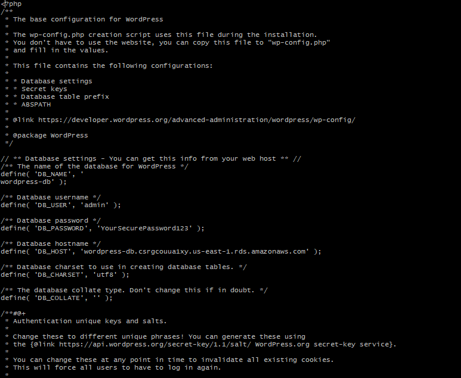

3. 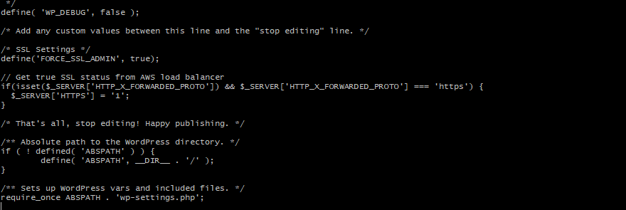

4. Restart apache
~~~
sudo systemctl restart httpd
~~~

Now we can Try to go to our site
